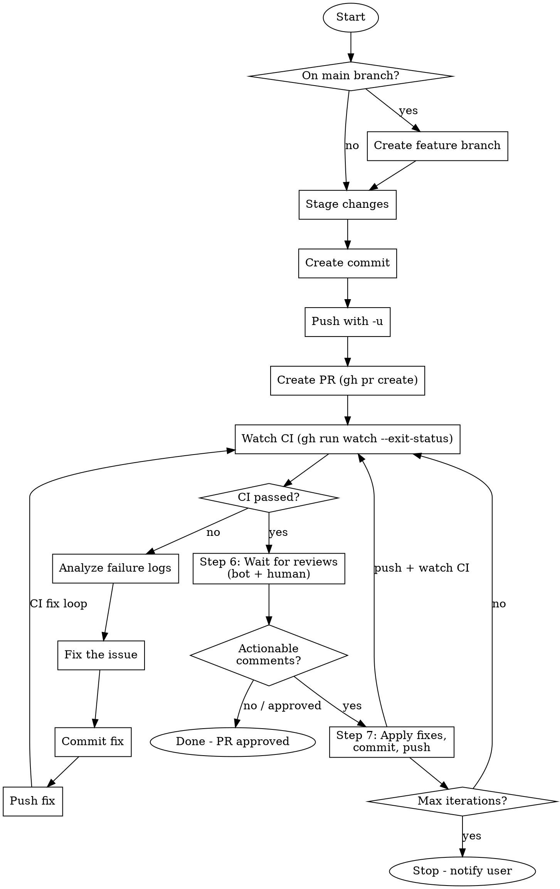

# Commit, Push, PR with CI Watch + Review Loop

Create commit, push branch, open PR, watch CI, then autonomously handle review feedback until approval.

## Workflow



## Steps

### 1. Branch Check

```bash
CURRENT_BRANCH=$(git branch --show-current)
if [ "$CURRENT_BRANCH" = "main" ]; then
    # Create descriptive branch from changes
    git checkout -b <branch-name>
fi
```

### 2. Stage & Commit

```bash
git add <specific-files>  # Prefer specific files over -A
git commit -m "<type>(<scope>): <description>"
```

Follow conventional commits. Commit message must be lowercase.

### 3. Push & Create PR

```bash
git push -u origin $(git branch --show-current)
gh pr create --title "<title>" --body "<body>"
```

PR body should include:

- Summary section with bullet points
- Test plan with checkboxes

### 3.5. Update feature.yaml

**After PR is created, update status:**

```yaml
# specs/NNN-feature-name/feature.yaml
feature:
  lifecycle: 'review' # Update from "implementation"

status:
  phase: 'in-review' # Update from "ready-for-review"
  lastUpdated: '<timestamp>'
  lastUpdatedBy: 'shep-kit:commit-pr'

prUrl: '<PR URL from gh pr create>' # Add PR URL

checkpoints:
  # Add new checkpoint:
  - phase: 'pr-created'
    completedAt: '<timestamp>'
    completedBy: 'shep-kit:commit-pr'
```

**Then commit the feature.yaml update:**

```bash
git add specs/NNN-feature-name/feature.yaml
git commit -m "chore(specs): update feature status to in-review"
git push
```

**Reference:** [docs/development/feature-yaml-protocol.md](../../docs/development/feature-yaml-protocol.md)

### 4. Watch CI (Critical)

```bash
# Get the latest run ID for current branch
gh run list --limit 5  # Find the run ID
gh run watch <run-id> --exit-status
```

**MUST wait for CI to complete.** The `--exit-status` flag returns non-zero if CI fails.

**Note:** `gh run watch` requires a run ID when not in interactive terminal.

### 5. Fix-Push-Watch Loop

If CI fails:

1. **Get failure logs**: `gh run view <run-id> --log-failed`
2. **Analyze root cause**: Read the error, understand the issue
3. **Fix the issue**: Make necessary code changes
4. **Commit the fix**: `git commit -m "fix(<scope>): <what was fixed>"`
5. **Push**: `git push`
6. **Get new run ID**: `gh run list --limit 1`
7. **Watch again**: `gh run watch <new-run-id> --exit-status`
8. **Repeat** until CI passes

### 6. Review Watch

After CI passes, wait for review comments (bot and human), then classify them.

**Phase A — Wait for review check to complete:**

```bash
# Wait for all checks including Claude Code Review to complete
gh pr checks --watch --fail-fast

# Fallback: poll for the review workflow directly
gh run list --workflow=claude-code-review.yml --limit 1 --json status,conclusion \
  --jq '.[0] | {status, conclusion}'
```

If the Claude Code Review check does not appear within 5 minutes, skip Phase A and proceed to Phase B (the review may not be configured for this repo).

**Phase B — Fetch all reviews from the three GitHub API endpoints:**

```bash
# 1. PR reviews (state, body, author)
gh api repos/{owner}/{repo}/pulls/{number}/reviews \
  --jq '.[] | {id, state, user: .user.login, user_type: .user.type, body}'

# 2. Inline review comments (file, line, content)
gh api repos/{owner}/{repo}/pulls/{number}/comments \
  --jq '.[] | {id, path, line, body, user: .user.login, user_type: .user.type, diff_hunk}'

# 3. Issue-level comments on the PR
gh api repos/{owner}/{repo}/issues/{number}/comments \
  --jq '.[] | {id, body, user: .user.login, user_type: .user.type}'
```

Replace `{owner}`, `{repo}`, and `{number}` with actual values from the PR URL.

**Identify reviewers:**

- **Bot reviewer**: `user.login == "claude[bot]"` or `user.type == "Bot"`
- **Human reviewer**: `user.type != "Bot"`

Process comments from **both** bot and human reviewers.

**Classify each comment as actionable or non-actionable:**

| Type                    | Actionable?  | Handling                                       |
| ----------------------- | ------------ | ---------------------------------------------- |
| GitHub suggestion block | Yes (direct) | Apply the suggested code as a line replacement |
| Change instruction      | Yes          | Interpret the request and apply the change     |
| Bug report              | Yes          | Analyze the issue, add the fix                 |
| Style feedback          | Yes (low)    | Apply the style correction                     |
| Question                | No           | Skip — non-actionable                          |
| Praise                  | No           | Skip — non-actionable                          |
| FYI / informational     | No           | Skip — informational only                      |

GitHub suggestion blocks (` ```suggestion ... ``` `) are a special case: they contain exact replacement code mapped to the comment's `path` and `line` fields. Apply them directly as file edits.

**Exit conditions (no fix loop needed):**

- **Any reviewer submitted APPROVED state** → Done. PR is approved.
- **No actionable comments found** (all praise, questions, or informational) → Done. PR is clean.
- **No reviews at all** after waiting 2 minutes past bot check completion → Done. Proceed.

If there ARE actionable comments, continue to Step 7.

### 7. Review Fix Loop

Apply fixes for all actionable review comments, commit, push, and loop until resolved.

**7.1 Apply fixes for each actionable comment:**

- **GitHub suggestion blocks**: Read the suggested code from the ` ```suggestion ``` ` block. Apply it as a direct line replacement at the comment's `path` and `line`.
- **Change instructions**: Read the comment, understand the requested change, apply it to the referenced file/line.
- **Bug reports**: Analyze the reported issue, implement the fix.

If a comment references an outdated diff, re-read the current file and apply the fix if still relevant. Skip if the issue no longer applies.

**7.2 Commit all fixes for this iteration:**

```bash
git add <modified-files>
git commit -m "$(cat <<'EOF'
fix(review): address PR review feedback (iteration N/M)

Addressed review comments:
- [bot] path/file.ts:42 - description of fix
- [human] path/other.ts:15 - description of fix
EOF
)"
git push
```

Replace `N` with current iteration number and `M` with max iterations (default 5).

**7.3 Watch CI again (reuse Step 4):**

```bash
gh run list --limit 1 --json databaseId --jq '.[0].databaseId'
gh run watch <run-id> --exit-status
```

If CI fails, enter the fix loop (Step 5) until CI passes, then continue.

**7.4 Loop back to Step 6:**

After CI passes, return to Step 6 to check for new review comments on the updated code.

**Loop control parameters:**

| Parameter           | Default | Description                                        |
| ------------------- | ------- | -------------------------------------------------- |
| `maxIterations`     | 5       | Maximum review-fix cycles before stopping          |
| `reviewWaitTimeout` | 120s    | Time to wait for reviews after bot check completes |
| `pollInterval`      | 30s     | Polling interval when waiting for review checks    |

**Comment-ID deduplication:** Track which comment IDs were addressed in each iteration. If the same comment IDs reappear after a fix attempt, the fix did not resolve the issue — exit with convergence failure.

**All exit conditions (in priority order):**

1. **Approved** — Any reviewer submits APPROVED state → Done (success)
2. **No actionable comments** — All remaining comments are non-actionable → Done (success)
3. **Max iterations reached** — Stop, notify user with summary of remaining issues
4. **Convergence failure** — Same comment IDs reappear after fix → Stop, notify user
5. **No reviews received** — Timeout with no new reviews → Done (assumed clean)
6. **Merge conflict** — `git push` fails due to conflicts → Stop, notify user

### 7.5. Update feature.yaml for Review Loop

**When the review loop starts, update status:**

```yaml
# specs/NNN-feature-name/feature.yaml
status:
  phase: 'review-watching' # or 'review-fixing' during fix iterations
  lastUpdated: '<timestamp>'
  lastUpdatedBy: 'shep-kit:commit-pr'

reviewLoop:
  iteration: 0 # Increment each review-fix cycle
  maxIterations: 5
  commentsAddressed: [] # Comment IDs fixed so far
  commentsRemaining: [] # Comment IDs still open
  status: 'watching' # watching | fixing | approved | exhausted | failed

checkpoints:
  # Add when loop starts:
  - phase: 'review-loop-started'
    completedAt: '<timestamp>'
    completedBy: 'shep-kit:commit-pr'
  # Add after each fix iteration:
  - phase: 'review-fixes-applied-1'
    completedAt: '<timestamp>'
    completedBy: 'shep-kit:commit-pr'
  # Add when approved:
  - phase: 'review-approved'
    completedAt: '<timestamp>'
    completedBy: 'shep-kit:commit-pr'
```

**Commit the feature.yaml update after each review loop state change.**

## Red Flags - STOP

- Don't claim "PR created" without watching CI
- Don't abandon after first CI failure
- Don't push broken code hoping "CI will pass this time"
- Don't skip the watch step "to save time"
- Don't skip the review watch after CI passes
- Don't apply fixes without tracking comment IDs
- Don't exceed max iterations (default 5) without stopping

## Quick Reference

| Command                                    | Purpose                         |
| ------------------------------------------ | ------------------------------- |
| `gh run list --limit 5`                    | List recent runs with IDs       |
| `gh run watch <id> --exit-status`          | Watch CI, exit 1 if fails       |
| `gh run view <id> --log-failed`            | Get failure logs                |
| `gh pr view --web`                         | Open PR in browser              |
| `gh pr checks --watch --fail-fast`         | Wait for all checks to complete |
| `gh api repos/{o}/{r}/pulls/{n}/reviews`   | Fetch PR reviews (state, body)  |
| `gh api repos/{o}/{r}/pulls/{n}/comments`  | Fetch inline review comments    |
| `gh api repos/{o}/{r}/issues/{n}/comments` | Fetch issue-level PR comments   |

## Example

```bash
# Stage and commit
git add src/feature.ts tests/feature.test.ts
git commit -m "feat(cli): add new command"

# Push and create PR
git push -u origin feat/new-command
gh pr create --title "feat(cli): add new command" --body "..."

# Watch CI
gh run watch --exit-status
# If fails, fix and repeat
```
