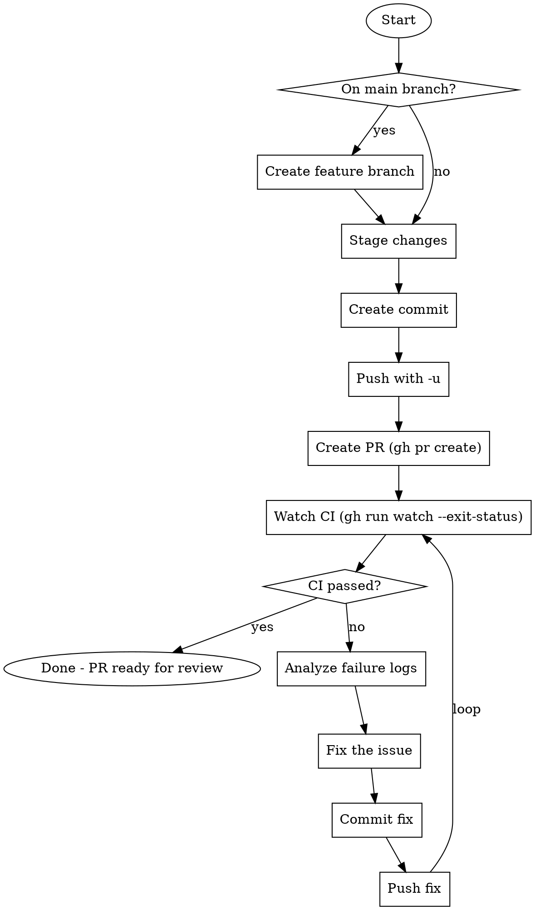

# Commit, Push, PR with CI Watch

Create commit, push branch, open PR, then watch CI. If CI fails, fix-push-watch in a loop until green.

## Workflow



## Steps

### 1. Branch Check

```bash
CURRENT_BRANCH=$(git branch --show-current)
if [ "$CURRENT_BRANCH" = "main" ]; then
    # Create descriptive branch from changes
    git checkout -b <branch-name>
fi
```

### 2. Stage & Commit

```bash
git add <specific-files>  # Prefer specific files over -A
git commit -m "<type>(<scope>): <description>"
```

Follow conventional commits. Commit message must be lowercase.

### 3. Push & Create PR

```bash
git push -u origin $(git branch --show-current)
gh pr create --title "<title>" --body "<body>"
```

PR body should include:

- Summary section with bullet points
- Test plan with checkboxes

### 4. Watch CI (Critical)

```bash
gh run watch --exit-status
```

**MUST wait for CI to complete.** The `--exit-status` flag returns non-zero if CI fails.

### 5. Fix-Push-Watch Loop

If CI fails:

1. **Get failure logs**: `gh run view --log-failed`
2. **Analyze root cause**: Read the error, understand the issue
3. **Fix the issue**: Make necessary code changes
4. **Commit the fix**: `git commit -m "fix(<scope>): <what was fixed>"`
5. **Push**: `git push`
6. **Watch again**: `gh run watch --exit-status`
7. **Repeat** until CI passes

## Red Flags - STOP

- Don't claim "PR created" without watching CI
- Don't abandon after first CI failure
- Don't push broken code hoping "CI will pass this time"
- Don't skip the watch step "to save time"

## Quick Reference

| Command                      | Purpose                   |
| ---------------------------- | ------------------------- |
| `gh run watch --exit-status` | Watch CI, exit 1 if fails |
| `gh run view --log-failed`   | Get failure logs          |
| `gh run list`                | List recent runs          |
| `gh pr view --web`           | Open PR in browser        |

## Example

```bash
# Stage and commit
git add src/feature.ts tests/feature.test.ts
git commit -m "feat(cli): add new command"

# Push and create PR
git push -u origin feat/new-command
gh pr create --title "feat(cli): add new command" --body "..."

# Watch CI
gh run watch --exit-status
# If fails, fix and repeat
```
