# Post-Merge Cleanup

Switch to main, pull latest changes, and delete the local feature branch.

## Workflow

```dot
digraph merged_flow {
    rankdir=LR;
    node [shape=box];

    start [label="Start" shape=ellipse];
    get_branch [label="Get current branch name"];
    checkout_main [label="git checkout main"];
    pull [label="git pull"];
    delete_branch [label="git branch -d <branch>"];
    done [label="Done" shape=ellipse];

    start -> get_branch;
    get_branch -> checkout_main;
    checkout_main -> pull;
    pull -> delete_branch;
    delete_branch -> done;
}
```



## Steps

### 1. Get Current Branch

```bash
CURRENT_BRANCH=$(git branch --show-current)
```

If already on main, skip cleanup.

### 2. Switch to Main and Pull

```bash
git checkout main
git pull
```

### 3. Delete Local Branch

```bash
git branch -d $CURRENT_BRANCH
```

Use `-d` (safe delete) which only deletes if branch is merged. If it fails, the branch wasn't merged - warn the user.

## Quick Reference

| Command                         | Purpose                         |
| ------------------------------- | ------------------------------- |
| `git branch --show-current`     | Get current branch name         |
| `git checkout main && git pull` | Switch to main and update       |
| `git branch -d <branch>`        | Delete merged branch (safe)     |
| `git branch -D <branch>`        | Force delete (use with caution) |

## Example

```bash
# On feature branch after PR merged
BRANCH=$(git branch --show-current)
git checkout main && git pull && git branch -d $BRANCH
```
