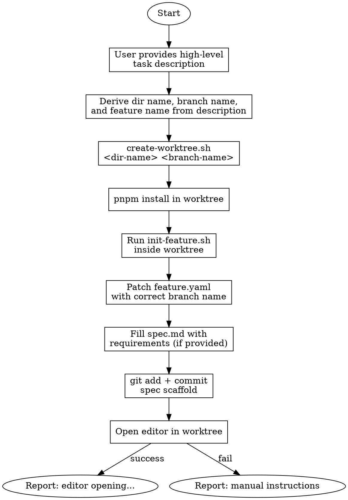

# Parallel Task via Git Worktree

Create an isolated worktree in `.worktrees/` branched from up-to-date main, with spec directory scaffolded.

## When to Use

- Working on an independent task that doesn't block or depend on current work
- Need isolation from the current branch's in-progress changes
- Running long builds/tests while continuing other work

## Workflow



## Steps

### 1. Get Task Description

The user provides a high-level description of what the parallel task is about.

Examples:

- "fix the version display bug in settings"
- "add retry logic to the agent HTTP calls"
- "refactor DI container registration"

### 2. Derive Names

From the description, generate:

- **Dir name**: Short kebab-case identifier for the worktree directory (e.g., `fix-version-display`, `add-agent-retry`, `refactor-di-container`)
- **Branch name**: Conventional branch name using the project's prefix conventions (e.g., `fix/version-display`, `feat/agent-retry`, `refactor/di-container`)
- **Feature name**: Kebab-case name for the spec directory (same as dir name or adjusted)

Use the appropriate prefix: `feat/`, `fix/`, `refactor/`, `chore/`, `docs/` etc.

### 3. Create Worktree

```bash
.claude/skills/shep-kit:parallel-task/scripts/create-worktree.sh "<dir-name>" "<branch-name>"
```

The script fetches latest main and creates the worktree at `.worktrees/<dir-name>` with branch `<branch-name>` based on `origin/main`.

### 4. Install Dependencies

```bash
cd .worktrees/<dir-name> && pnpm install
```

### 5. Initialize Spec Directory

Determine the next spec number and run the existing init script **inside the worktree**:

```bash
cd .worktrees/<dir-name>

# Determine next spec number
NEXT_NUM=$(ls -d specs/[0-9][0-9][0-9]-* 2>/dev/null | wc -l | xargs -I{} printf "%03d" $(({} + 1)))
[ -z "$NEXT_NUM" ] && NEXT_NUM="001"

# Run init-feature.sh (reuses shep-kit:new-feature templates)
.claude/skills/shep-kit:new-feature/scripts/init-feature.sh "$NEXT_NUM" "<feature-name>"
```

### 6. Patch feature.yaml

The init script sets `branch: feat/NNN-feature-name` but our actual branch is different. Fix it:

```bash
# Update branch name in feature.yaml to match the actual worktree branch
sed -i "s|branch: 'feat/.*'|branch: '<branch-name>'|" specs/NNN-feature-name/feature.yaml
```

### 7. Fill spec.md (if requirements provided)

If the user provided a description with enough context, fill in spec.md:

- Problem statement (from user description)
- Success criteria (inferred from scope)
- Affected areas (from codebase analysis)
- Size estimate with reasoning

Otherwise leave the template placeholders for manual filling.

### 8. Commit Spec Scaffold

```bash
cd .worktrees/<dir-name>
git add specs/
git commit -m "feat(specs): add NNN-feature-name specification"
```

### 9. Open Editor & Hand Off (STOP HERE)

**CRITICAL: Do NOT start implementation. Do NOT run `/shep-kit:research`, `/shep-kit:plan`, or `/shep-kit:implement`.**

**Auto-open editor:** Detect the current execution context from `$TERM_PROGRAM` and open the worktree with the matching editor:

- If `$TERM_PROGRAM` is `vscode` → use `code`
- If `$TERM_PROGRAM` is `cursor` → use `cursor`
- Otherwise → try `code`, then fall back to `cursor`

```bash
if [ "$TERM_PROGRAM" = "vscode" ]; then
  code .worktrees/<dir-name>
elif [ "$TERM_PROGRAM" = "cursor" ]; then
  cursor .worktrees/<dir-name>
else
  code .worktrees/<dir-name> || cursor .worktrees/<dir-name>
fi
```

**If the command succeeds**, print:

---

**Worktree is ready! Opening in editor...**

| Detail   | Value                                    |
| -------- | ---------------------------------------- |
| Worktree | `.worktrees/<dir-name>`                  |
| Branch   | `<branch-name>` (based on `origin/main`) |
| Spec     | `specs/NNN-feature-name/`                |

A new editor window should be opening. Once it's loaded, open the AI agent panel and continue with `/shep-kit:research`.

> Working inside the worktree keeps your current session free and gives
> the new session its own full context for the feature.

---

**If both commands fail** (not installed, not in PATH, etc.), fall back to printing manual instructions:

---

**Worktree is ready!**

| Detail   | Value                                    |
| -------- | ---------------------------------------- |
| Worktree | `.worktrees/<dir-name>`                  |
| Branch   | `<branch-name>` (based on `origin/main`) |
| Spec     | `specs/NNN-feature-name/`                |

Could not auto-open an editor. Open it manually:

**Option A — Editor** (recommended)

1. Open a **new editor window** (Cursor, VS Code, etc.)
2. `File → Open Folder…` → select `.worktrees/<dir-name>`
3. Open the AI agent panel and continue with `/shep-kit:research`

**Option B — Terminal**

```bash
cd .worktrees/<dir-name>
claude
# then run /shep-kit:research
```

> Working inside the worktree keeps your current session free and gives
> the new session its own full context for the feature.

---

**After printing the above message, STOP. Do not take any further action.**

## Cleanup

When done with a parallel task:

```bash
# Remove the worktree
git worktree remove .worktrees/<dir-name>

# Delete the branch (if merged or no longer needed)
git branch -d <branch-name>

# Or prune stale worktree entries
git worktree prune
```

## Quick Reference

| Command                                           | Purpose                   |
| ------------------------------------------------- | ------------------------- |
| `git worktree add <path> -b <branch> origin/main` | Create worktree from main |
| `git worktree list`                               | List all worktrees        |
| `git worktree remove .worktrees/<name>`           | Remove a worktree         |
| `git worktree prune`                              | Clean up stale entries    |
| `git branch -d <branch>`                          | Delete merged branch      |

## Common Mistakes

### Forgetting to install dependencies

- **Problem:** Worktree shares git objects but not `node_modules`
- **Fix:** Always run `pnpm install` in new worktree

### Not cleaning up worktrees

- **Problem:** Stale worktrees accumulate in `.worktrees/`
- **Fix:** Remove worktree + delete branch when task is done

### Branch name collisions

- **Problem:** Reusing a branch name that already exists
- **Fix:** Script checks for existing branch and appends timestamp if needed

### Wrong branch in feature.yaml

- **Problem:** `init-feature.sh` sets `branch: feat/NNN-name` but worktree uses a different branch
- **Fix:** Always patch `feature.yaml` after running init script (step 6)
