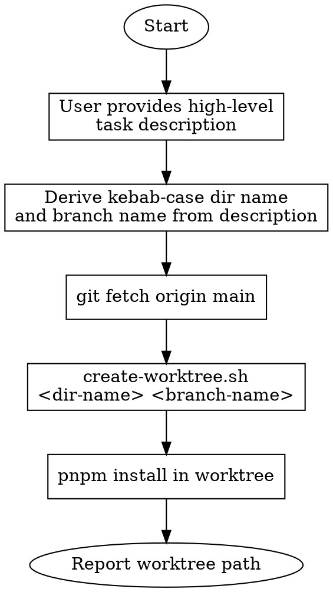

# Parallel Task via Git Worktree

Create an isolated worktree in `.worktrees/` branched from up-to-date main for parallel development.

## When to Use

- Working on an independent task that doesn't block or depend on current work
- Need isolation from the current branch's in-progress changes
- Running long builds/tests while continuing other work

## Workflow



## Steps

### 1. Get Task Description

The user provides a high-level description of what the parallel task is about.

Examples:

- "fix the version display bug in settings"
- "add retry logic to the agent HTTP calls"
- "refactor DI container registration"

### 2. Derive Names

From the description, generate:

- **Dir name**: Short kebab-case identifier for the worktree directory (e.g., `fix-version-display`, `add-agent-retry`, `refactor-di-container`)
- **Branch name**: Conventional branch name using the project's prefix conventions (e.g., `fix/version-display`, `feat/agent-retry`, `refactor/di-container`)

Use the appropriate prefix: `feat/`, `fix/`, `refactor/`, `chore/`, `docs/` etc.

### 3. Fetch Latest Main

```bash
git fetch origin main
```

### 4. Create Worktree

```bash
.claude/skills/shep-kit:parallel-task/scripts/create-worktree.sh "<dir-name>" "<branch-name>"
```

The script creates the worktree at `.worktrees/<dir-name>` with branch `<branch-name>` based on `origin/main`.

### 5. Install Dependencies

```bash
cd .worktrees/<dir-name> && pnpm install
```

### 6. Report

```
Worktree ready at .worktrees/<dir-name>
Branch: <branch-name> (from origin/main)
```

## Cleanup

When done with a parallel task:

```bash
# Remove the worktree
git worktree remove .worktrees/<dir-name>

# Delete the branch (if merged or no longer needed)
git branch -d <branch-name>

# Or prune stale worktree entries
git worktree prune
```

## Quick Reference

| Command                                           | Purpose                   |
| ------------------------------------------------- | ------------------------- |
| `git worktree add <path> -b <branch> origin/main` | Create worktree from main |
| `git worktree list`                               | List all worktrees        |
| `git worktree remove .worktrees/<name>`           | Remove a worktree         |
| `git worktree prune`                              | Clean up stale entries    |
| `git branch -d <branch>`                          | Delete merged branch      |

## Common Mistakes

### Forgetting to install dependencies

- **Problem:** Worktree shares git objects but not `node_modules`
- **Fix:** Always run `pnpm install` in new worktree

### Not cleaning up worktrees

- **Problem:** Stale worktrees accumulate in `.worktrees/`
- **Fix:** Remove worktree + delete branch when task is done

### Branch name collisions

- **Problem:** Reusing a branch name that already exists
- **Fix:** Script checks for existing branch and appends timestamp if needed
