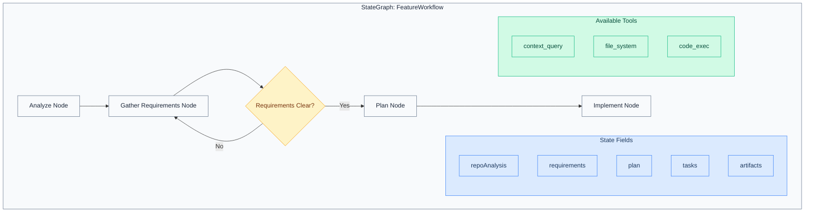

# AGENTS.md

> **Implementation Status**
>
> The **FeatureAgent LangGraph graph** is implemented with background execution support. Each agent graph lives in its own subdirectory under `src/infrastructure/services/agents/` with separated state, nodes, and graph factory files. The full multi-agent supervisor pattern described later in this document remains **planned architecture**.
>
> The agent system also handles **configuration of external AI coding tools** (Claude Code, Gemini CLI, Aider, Continue, Cursor) via the `shep settings agent` command. See [Current Implementation](#current-implementation) below.

## Current Implementation

The agent system provides three capabilities:

1. **FeatureAgent Graph** — A LangGraph StateGraph implementing the SDLC workflow (see [FeatureAgent Graph](#featureagent-graph) below)
2. **Analyze Repository Graph** — Single-node graph for repository analysis
3. **External Agent Configuration** — Configuration and validation of external AI coding tools

### Directory Structure

```
src/infrastructure/services/agents/
├── common/                              # Shared agent infrastructure
│   ├── agent-executor-factory.service.ts
│   ├── agent-registry.service.ts
│   ├── agent-runner.service.ts
│   ├── agent-validator.service.ts
│   ├── checkpointer.ts
│   └── executors/
│       └── claude-code-executor.service.ts
├── analyze-repo/                        # Repository analysis graph
│   ├── analyze-repository-graph.ts
│   └── prompts/
│       └── analyze-repository.prompt.ts
├── feature-agent/                       # Feature SDLC workflow graph
│   ├── state.ts                         # FeatureAgentAnnotation + type
│   ├── nodes/                           # One file per graph node
│   │   ├── analyze.node.ts
│   │   ├── requirements.node.ts
│   │   ├── research.node.ts
│   │   ├── plan.node.ts
│   │   └── implement.node.ts
│   ├── feature-agent-graph.ts           # Graph factory (wires nodes)
│   ├── feature-agent-process.service.ts # Background process management
│   └── feature-agent-worker.ts          # Detached worker entry point
└── streaming/                           # SSE streaming infrastructure
    ├── event-channel.ts
    ├── streaming-executor-proxy.ts
    └── index.ts
```

### What Exists Today

| Component                    | Location                                                                            | Purpose                                                                                   |
| ---------------------------- | ----------------------------------------------------------------------------------- | ----------------------------------------------------------------------------------------- |
| `AgentType` enum             | `src/domain/generated/output.ts`                                                    | Defines supported agent tools: `claude-code`, `gemini-cli`, `aider`, `continue`, `cursor` |
| `AgentAuthMethod` enum       | `src/domain/generated/output.ts`                                                    | Authentication methods: `session`, `token`                                                |
| `IAgentValidator`            | `src/application/ports/output/agent-validator.interface.ts`                         | Port interface for checking agent binary availability                                     |
| `AgentValidatorService`      | `src/infrastructure/services/agents/common/agent-validator.service.ts`              | Checks if agent binaries (e.g., `claude`) exist on the system via `--version`             |
| `AgentRunnerService`         | `src/infrastructure/services/agents/common/agent-runner.service.ts`                 | Orchestrates graph execution with streaming support                                       |
| `FeatureAgentProcessService` | `src/infrastructure/services/agents/feature-agent/feature-agent-process.service.ts` | Spawns/manages background worker processes via fork()                                     |
| `ConfigureAgentUseCase`      | `src/application/use-cases/agents/configure-agent.use-case.ts`                      | Validates agent availability, then persists agent config to settings                      |
| `ValidateAgentAuthUseCase`   | `src/application/use-cases/agents/validate-agent-auth.use-case.ts`                  | Delegates to `IAgentValidator` to check binary availability                               |
| `createAgentCommand()`       | `src/presentation/cli/commands/settings/agent.command.ts`                           | CLI command: `shep settings agent` (interactive wizard or `--agent`/`--auth` flags)       |
| `agentConfigWizard()`        | `src/presentation/tui/wizards/agent-config.wizard.ts`                               | Interactive TUI for selecting agent type and auth method                                  |
| `createAgentSelectConfig()`  | `src/presentation/tui/prompts/agent-select.prompt.ts`                               | Prompt choices (only Claude Code enabled; others show "Coming Soon")                      |

### Current Flow

```
User runs `shep settings agent`
  → Interactive wizard (or CLI flags)
  → Select agent type (Claude Code only currently enabled)
  → Select auth method (session or token)
  → AgentValidatorService checks binary availability (`claude --version`)
  → ConfigureAgentUseCase persists to Settings
```

### Supported Agents

| Agent       | Enum Value    | Status      |
| ----------- | ------------- | ----------- |
| Claude Code | `claude-code` | Available   |
| Gemini CLI  | `gemini-cli`  | Coming Soon |
| Aider       | `aider`       | Coming Soon |
| Continue    | `continue`    | Coming Soon |
| Cursor      | `cursor`      | Coming Soon |

### FeatureAgent Graph

**Location:** `src/infrastructure/services/agents/feature-agent/`

The FeatureAgent is a LangGraph `StateGraph` implementing a linear SDLC workflow. Each node is in its own file under `nodes/` for maintainability.

#### State Schema (`FeatureAgentAnnotation`)

**File:** `feature-agent/state.ts`

```typescript
FeatureAgentAnnotation = Annotation.Root({
  featureId: Annotation<string>, // UUID of the feature
  repositoryPath: Annotation<string>, // Path to the git repository
  specDir: Annotation<string>, // Path to the spec directory
  currentNode: Annotation<string>, // Currently executing node name
  error: Annotation<string | null>, // Error message (null = no error)
  messages: Annotation<string[]>, // Accumulated log messages (reducer: append)
});
```

The `messages` channel uses a reducer to accumulate messages from all nodes. The `error` channel preserves the previous value when `undefined` is returned.

#### Graph Nodes

Each node is a separate file in `feature-agent/nodes/`:

| Node           | File                   | Purpose                                     | Reads           |
| -------------- | ---------------------- | ------------------------------------------- | --------------- |
| `analyze`      | `analyze.node.ts`      | Confirms spec.yaml exists and is readable   | `spec.yaml`     |
| `requirements` | `requirements.node.ts` | Analyzes spec for success criteria presence | `spec.yaml`     |
| `research`     | `research.node.ts`     | Checks whether research.yaml exists         | `research.yaml` |
| `plan`         | `plan.node.ts`         | Checks whether plan.yaml exists             | `plan.yaml`     |
| `implement`    | `implement.node.ts`    | Checks whether tasks.yaml exists            | `tasks.yaml`    |

#### Graph Flow

```
START → analyze → requirements → research → plan → implement → END
```

Linear flow — each node executes sequentially. Future iterations may add conditional edges (e.g., looping back from requirements if criteria are missing).

#### Factory Function

**File:** `feature-agent/feature-agent-graph.ts`

```typescript
createFeatureAgentGraph(checkpointer?: BaseCheckpointSaver): CompiledStateGraph
```

Accepts an optional `BaseCheckpointSaver` for state persistence across invocations. The DI container registers a `:memory:` SQLite checkpointer by default.

#### Background Execution

The feature agent runs as a detached background process:

- **Worker:** `feature-agent/feature-agent-worker.ts` — Entry point for `child_process.fork()`, initializes DI, runs graph, handles SIGTERM
- **Process Service:** `feature-agent/feature-agent-process.service.ts` — `spawn()`, `isAlive()`, `checkAndMarkCrashed()` for process lifecycle management

#### Error Handling

Each node wraps its logic in try/catch. On error, the node sets the `error` state field and appends an error message to `messages`. The graph continues execution — downstream nodes can inspect the `error` field to decide behavior.

---

## Planned Architecture (Not Yet Implemented)

The sections below describe the **target architecture** for the full autonomous LangGraph-based multi-agent system with LLM integration, tools, and supervisor pattern. This serves as architectural planning documentation for future implementation.

---

Agent system architecture for Shep AI CLI, powered by **LangGraph** (LangChain).

## Overview

Shep will use a **LangGraph-based** multi-agent system implemented in TypeScript. Agents will be specialized nodes in a StateGraph that collaborate to complete SDLC tasks. The graph-based architecture will provide type-safe workflows, durable execution, and human-in-the-loop capabilities.

## Spec-Driven Agent Workflow

Before agents execute, features must have specifications. See [Spec-Driven Workflow](./docs/development/spec-driven-workflow.md).

```
specs/NNN-feature-name/
├── spec.md         ──→ Feeds into Requirements Node
├── research.md     ──→ Informs Plan Node decisions
├── plan.md         ──→ Structures task execution
└── tasks.md        ──→ Drives Implementation Node
```

The agent system reads spec files to understand context, requirements, and technical decisions before executing.

## Technology Stack

| Component     | Technology                                                                 | Purpose                        |
| ------------- | -------------------------------------------------------------------------- | ------------------------------ |
| Orchestration | [@langchain/langgraph](https://www.npmjs.com/package/@langchain/langgraph) | StateGraph workflow management |
| Core          | [@langchain/core](https://www.npmjs.com/package/@langchain/core)           | Tools, messages, prompts       |
| LLM           | [@langchain/anthropic](https://www.npmjs.com/package/@langchain/anthropic) | Claude integration             |
| Validation    | [zod](https://www.npmjs.com/package/zod)                                   | Schema validation for tools    |

## Agent Architecture



## LangGraph Concepts

| Concept        | Description                                               |
| -------------- | --------------------------------------------------------- |
| **StateGraph** | Core workflow definition with typed state schema          |
| **Node**       | Function that processes state and returns partial updates |
| **Edge**       | Connection between nodes (direct or conditional)          |
| **State**      | Typed object (Annotation) passed through the graph        |
| **Checkpoint** | Persistence point for durable execution                   |
| **Tool**       | External capability agents can invoke                     |
| **Command**    | Directive to route to next node with state update         |

## State Schema

```typescript
// src/infrastructure/agents/langgraph/state.ts

import { Annotation } from '@langchain/langgraph';
import { BaseMessage } from '@langchain/core/messages';

export const FeatureState = Annotation.Root({
  // Context
  repoPath: Annotation<string>,
  repoAnalysis: Annotation<RepoAnalysis | null>,

  // Feature data
  featureId: Annotation<string>,
  featureDescription: Annotation<string>,

  // Workflow outputs
  requirements: Annotation<Requirement[]>({
    reducer: (prev, next) => [...prev, ...next],
    default: () => [],
  }),
  plan: Annotation<Plan | null>,
  tasks: Annotation<Task[]>({
    reducer: (prev, next) => [...prev, ...next],
    default: () => [],
  }),
  artifacts: Annotation<Artifact[]>({
    reducer: (prev, next) => [...prev, ...next],
    default: () => [],
  }),

  // Conversation history
  messages: Annotation<BaseMessage[]>({
    reducer: (prev, next) => [...prev, ...next],
    default: () => [],
  }),

  // Status tracking
  currentPhase: Annotation<SdlcLifecycle>,
  error: Annotation<string | null>,
});
```

## Node Definitions

### Analyze Node

**Purpose:** Analyze repository structure and build context for other nodes.

**Triggers:**

- Initial `shep` or `shep --init` command
- Manual re-analysis request

**Capabilities:**

- Uses `context_query` tool to search codebase
- File system traversal and pattern detection
- Dependency graph construction
- Architecture pattern recognition

**Output:** `repoAnalysis` state field populated

```typescript
// src/infrastructure/agents/langgraph/nodes/analyze.node.ts

export async function analyzeNode(state: FeatureStateType): Promise<Partial<FeatureStateType>> {
  const analysis = await analyzeRepository(state.repoPath);
  return {
    repoAnalysis: analysis,
    currentPhase: SdlcLifecycle.Requirements,
  };
}
```

### Requirements Node

**Purpose:** Gather and refine requirements through conversational interaction.

**Triggers:**

- User initiates new feature
- Conditional loop back for clarification

**Capabilities:**

- Context-aware questioning based on repo analysis
- Option generation and presentation
- Ambiguity detection and resolution
- Requirement validation

**Output:** `requirements[]` state field populated

```typescript
// src/infrastructure/agents/langgraph/nodes/requirements.node.ts

export async function requirementsNode(
  state: FeatureStateType
): Promise<Partial<FeatureStateType>> {
  const response = await model.invoke([
    { role: 'system', content: REQUIREMENTS_PROMPT },
    ...state.messages,
  ]);

  const requirements = extractRequirements(response.content);

  return {
    requirements,
    messages: [response],
    currentPhase: allClear(requirements) ? SdlcLifecycle.Plan : state.currentPhase,
  };
}
```

### Plan Node

**Purpose:** Break down requirements into executable Tasks, ActionItems, and Artifacts.

**Triggers:**

- Requirements phase complete (all requirements clear)

**Capabilities:**

- Task decomposition with dependency analysis
- ActionItem granularity optimization
- Artifact generation (PRD, RFC, Design, TechPlan, Other)
- Dependency graph validation (no cycles)

**Output:** `plan`, `tasks[]`, `artifacts[]` state fields populated

```typescript
// src/infrastructure/agents/langgraph/nodes/plan.node.ts

export async function planNode(state: FeatureStateType): Promise<Partial<FeatureStateType>> {
  const plan = await generatePlan(state.requirements, state.repoAnalysis);
  const artifacts = await generateArtifacts(plan);

  return {
    plan,
    tasks: plan.tasks,
    artifacts,
    currentPhase: SdlcLifecycle.Implementation,
  };
}
```

### Implement Node

**Purpose:** Execute code changes according to the plan.

**Triggers:**

- Planning phase complete

**Capabilities:**

- Code generation and modification
- Test creation following TDD
- Respects task dependency graph
- Progress tracking and reporting

**Output:** Updated `tasks[]` with completion status

```typescript
// src/infrastructure/agents/langgraph/nodes/implement.node.ts

export async function implementNode(state: FeatureStateType): Promise<Partial<FeatureStateType>> {
  const results = await executeTaskGraph(state.tasks);
  return {
    tasks: results.updatedTasks,
    currentPhase: SdlcLifecycle.Test,
  };
}
```

## Graph Construction

```typescript
// src/infrastructure/agents/langgraph/graphs/feature.graph.ts

import { StateGraph, START, END } from '@langchain/langgraph';

export function createFeatureGraph() {
  return (
    new StateGraph(FeatureState)
      .addNode('analyze', analyzeNode)
      .addNode('requirements', requirementsNode)
      .addNode('plan', planNode)
      .addNode('implement', implementNode)

      // Define flow
      .addEdge(START, 'analyze')
      .addEdge('analyze', 'requirements')
      .addConditionalEdges('requirements', (state) => {
        return allRequirementsClear(state) ? 'plan' : 'requirements';
      })
      .addEdge('plan', 'implement')
      .addEdge('implement', END)

      .compile()
  );
}
```

## Custom Tools

Tools provide agents with external capabilities:

### Context Query Tool

Queries the LanceDB vector store for relevant codebase context.

```typescript
import { tool } from '@langchain/core/tools';
import { z } from 'zod';

export const contextQueryTool = tool(
  async ({ query, assetType, limit }) => {
    const results = await vectorStore.searchAssets(await embed(query), {
      filter: assetType ? `type = '${assetType}'` : undefined,
      limit,
    });
    return JSON.stringify(results);
  },
  {
    name: 'context_query',
    description: 'Search codebase knowledge graph for relevant code, components, or docs',
    schema: z.object({
      query: z.string().describe('Natural language query'),
      assetType: z.string().optional().describe('Filter: file|function|class|component|...'),
      limit: z.number().default(10),
    }),
  }
);
```

### File System Tool

Read, write, and list files in the repository.

```typescript
export const fileSystemTool = tool(
  async ({ action, path, content }) => {
    switch (action) {
      case 'read':
        return await readFile(path);
      case 'write':
        await writeFile(path, content!);
        return 'Written';
      case 'list':
        return JSON.stringify(await listDir(path));
    }
  },
  {
    name: 'file_system',
    description: 'Read, write, or list files in the repository',
    schema: z.object({
      action: z.enum(['read', 'write', 'list']),
      path: z.string(),
      content: z.string().optional(),
    }),
  }
);
```

### Code Execution Tool

Execute shell commands for testing and validation.

```typescript
export const codeExecTool = tool(
  async ({ command, cwd }) => {
    const result = await execCommand(command, { cwd });
    return result.stdout + result.stderr;
  },
  {
    name: 'code_exec',
    description: 'Execute shell commands for testing and validation',
    schema: z.object({
      command: z.string(),
      cwd: z.string().optional(),
    }),
  }
);
```

## Multi-Agent Pattern (Supervisor)

For complex orchestration, use a supervisor pattern:

```typescript
// src/infrastructure/agents/langgraph/graphs/supervisor.graph.ts

async function supervisorNode(state: SupervisorStateType) {
  const response = await model.invoke([
    { role: 'system', content: SUPERVISOR_PROMPT },
    ...state.messages,
  ]);

  return new Command({
    goto: parseDecision(response.content).nextAgent,
    update: { messages: [response] },
  });
}

export function createSupervisorGraph() {
  return new StateGraph(SupervisorState)
    .addNode('supervisor', supervisorNode)
    .addNode('analyst', analystAgent)
    .addNode('planner', plannerAgent)
    .addNode('implementer', implementerAgent)
    .addEdge(START, 'supervisor')
    .addConditionalEdges('supervisor', (state) => state.nextAgent)
    .addEdge('analyst', 'supervisor')
    .addEdge('planner', 'supervisor')
    .addEdge('implementer', 'supervisor')
    .compile();
}
```

## Configuration

Global agent settings in `~/.shep/config.json`:

```json
{
  "agents": {
    "llm": {
      "provider": "anthropic",
      "model": "claude-sonnet-4-20250514",
      "temperature": 0.7
    },
    "timeoutMs": 300000,
    "maxRetries": 3,
    "logging": {
      "level": "info",
      "includeMessages": true
    }
  }
}
```

Per-repository overrides in `.shep/agents.json`:

```json
{
  "analyze": {
    "excludePatterns": ["**/generated/**", "**/vendor/**"],
    "maxFileSize": 1048576
  },
  "implement": {
    "requireApproval": true,
    "maxParallelTasks": 2
  }
}
```

## Extending the Agent System

### Adding a New Node to an Existing Graph

1. Create node function in `agents/<graph-name>/nodes/<name>.node.ts`
2. Define input/output state fields matching the graph's state annotation
3. Import and add to graph factory file
4. Connect with edges (direct or conditional)
5. Write tests (TDD)

### Adding a New Tool

1. Create tool in `agents/<graph-name>/tools/`
2. Define Zod schema for parameters
3. Implement execution function
4. Bind to agent model
5. Document in this file

### Creating a New Agent Graph

1. Create subdirectory: `agents/<graph-name>/`
2. Define state schema in `state.ts` using `Annotation.Root`
3. Create node functions in `nodes/` (one file per node)
4. Create graph factory in `<graph-name>-graph.ts` (imports + wires nodes)
5. Register in `agents/common/agent-registry.service.ts`
6. Write tests (TDD)

See [docs/guides/langgraph-agents.md](./docs/guides/langgraph-agents.md) for detailed guide.

---

## Maintaining This Document

**Update when:**

- New nodes are added
- New tools are added
- State schema changes
- Configuration options change
- LangGraph patterns evolve

**Related docs:**

- [docs/architecture/agent-system.md](./docs/architecture/agent-system.md) - Detailed implementation
- [docs/architecture/context-layer.md](./docs/architecture/context-layer.md) - Vector DB integration
- [docs/guides/langgraph-agents.md](./docs/guides/langgraph-agents.md) - Working with agents
- [docs/api/agent-interfaces.md](./docs/api/agent-interfaces.md) - Interface specifications
