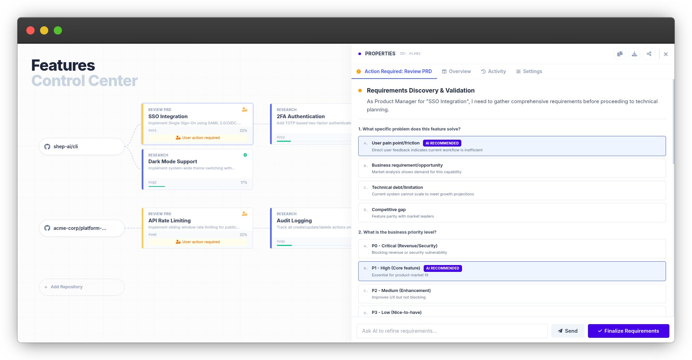
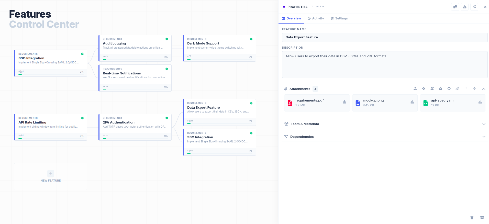
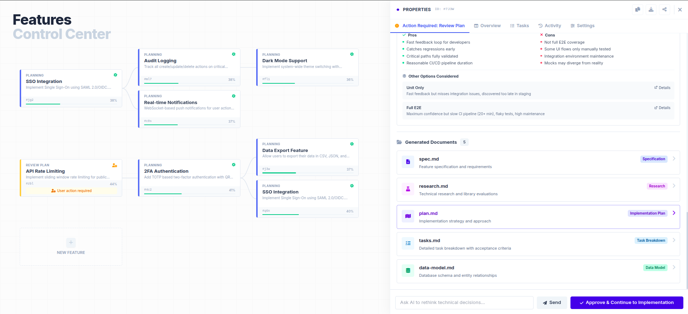
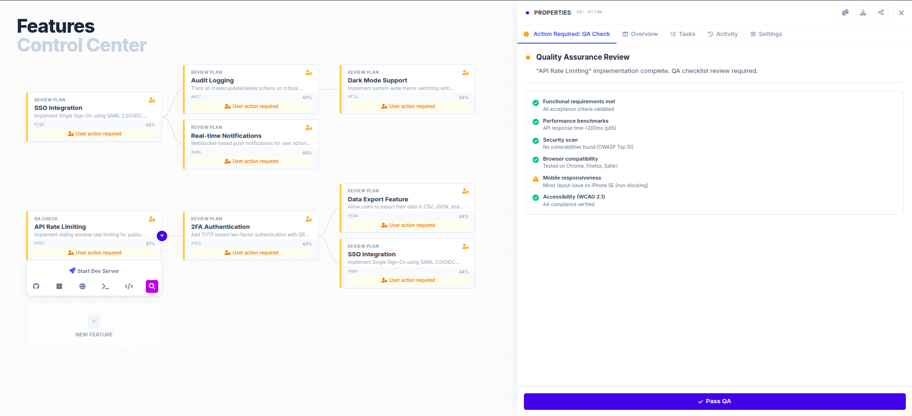
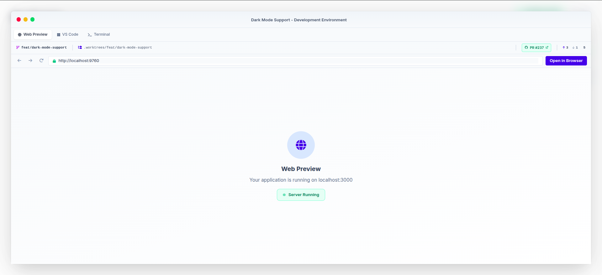
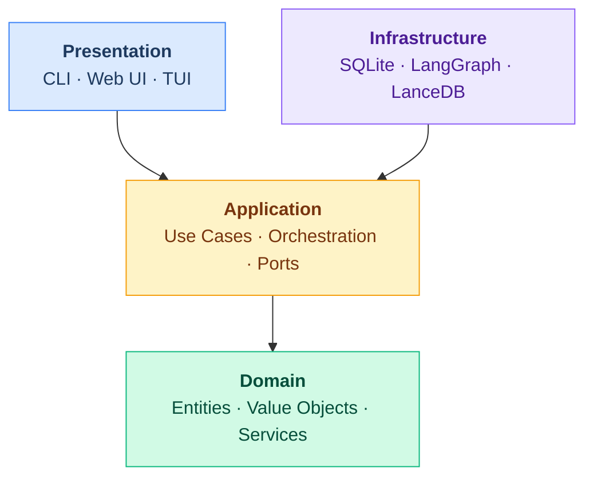

<div align="center">

# Shep AI

### Multi-Session SDLC Control Center for AI Coding Agents

_Manage Claude Code, Cursor CLI, or any coding agent across the full development lifecycle — from requirements to deploy — with parallel sessions, instant context switching, and human-in-the-loop control_

[](https://github.com/shep-ai/cli/actions/workflows/ci.yml)
[](https://www.npmjs.com/package/@shepai/cli)
[](https://opensource.org/licenses/MIT)
[](https://www.typescriptlang.org/)
[](https://nodejs.org/)
[](https://pnpm.io/)
[](https://github.com/shep-ai/cli/pulls)
[](https://conventionalcommits.org)

<br />

[Features](#features) · [Quick Start](#quick-start) · [CLI Reference](#cli) · [Architecture](#architecture) · [Contributing](#contributing)

<br />



<br />

</div>

---

Running AI agents is easy. **Managing many of them through a full SDLC is the hard part.** Shep gives you a control center that handles the entire lifecycle — requirements gathering, planning, implementation, QA, and deployment — across multiple agent sessions running in parallel. See what each agent is doing, jump into any session's web preview, code editor, or terminal, approve plans when agents need your input, and let them keep working while you move on. Plug in Claude Code, Cursor CLI, Gemini CLI, or any coding agent. Each feature gets its own isolated worktree and dev environment. You manage the lifecycle, agents do the work.

```bash
npm i -g @shepai/cli
cd your-repo/
shep feat new "Implement SSO with SAML 2.0"
# Agent starts working in a dedicated worktree.
# Open the control center to watch progress, intervene, or switch context.
shep ui
```

---

## Features

<table>
<tr>
<td width="55%"></td>
<td width="45%">

### Feature Properties & Attachments

- **Rich feature detail panel** with name, description, and metadata
- **File attachments** — requirements PDFs, mockup images, API specs linked directly to features
- **Team & metadata** tracking for ownership and collaboration
- **Dependency mapping** between features across repos
- **Iterative refinement** — update properties as requirements evolve through the lifecycle

</td>
</tr>

<tr>
<td width="55%"></td>
<td width="45%">

### Feature Cards with Quick Actions

- **One-click dev server** launch directly from any card
- **Action toolbar** — GitHub, web preview, terminal, code editor at your fingertips
- **Live progress** tracking with percentage and lifecycle stage badge
- **Unique IDs** for instant cross-referencing across CLI and UI

</td>
</tr>

<tr>
<td width="55%"></td>
<td width="45%">

### AI-Guided Requirements Discovery

- **Smart questionnaires** that surface the right questions for your feature
- **Categorized inputs** — business, technical, and UX problem classification
- **Priority tiers** (P1–P3) with clear impact descriptions
- **Domain tagging** to scope the affected areas of your codebase
- **Human breakpoint** — agent pauses here until you finalize

</td>
</tr>

<tr>
<td width="55%"></td>
<td width="45%">

### Technical Plan Review

- **AI-generated implementation plans** with full architecture rationale
- **Technical decision cards** — see the chosen approach and alternatives side-by-side
- **Architecture pattern selection** (microservices, monolith, serverless) with trade-off analysis
- **Approve & continue** or send back for revision — you control the direction

</td>
</tr>

<tr>
<td width="55%"></td>
<td width="45%">

### Tasks & Generated Artifacts

- **Auto-generated documents** — plan.md, tasks.md, data_model.md created from your approved spec
- **Task breakdown** with dependency tracking and status badges
- **Artifact browser** — inspect any generated document directly in the panel
- **Draft indicator** — nothing ships until you explicitly approve

</td>
</tr>

<tr>
<td width="55%"></td>
<td width="45%">

### Quality Assurance Gate

- **Automated QA checklist** — functional, performance, compatibility, accessibility
- **Performance benchmarks** — API response time p95 thresholds
- **WCAG 2.5** accessibility compliance verification
- **One-click Pass QA** when all checks are green

</td>
</tr>

<tr>
<td width="55%"></td>
<td width="45%">

### Integrated Dev Environment — Web Preview

- **Live localhost preview** embedded in the control center
- **Isolated ports** — each feature runs its own dev server
- **Server status** indicator with start/stop controls
- **Open in Browser** for full-screen testing
- **PR context** — branch, worktree path, and PR link always visible

</td>
</tr>

<tr>
<td width="55%"></td>
<td width="45%">

### Integrated Dev Environment — Code Editor

- **Embedded VS Code** with full editor capabilities
- **Git worktree isolation** — each feature in its own directory, no branch conflicts
- **File explorer** with project structure at a glance
- **PR badge** with commits ahead/behind and changed file count
- **Zero context-switch** — edit code without leaving the control center

</td>
</tr>

<tr>
<td width="55%"></td>
<td width="45%">

### Integrated Dev Environment — Terminal

- **Full terminal access** inside the feature workspace
- **Build output, test results, agent logs** in one place
- **Pre-configured** in the feature's worktree directory
- **Dev server output** — see Next.js/Vite/Express startup and compile times
- **Three-tab workflow** — preview, code, and terminal without leaving the UI

</td>
</tr>
</table>

---

## Quick Start

```bash
# Install
npm i -g @shepai/cli

# Start the background service
shep start
#  ➜  Local:   http://localhost:5173/
#  Shep service is running in background, have fun!

# Navigate to any repo
cd ~/repos/your-project

# Create your first feature
shep feat new "Add user authentication with OAuth 2.0"

# Open the control center
shep ui
```

## CLI

```
shep start                            Start background service
shep feat new <description>           Create a new feature
shep feat new --interactive           Interactive mode with human checkpoints
shep feat new --allow-all             Full autonomous mode
shep feat ls                          List features across repos
shep feat show <id>                   Show feature details
shep feat preview <id>                Preview feature dev environment
shep ui                               Open the web control center
shep settings show                    Display current configuration
shep settings agent                   Configure AI coding agent
shep mem add <text> --global|--repo   Add agent memory
shep mem ls                           List memories
shep version                          Version info
```

## Architecture

Clean Architecture with four layers. Dependencies point inward — domain has zero external deps.



### Feature Lifecycle

Every feature progresses through a structured SDLC pipeline:

```
Requirements → Research → Review PRD → Planning → Review Plan → Implementation → QA → Approval → Live
     ↑              ↑           ↑            ↑           ↑             ↑          ↑        ↑
   Agent         Agent       Human        Agent       Human        Agent      Human    Human
                           breakpoint                breakpoint               check    gate
```

Breakpoints are configurable. In `--allow-all` mode, the agent handles everything autonomously.

### Tech Stack

| Component       | Technology                                                                              |
| --------------- | --------------------------------------------------------------------------------------- |
| Language        | TypeScript                                                                              |
| Package Manager | pnpm                                                                                    |
| CLI Framework   | Commander                                                                               |
| TUI Framework   | [@inquirer/prompts](https://github.com/SBoudrias/Inquirer.js)                           |
| Web UI          | Next.js 16 + React 19 + shadcn/ui ([@shepai/web](./src/presentation/web/))              |
| Design System   | Storybook                                                                               |
| Build Tool      | tsc + tsc-alias (prod), Vite (dev)                                                      |
| Database        | SQLite                                                                                  |
| Agent System    | [LangGraph](https://www.langchain.com/langgraph) (`@langchain/langgraph`)               |
| Vector DB       | [LanceDB](https://lancedb.com/) (file-based)                                            |
| Embeddings      | [Transformers.js](https://huggingface.co/docs/transformers.js) (local, multiple models) |
| Testing         | Vitest (unit/integration) + Playwright (e2e)                                            |
| Methodology     | TDD (Red-Green-Refactor)                                                                |

### Data Model

```
Repository ──┬── Feature ──┬── Plan ──┬── Task ──── ActionItem
             │             │          └── Artifact
             │             └── Requirement ── Research
             └── Analysis docs (cached)
```

All data lives locally in `~/.shep/`. Per-repo SQLite databases. No cloud dependency.

## Documentation

| Document                                           | Description                           |
| -------------------------------------------------- | ------------------------------------- |
| [CLAUDE.md](./CLAUDE.md)                           | Guidance for Claude Code instances    |
| [AGENTS.md](./AGENTS.md)                           | Agent system architecture             |
| [CONTRIBUTING-AGENTS.md](./CONTRIBUTING-AGENTS.md) | AI agent contribution guidelines      |
| [Architecture](./docs/architecture/)               | System design and patterns            |
| [Concepts](./docs/concepts/)                       | Core domain concepts                  |
| [UI](./docs/ui/)                                   | Web UI architecture and design system |
| [Guides](./docs/guides/)                           | User guides and tutorials             |
| [Development](./docs/development/)                 | Contributing and development setup    |
| [API Reference](./docs/api/)                       | Interface and model documentation     |
| [POC: Feature Flow](./docs/poc/)                   | Interactive feature lifecycle demo    |

## Contributing

We welcome contributions from humans and AI agents alike.

- **Humans**: See [CONTRIBUTING.md](./CONTRIBUTING.md)
- **AI Agents**: See [CONTRIBUTING-AGENTS.md](./CONTRIBUTING-AGENTS.md)
- **Spec-driven workflow**: All features start with `/shep-kit:new-feature` — see [Spec-Driven Workflow](./docs/development/spec-driven-workflow.md)

## License

MIT — see [LICENSE](./LICENSE).
