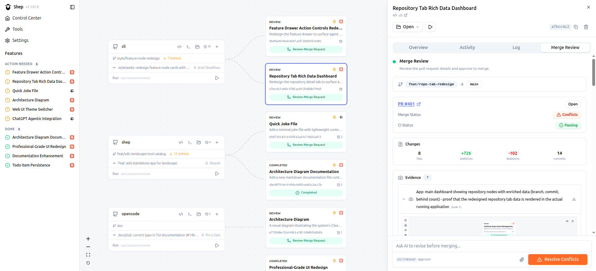
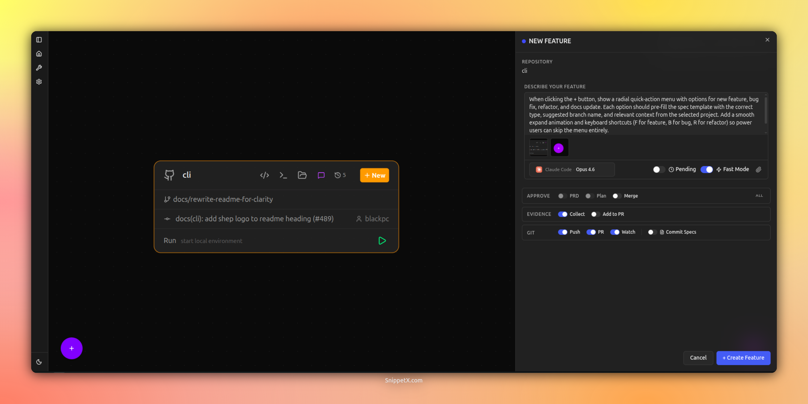
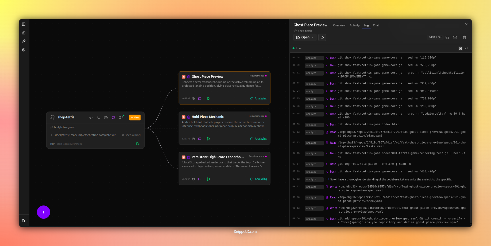
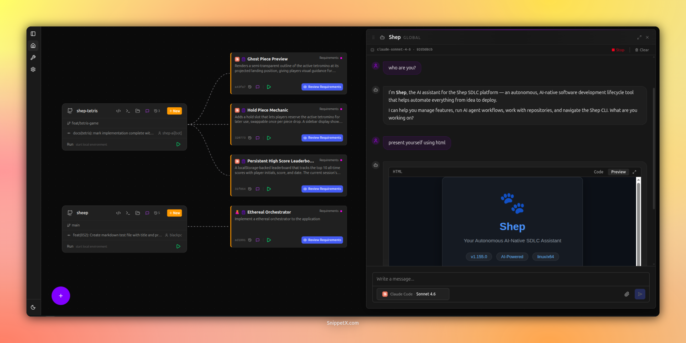

<div align="center">

<h1>
  <picture>
    <source media="(prefers-color-scheme: dark)" srcset="src/presentation/web/public/favicon-light.svg">
    <source media="(prefers-color-scheme: light)" srcset="src/presentation/web/public/favicon-dark.svg">
    
  </picture>
  Shep
</h1>

### Run multiple AI agents in parallel. Each in its own worktree.

_Manage 10 features at once — isolated branches, automatic commits, CI watching, and PRs — from a dashboard or the terminal._

[](https://github.com/shep-ai/shep/actions/workflows/ci.yml)
[](https://www.npmjs.com/package/@shepai/cli)
[](https://opensource.org/licenses/MIT)

[Quick Start](#quick-start) · [How It Works](#how-it-works) · [Features](#features) · [Trust & Safety](#trust--safety) · [FAQ](#faq)

<br />



</div>

---

## Why Shep?

You're already using AI coding agents. The problem isn't the coding — it's everything around it.

Switching branches. Stashing changes. Watching CI. Assembling PRs. Losing context when you juggle three things at once. One agent session is fine. Five is chaos.

**Shep gives each feature its own isolated world** — a git worktree, a branch, an agent session — and handles the boring parts: committing, pushing, opening PRs, watching CI, and fixing failures. You manage it all from one dashboard or the CLI.

```bash
shep feat new "add stripe payments" --push --pr
shep feat new "add dark mode toggle" --push --pr
shep feat new "fix login redirect bug" --push --pr
# Three agents running in parallel. Zero branch conflicts. You monitor from one place.
```

---

## Quick Start

### Prerequisites

- **Node.js 22+** and **npm** (or install via `nvm`)
- **Git** and **GitHub CLI** (`gh`) — [install guide](https://cli.github.com/)
- **An AI coding agent**, authenticated and ready:
  - **Claude Code**: `claude` · **Cursor CLI**: `cursor` · **Gemini CLI**: `gemini`
  - If prompted to log in, complete auth first — Shep can't authenticate on your behalf.

> **Sandbox mode note:** Some agents restrict network access by default. If operations like `npm install` fail, configure allowed hosts in your agent's settings or disable sandbox for Shep features. See [Agent Permissions](#agent-permissions).

### Install and run

```bash
# Try it instantly — no install needed
npx @shepai/cli

# Or install globally
npm i -g @shepai/cli

# Start Shep — opens the web dashboard at localhost:4050
shep
```

### Your first feature

```bash
cd ~/projects/my-app        # Any git repo. Shep uses the repo you're in.
shep feat new "add a /health endpoint that returns uptime and version" --push --pr

# Shep creates a worktree, runs your agent, commits, pushes, and opens a PR.
```

Not in a git repo? Shep initializes one for you — `git init`, creates a branch, and starts working.

Or use the dashboard — describe what you need, configure automation, and hit create:

<div align="center">

</div>

### Go parallel

```bash
shep feat new "add stripe payments" --push --pr
shep feat new "add dark mode toggle" --push --pr
shep feat new "refactor auth middleware" --push --pr
# All three run simultaneously in the same repo. Each in its own worktree.
```

Launch from CLI or dashboard — monitor everything in one place. Open any feature in your IDE, terminal, or file manager with one click:

<div align="center">

</div>

Or work across multiple repos:

```bash
shep feat new "add payments" --repo ~/projects/backend --push --pr
shep feat new "add checkout UI" --repo ~/projects/frontend --push --pr
```

Manage multiple repos from one dashboard. Start a local dev server per feature, chat with Shep for questions or HTML previews — all without leaving the UI:

<div align="center">

</div>

---

## How It Works

The default flow is simple: **prompt → implement → commit → push → PR**.

```
 You describe       Agent codes         Shep commits        Shep pushes         Shep opens
 a feature    →     in a worktree  →    the changes    →    to remote      →    a PR
```

Shep creates an isolated git worktree, hands your prompt to the agent, and handles everything after: committing, pushing, and opening a PR. If CI fails, Shep reads the logs, fixes the issue, and retries (configurable).

### Configure everything

Every step of the pipeline is configurable. Turn things on or off per feature or set defaults:

| Flag | What it does | Default |
|------|-------------|---------|
| `--push` | Auto-push after implementation | off |
| `--pr` | Auto-create PR after push | off |
| `--fast` | Skip spec-driven phases, go straight to coding | on |
| `--allow-merge` | Auto-merge the PR after CI passes | off |
| `--allow-all` | Enable all automations | off |
| `--model` | Choose which AI model to use | agent default |
| `--attach` | Attach reference files for context | — |

Use `shep settings workflow` to set your defaults so you don't repeat flags.

### Optional: Spec-Driven Development

For complex features, enable the full structured pipeline with requirements, research, and planning phases:

```bash
# Disable --fast to get the full pipeline
shep feat new "redesign the payment system" --no-fast --push --pr
```

This adds **approval gates** where Shep pauses for your review:

```
 Prompt  →  Requirements  →  Research  →  Plan  →  Implement  →  Commit  →  PR
                 ▲                          ▲                                ▲
             Gate 1: PRD              Gate 2: Plan                    Gate 3: Merge
```

Each gate produces a YAML artifact you can read, edit, and approve before the agent continues. Use `--allow-prd` and `--allow-plan` to auto-approve individual gates, or keep them manual for full control.

> **[Spec-Driven Development guide →](./docs/development/spec-driven-workflow.md)**

---

## Features

### Parallel Sessions

Run multiple features at once. Each gets its own git worktree — isolated branch, isolated files, zero conflicts. Monitor all of them from one dashboard.

### Prompt to PR

One command: `shep feat new "do X" --push --pr`. Agent implements, Shep commits, pushes, opens a PR. Done.

### Agent-Agnostic

Use Claude Code, Cursor CLI, or Gemini CLI. Swap per feature, per repo, anytime. If it runs in a terminal, Shep can orchestrate it.

### Web Dashboard + CLI

Two ways to manage everything. The dashboard at `localhost:4050` shows a visual graph of all repos and features with real-time status, diff review, and interactive chat. The CLI gives you the same control from the terminal.

### CI Watch & Auto-Fix

Shep watches your CI pipeline after push. If it fails, the agent reads the logs, diagnoses the problem, and pushes a fix. Retries are configurable (default: 3). Works best when CI produces clear error messages.

### Everything Configurable

Push, PR, merge, CI watch, CI fix retries, timeouts, model selection, agent type — configure per feature with flags or set global defaults with `shep settings`. Nothing is hardcoded.

### 100% Local

All data lives in `~/.shep/` as SQLite. No cloud, no account, no tracking. Your code is only sent to whichever AI agent you configure, under that agent's own terms.

### Optional: Spec-Driven Development

When you need more structure — requirements, technical research, implementation plans with approval gates. Produces versioned YAML artifacts you review before any code is written. Enable per feature with `--no-fast`.

---

## What Happens When Things Go Wrong

- **CI fails.** Shep reads the logs, diagnoses the problem, and pushes a fix. Retries up to 3 times (configurable), then pauses and asks you.
- **Agent gets stuck.** The feature enters a `Blocked` state. You get notified and can provide feedback or restart from a checkpoint.
- **You need to stop immediately.** Run `shep agent stop <id>` or hit the stop button in the dashboard. The worktree is preserved — resume or take over manually.
- **You want to take over.** The code lives in a standard git worktree on a named branch. Open it in your IDE at any point.
- **Too many features in flight.** Each feature is independent. Stop, pause, or delete any of them without affecting the others.

---

## Trust & Safety

Shep runs entirely on your machine.

| Concern | How Shep handles it |
|---------|-------------------|
| **Data stays local** | All data in `~/.shep/` as SQLite. Nothing sent to Shep servers — there are none. |
| **Agent permissions** | Shep runs your agent with permission-bypass flags to avoid blocking the automated pipeline. See [Agent Permissions](#agent-permissions) below. |
| **Git isolation** | Every feature runs in its own worktree branched from main. Your working directory is never modified. |
| **No credential access** | Shep never reads, stores, or transmits your API keys. |
| **Agent mistakes** | Shep creates a draft PR. Your CI, linters, and security scanners run before any merge. Shep does not merge code that fails CI. |
| **Review before merge** | Unless you pass `--allow-merge`, no code is merged without your approval. |
| **Full audit trail** | Every action and state transition is logged. View with `shep feat logs <id>`. |

### Agent Permissions

Shep runs your agent non-interactively — it can't pause for "allow this command?" prompts mid-pipeline. By default, it passes permission-bypass flags (e.g., `--dangerously-skip-permissions` for Claude Code — each agent has an equivalent).

**Your safety net is three layers deep:**
1. **Worktree isolation** — the agent works on a copy, not your checkout
2. **Draft PRs** — you review the diff before anything is merged
3. **CI pipeline** — your tests, linters, and security scanners run before merge

The skip-permissions flag is a default, not a requirement. Configure your agent's permission model independently if you need tighter control.

**What Shep does NOT protect you from:** If your CI doesn't catch a vulnerability, Shep won't either. Shep is an orchestration layer, not a security scanner.

---

## Supported Agents & Tools

| Category | Supported |
|----------|-----------|
| **AI Agents** | Claude Code, Cursor CLI, Gemini CLI |
| **IDEs** | VS Code, Cursor, Zed, Windsurf, and more |
| **Required** | Git, GitHub CLI (`gh`) |

---

## CLI Reference

### Core Commands

```
shep                              Start daemon + onboarding (first run)
shep feat new <description>       Create a new feature
      [--push] [--pr] [--fast] [--model] [--attach]
      [--allow-prd] [--allow-plan] [--allow-merge] [--allow-all]
shep feat ls                      List features
shep feat show <id>               Show feature details
shep feat resume <id>             Resume a paused feature
shep feat approve <id>            Approve current phase (spec-driven mode)
shep feat reject <id> --feedback  Reject with feedback (spec-driven mode)
shep feat logs <id>               View feature logs
```

### Stopping a Feature

```
shep agent stop <id>              Stop a running agent immediately
shep agent ls                     Find the agent ID for a feature
```

The web dashboard also has a stop button on every in-progress feature.

### Daemon & Dashboard

```
shep start [--port]               Start web daemon (default: 4050)
shep stop                         Stop the daemon
shep status                       Show daemon status and metrics
shep ui                           Start web UI in foreground
```

### Settings & Configuration

```
shep settings                     Launch setup wizard
shep settings workflow            Configure default flags (push, pr, ci watch, etc.)
shep settings agent               Configure AI coding agent
shep settings ide                 Configure IDE
shep settings model               Configure default model
```

### Agent & Repo Management

```
shep agent ls                     List agent runs
shep agent stop <id>              Stop a running agent
shep agent logs <id>              View agent logs
shep repo ls                      List repositories
```

> **[Full CLI reference →](./docs/cli/architecture.md)**

---

## FAQ

**How is this different from just using an AI coding agent directly?**

Your agent writes the code. Shep manages the session: creating the worktree, committing, pushing, opening PRs, watching CI, and retrying failures. The difference is most obvious when you're running 3-5 features in parallel — Shep keeps them organized and isolated while you focus on what matters.

**How is this different from Superset?**

Superset is a terminal multiplexer for agents — it runs them in parallel tabs. Shep manages the development lifecycle: worktrees, commits, pushes, PRs, CI. They're complementary. Use Superset for the execution environment, Shep for the workflow.

**What happens if the agent writes bad code?**

Shep creates a draft PR. Your CI runs. If tests fail, the agent reads the logs and attempts a fix (up to 3 retries, configurable). If that fails, the feature pauses and you're notified. The agent never merges code that fails CI.

**What about agent sandbox / permission modes?**

Shep runs the agent with permission-bypass flags by default so the pipeline isn't blocked by interactive prompts. Your protection is worktree isolation, draft PRs, and your CI pipeline. See [Agent Permissions](#agent-permissions).

**Does this work on large codebases?**

Yes. The practical limit is the underlying agent's context window, not Shep. If your agent handles your repo well directly, Shep will too. For monorepos, scope features to specific packages with `--repo`.

**Can I use this on a team?**

Shep runs locally on your git repo. Multiple team members can run Shep independently. Features are just branches and PRs — your existing review process applies.

**Is my code sent anywhere?**

Not by Shep. Your code is sent to whichever AI agent you configure, under that agent's own privacy terms. Shep stores everything locally and makes no network calls.

**What's the spec-driven mode?**

An optional structured pipeline that adds requirements, research, and planning phases with approval gates before any code is written. Useful for complex features where you want to review the approach first. Enable with `--no-fast`. [Learn more →](./docs/development/spec-driven-workflow.md)

**How do I stop a feature that's running?**

CLI: `shep agent stop <id>`. Dashboard: click the stop button. The worktree is preserved — resume with `shep feat resume <id>` or work on it manually.

---

## Architecture

Shep follows Clean Architecture with four layers. For contributors and the curious:

| Layer | Responsibility |
|-------|---------------|
| **Domain** | Business logic, TypeSpec-generated types |
| **Application** | Use cases, port interfaces |
| **Infrastructure** | SQLite, LangGraph agents, DI |
| **Presentation** | CLI, Web UI |

> **[Full architecture docs →](./docs/architecture/overview.md)**

---

## Contributing

See [CONTRIBUTING.md](./CONTRIBUTING.md) for humans and [CONTRIBUTING-AGENTS.md](./CONTRIBUTING-AGENTS.md) for AI agents.

---

## Star History

<a href="https://www.star-history.com/?repos=shep-ai%2Fshep&type=timeline&legend=top-left">
 <picture>
   <source media="(prefers-color-scheme: dark)" srcset="https://api.star-history.com/image?repos=shep-ai/shep&type=timeline&theme=dark&legend=top-left" />
   <source media="(prefers-color-scheme: light)" srcset="https://api.star-history.com/image?repos=shep-ai/shep&type=timeline&legend=top-left" />
   
 </picture>
</a>

---

## License

MIT — see [LICENSE](./LICENSE).
