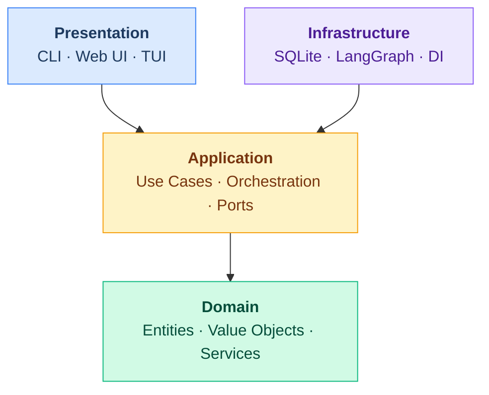

<div align="center">

# Shep AI

### One command. Full lifecycle. Merged PR.

_Describe a feature in plain English — Shep researches, plans, codes, tests, and opens a PR. You approve when you want to, or let it run hands-free._

[](https://github.com/shep-ai/cli/actions/workflows/ci.yml)
[](https://www.npmjs.com/package/@shepai/cli)
[](https://opensource.org/licenses/MIT)
[](https://www.typescriptlang.org/)
[](https://nodejs.org/)
[](https://pnpm.io/)
[](https://github.com/shep-ai/cli/pulls)
[](https://conventionalcommits.org)

<br />

[Features](#features) · [Quick Start](#quick-start) · [CLI Reference](#cli-reference) · [Architecture](#architecture) · [Contributing](#contributing)

<br />


</div>

---

## Quick Start

```bash
# Try it instantly — no install needed
npx @shepai/cli

# Or install globally
npm i -g @shepai/cli
shep

# Browser opens at http://localhost:4050 — you're in
```

---

## Features

```bash
shep feat new "add stripe payments" --allow-all --push --pr
# ↳ PRD → research → plan → code → tests → PR → CI watch — done.
```

- **Full lifecycle in one shot** — From idea to merged PR: requirements, technical research, implementation plan, code with tests, PR creation, and CI fix loop
- **Approve or go hands-free** — Three review gates (PRD, Plan, Merge) you can enable, disable, or skip entirely with `--allow-all`
- **Run 10 features in parallel** — Each gets its own git worktree — switch context instantly, no stashing, no branch juggling, no conflicts
- **Pick your agent** — Claude Code, Cursor CLI, or Gemini CLI — swap per feature, per repo, anytime
- **Live dashboard** — Interactive graph of every repo and feature — review diffs, approve merges, launch dev servers, all in-browser
- **100% local, zero signup** — SQLite in `~/.shep/`, nothing leaves your machine, no account needed

> **[See the full Features Guide with screenshots →](./docs/FEATURES.md)**

---

## CLI Reference

### Daemon

```
shep                                  Start daemon + onboarding (first run)
shep start [--port <number>]          Start web UI daemon (background, default port 4050)
shep stop                             Stop the running daemon
shep restart                          Restart the daemon
shep status                           Show daemon status and live metrics
shep ui [--port] [--no-open]          Start the web UI in the foreground
```

### Feature Management

```
shep feat new <description>           Create a new feature
      [--repo] [--push] [--pr]
      [--allow-prd] [--allow-plan] [--allow-merge] [--allow-all]
      [--parent] [--fast] [--model] [--attach]
shep feat ls [--repo]                 List features
shep feat show <id>                   Show feature details
shep feat del <id>                    Delete a feature
shep feat resume <id>                 Resume a paused feature
shep feat review <id>                 Review a feature
shep feat approve <id> [--comments]   Approve a feature
shep feat reject <id> [--feedback]    Reject a feature
shep feat logs <id>                   View feature logs
```

### Agent Management

```
shep agent ls                         List agents
shep agent show <id>                  Show agent details
shep agent stop <id>                  Stop a running agent
shep agent logs <id>                  View agent logs
shep agent delete <id>                Delete an agent
shep agent approve <id>               Approve an agent action
shep agent reject <id>                Reject an agent action
```

### Repository & Session Management

```
shep repo ls                          List repositories
shep repo show <id>                   Show repository details
shep session ls                       List sessions
shep session show <id>                Show session details
```

### Settings

```
shep settings                         Launch setup wizard
shep settings show                    Display current configuration
shep settings init                    Initialize settings
shep settings agent                   Configure AI coding agent
shep settings ide                     Configure IDE
shep settings workflow                Configure workflow
shep settings model                   Configure model
```

### Tools

```
shep tools list                       List tools with install status
shep install <tool> [--how]           Install a dev tool
shep ide-open [--ide] [--dir]         Open IDE in directory
```

### Other

```
shep version                          Show version info
shep upgrade                          Upgrade to latest version
shep run <agent> [-p prompt] [-r repo] [-s]   Run an agent directly
```

---

## Architecture

Clean Architecture with four layers. Dependencies point inward — domain has zero external deps.


```mermaid
flowchart TB
    P["<b>Presentation</b><br/>CLI · Web UI · TUI"]
    A["<b>Application</b><br/>Use Cases · Orchestration · Ports"]
    D["<b>Domain</b><br/>Entities · Value Objects · Services"]
    I["<b>Infrastructure</b><br/>SQLite · LangGraph · DI"]

    P --> A --> D
    I --> A

    style P fill:#dbeafe,stroke:#3b82f6,color:#1e3a5f
    style A fill:#fef3c7,stroke:#f59e0b,color:#78350f
    style D fill:#d1fae5,stroke:#10b981,color:#064e3b
    style I fill:#ede9fe,stroke:#8b5cf6,color:#4c1d95
```

| Layer          | Path                                | Responsibility                                    |
| -------------- | ----------------------------------- | ------------------------------------------------- |
| Domain         | `packages/core/src/domain/`         | Business logic, TypeSpec-generated types          |
| Application    | `packages/core/src/application/`    | Use cases, output port interfaces                 |
| Infrastructure | `packages/core/src/infrastructure/` | SQLite repos, LangGraph agents, DI (tsyringe)     |
| Presentation   | `src/presentation/`                 | CLI (Commander), TUI (Inquirer), Web UI (Next.js) |

### Feature Lifecycle

Every feature progresses through a structured SDLC pipeline with 9 states:

```
Started -> Analyze -> Requirements -> Research -> Planning -> Implementation -> Review -> Maintain
                                                                                   |
                                                                               (Blocked)
```

Human approval gates are configurable at PRD, Plan, and Merge phases. In `--allow-all` mode the agent handles everything autonomously.

### Tech Stack

| Component       | Technology                                                                |
| --------------- | ------------------------------------------------------------------------- |
| Language        | TypeScript (ES2022)                                                       |
| Package Manager | pnpm                                                                      |
| CLI Framework   | Commander                                                                 |
| TUI Framework   | [@inquirer/prompts](https://github.com/SBoudrias/Inquirer.js)             |
| Web UI          | Next.js 16 + React 19 + shadcn/ui + Tailwind CSS 4                        |
| Graph Viz       | React Flow (XYFlow) 12                                                    |
| Design System   | Storybook 8.x                                                             |
| Build Tool      | tsc + tsc-alias (prod), tsx (CLI dev), Next.js (web dev)                  |
| Database        | SQLite (better-sqlite3, per-repo)                                         |
| Domain Models   | TypeSpec -> generated TypeScript                                          |
| Agent System    | [LangGraph](https://www.langchain.com/langgraph) (`@langchain/langgraph`) |
| DI Container    | tsyringe                                                                  |
| Testing         | Vitest (unit/integration) + Playwright (e2e)                              |
| Methodology     | TDD (Red-Green-Refactor)                                                  |

### Supported Tools

Shep can detect, install, and manage the following tools:

| Category   | Tools                                                                             |
| ---------- | --------------------------------------------------------------------------------- |
| IDEs       | Alacritty, Antigravity, Cursor, iTerm2, Kitty, TMux, VS Code, Warp, Windsurf, Zed |
| CLI Agents | Claude Code, Cursor CLI, Gemini CLI                                               |
| Dev Tools  | Git, GitHub CLI                                                                   |

### Web UI

The web dashboard runs at `http://localhost:4050` and provides:

- **Dashboard canvas** — Interactive React Flow graph with feature and repository nodes
- **Feature drawer** — Tabs for overview, activity, approval, rejection, PR info, deployment, and timeline
- **Create feature form** — Start new features from the UI
- **Settings, Tools, Skills, and Version pages**
- **Real-time updates** via Server-Sent Events (SSE)

### Data Model

```
Repository --+-- Feature --+-- Plan --+-- Task -- ActionItem
             |             |          +-- Artifact
             |             +-- Requirement -- Research
```

All data lives locally in `~/.shep/`. Per-repo SQLite databases. No cloud dependency.

---

## Documentation

| Document                                           | Description                                |
| -------------------------------------------------- | ------------------------------------------ |
| [Features Guide](./docs/FEATURES.md)               | Full features overview with screenshots    |
| [Competitive Landscape](./docs/competitors/)       | How Shep fits in the AI dev tool ecosystem |
| [CLAUDE.md](./CLAUDE.md)                           | Guidance for Claude Code instances         |
| [AGENTS.md](./AGENTS.md)                           | Agent system architecture                  |
| [CONTRIBUTING-AGENTS.md](./CONTRIBUTING-AGENTS.md) | AI agent contribution guidelines           |
| [Architecture](./docs/architecture/)               | System design and patterns                 |
| [Concepts](./docs/concepts/)                       | Core domain concepts                       |
| [UI](./docs/ui/)                                   | Web UI architecture and design system      |
| [Guides](./docs/guides/)                           | User guides and tutorials                  |
| [Development](./docs/development/)                 | Contributing and development setup         |
| [API Reference](./docs/api/)                       | Interface and model documentation          |

## Contributing

We welcome contributions from humans and AI agents alike.

- **Humans**: See [CONTRIBUTING.md](./CONTRIBUTING.md)
- **AI Agents**: See [CONTRIBUTING-AGENTS.md](./CONTRIBUTING-AGENTS.md)
- **Spec-driven workflow**: All features start with `/shep-kit:new-feature` — see [Spec-Driven Workflow](./docs/development/spec-driven-workflow.md)

## License

MIT — see [LICENSE](./LICENSE).
