<div align="center">

# Shep AI

### Multi-Session SDLC Control Center for AI Coding Agents

_Manage Claude Code, Cursor CLI, or any coding agent across the full development lifecycle — from requirements to deploy — with parallel sessions, instant context switching, and human-in-the-loop control_

[](https://github.com/shep-ai/cli/actions/workflows/ci.yml)
[](https://www.npmjs.com/package/@shepai/cli)
[](https://opensource.org/licenses/MIT)
[](https://www.typescriptlang.org/)
[](https://nodejs.org/)
[](https://pnpm.io/)
[](https://github.com/shep-ai/cli/pulls)
[](https://conventionalcommits.org)

<br />

[Features](#features) · [Quick Start](#quick-start) · [CLI Reference](#cli) · [Architecture](#architecture) · [Contributing](#contributing)

<br />


[](https://shep-ai.github.io/cli/poc/)

</div>

### Install

```bash
npm i -g @shepai/cli
```

### Try it

```bash
cd your-project/
shep feat new "Add unit tests for all source files"
```

<details>
<summary><b>List features</b> &mdash; <code>shep feat ls</code></summary>
<br />

```
  Features for /home/user/projects/my-app

  ID        Name             Status          Branch               Created
  1b0a7969  Add Unit Tests   ✓ Completed     feat/add-unit-tests  2/13/2026
```

</details>

<details>
<summary><b>Show feature detail</b> &mdash; <code>shep feat show 1b0a7969</code></summary>
<br />

```
  Feature: Add Unit Tests

  ID           1b0a7969-b420-4754-832f-5c38801b4852
  Slug         add-unit-tests
  Description  Add comprehensive unit tests for all existing source files
               in the project to ensure code correctness and improve test coverage.
  Repository   /home/user/projects/my-app
  Branch       feat/add-unit-tests
  Status       ✓ Completed
  Worktree     ~/.shep/repos/9bbd30de/wt/feat-add-unit-tests
  Spec Dir     ~/.shep/repos/9bbd30de/wt/feat-add-unit-tests/specs/001-add-unit-tests
  Agent Run    732a1fc2-a346-4052-a028-dcb1a46b6f2c

  Timestamps
  Created  2/13/2026, 12:15:08 AM
  Updated  2/13/2026, 12:15:08 AM
```

</details>

<details>
<summary><b>Isolated worktree per feature</b> &mdash; no stashing, no branch switching</summary>
<br />

Each feature gets its own git worktree — fully isolated from your main branch.

```
~/.shep/repos/9bbd30de/wt/feat-add-unit-tests/
├── .git                    # linked worktree (not a clone)
├── src/
├── tests/
├── specs/
│   └── 001-add-unit-tests/
│       ├── feature.yaml    # status tracking
│       ├── spec.yaml       # requirements & scope
│       ├── research.yaml   # technical decisions
│       ├── plan.yaml       # implementation strategy
│       └── tasks.yaml      # task breakdown
├── pyproject.toml
└── README.md
```

</details>

<details>
<summary><b>Auto-generated spec files</b> &mdash; real output from a single <code>shep feat new</code></summary>
<br />

> **`spec.yaml`** — requirements & scope

```yaml
name: add-unit-tests
oneLiner: Add comprehensive unit tests for all source modules
summary: >
  Add unit tests for every module in the package. The project currently has
  minimal test coverage (only 7 tests total). This feature adds tests for
  config, agents, flows, tools, observability, and CLI — using pytest with
  mocking to avoid external dependencies.
sizeEstimate: M
openQuestions:
  - question: 'Should we set a minimum coverage threshold and enforce it in CI?'
    resolved: true
    answer: >
      Set 70% minimum via --cov-fail-under=70. Achievable and prevents regression.
```

> **`research.yaml`** — technical decisions with rationale

```yaml
decisions:
  - title: 'Test Framework'
    chosen: 'pytest (already configured)'
    rejected:
      - 'unittest — More verbose, no fixture system'
      - 'nose2 — Unmaintained, no advantage'
    rationale: >
      Already a dev dependency with asyncio and coverage plugins configured.

  - title: 'Mocking Library'
    chosen: 'unittest.mock (stdlib)'
    rejected:
      - 'pytest-mock — Adds a dependency for marginal convenience'
    rationale: >
      patch() for module-level replacement, MagicMock for spec objects,
      assert_called_with for verification. No new dependency needed.
```

> **`tasks.yaml`** — TDD task breakdown

```yaml
tasks:
  - id: task-1
    title: 'Create conftest.py with shared fixtures'
    dependencies: []
    acceptanceCriteria:
      - 'mock_settings returns a Settings instance with known values'
      - 'mock_llm returns MagicMock(spec=LLM) for agent tests'
      - 'tmp_repo creates a temp dir with git init and one commit'
    tdd:
      red: ['Write test_smoke.py that imports fixtures and asserts properties']
      green: ['Implement conftest.py with all three fixtures']
      refactor: ['Remove smoke test — subsumed by real test files']

  - id: task-3
    title: 'Test config/llm.py'
    dependencies: [task-1]
    acceptanceCriteria:
      - 'test_create_llm_with_openai_provider: verifies model, temperature, api_key'
      - 'test_create_llm_with_cursor_provider: verifies base_url included'
      - 'test_get_fast_llm: calls create_llm with settings.fast_model'
    tdd:
      red: ['Patch LLM and get_settings, assert constructor kwargs']
      green: ['Tests pass — they verify existing code with mocks']
      refactor: ['Extract common patch decorators if repetitive']
```

> **`feature.yaml`** — machine-readable progress (updated continuously)

```yaml
feature:
  id: '001-add-unit-tests'
  branch: 'feat/001-add-unit-tests'
  lifecycle: 'research'

status:
  phase: 'research'
  progress: { completed: 0, total: 12, percentage: 0 }
  lastUpdatedBy: 'feature-agent'
```

</details>

---

Running AI agents is easy. **Managing many of them through a full SDLC is the hard part.** Shep gives you a control center that handles the entire lifecycle — requirements gathering, planning, implementation, QA, and deployment — across multiple agent sessions running in parallel. See what each agent is doing, jump into any session's web preview, code editor, or terminal, approve plans when agents need your input, and let them keep working while you move on. Plug in Claude Code, Cursor CLI, Gemini CLI, or any coding agent. Each feature gets its own isolated worktree and dev environment. You manage the lifecycle, agents do the work.

---

## Features

> 🚧 **Under active development** — Web UI screenshots are from the design spec. Core CLI (`feat new`, `feat ls`, `feat show`, `settings`, `ui`) works today. Some commands (`mem`, `start`) are still WIP.

<table>
<tr>
<td width="55%"></td>
<td width="45%">

### Feature Properties & Attachments

- **Rich feature detail panel** with name, description, and metadata
- **File attachments** — requirements PDFs, mockup images, API specs linked directly to features
- **Team & metadata** tracking for ownership and collaboration
- **Dependency mapping** between features across repos
- **Iterative refinement** — update properties as requirements evolve through the lifecycle

</td>
</tr>

<tr>
<td width="55%"></td>
<td width="45%">

### Feature Cards with Quick Actions

- **One-click dev server** launch directly from any card
- **Action toolbar** — GitHub, web preview, terminal, code editor at your fingertips
- **Live progress** tracking with percentage and lifecycle stage badge
- **Unique IDs** for instant cross-referencing across CLI and UI

</td>
</tr>

<tr>
<td width="55%"></td>
<td width="45%">

### AI-Guided Requirements Discovery

- **Smart questionnaires** that surface the right questions for your feature
- **Categorized inputs** — business, technical, and UX problem classification
- **Priority tiers** (P1–P3) with clear impact descriptions
- **Domain tagging** to scope the affected areas of your codebase
- **Human breakpoint** — agent pauses here until you finalize

</td>
</tr>

<tr>
<td width="55%"></td>
<td width="45%">

### Technical Plan Review

- **AI-generated implementation plans** with full architecture rationale
- **Technical decision cards** — see the chosen approach and alternatives side-by-side
- **Architecture pattern selection** (microservices, monolith, serverless) with trade-off analysis
- **Approve & continue** or send back for revision — you control the direction

</td>
</tr>

<tr>
<td width="55%"></td>
<td width="45%">

### Tasks & Generated Artifacts

- **Auto-generated documents** — plan.md, tasks.md, data_model.md created from your approved spec
- **Task breakdown** with dependency tracking and status badges
- **Artifact browser** — inspect any generated document directly in the panel
- **Draft indicator** — nothing ships until you explicitly approve

</td>
</tr>

<tr>
<td width="55%"></td>
<td width="45%">

### Quality Assurance Gate

- **Automated QA checklist** — functional, performance, compatibility, accessibility
- **Performance benchmarks** — API response time p95 thresholds
- **WCAG 2.5** accessibility compliance verification
- **One-click Pass QA** when all checks are green

</td>
</tr>

<tr>
<td width="55%"></td>
<td width="45%">

### Integrated Dev Environment — Web Preview

- **Live localhost preview** embedded in the control center
- **Isolated ports** — each feature runs its own dev server
- **Server status** indicator with start/stop controls
- **Open in Browser** for full-screen testing
- **PR context** — branch, worktree path, and PR link always visible

</td>
</tr>

<tr>
<td width="55%"></td>
<td width="45%">

### Integrated Dev Environment — Code Editor

- **Embedded VS Code** with full editor capabilities
- **Git worktree isolation** — each feature in its own directory, no branch conflicts
- **File explorer** with project structure at a glance
- **PR badge** with commits ahead/behind and changed file count
- **Zero context-switch** — edit code without leaving the control center

</td>
</tr>

<tr>
<td width="55%"></td>
<td width="45%">

### Integrated Dev Environment — Terminal

- **Full terminal access** inside the feature workspace
- **Build output, test results, agent logs** in one place
- **Pre-configured** in the feature's worktree directory
- **Dev server output** — see Next.js/Vite/Express startup and compile times
- **Three-tab workflow** — preview, code, and terminal without leaving the UI

</td>
</tr>
</table>

---

## Quick Start

```bash
# Navigate to any repo and create a feature
cd ~/projects/your-app
shep feat new "Add user authentication with OAuth 2.0"

# Open the control center to watch progress
shep ui
```

## CLI

```
shep start                            Start background service
shep feat new <description>           Create a new feature
shep feat new --interactive           Interactive mode with human checkpoints
shep feat new --allow-all             Full autonomous mode
shep feat ls                          List features across repos
shep feat show <id>                   Show feature details
shep feat preview <id>                Preview feature dev environment
shep ui                               Open the web control center
shep settings show                    Display current configuration
shep settings agent                   Configure AI coding agent
shep mem add <text> --global|--repo   Add agent memory
shep mem ls                           List memories
shep version                          Version info
```

## Architecture

Clean Architecture with four layers. Dependencies point inward — domain has zero external deps.

```mermaid
flowchart TB
    P["<b>Presentation</b><br/>CLI · Web UI · TUI"]
    A["<b>Application</b><br/>Use Cases · Orchestration · Ports"]
    D["<b>Domain</b><br/>Entities · Value Objects · Services"]
    I["<b>Infrastructure</b><br/>SQLite · LangGraph · LanceDB"]

    P --> A --> D
    I --> A

    style P fill:#dbeafe,stroke:#3b82f6,color:#1e3a5f
    style A fill:#fef3c7,stroke:#f59e0b,color:#78350f
    style D fill:#d1fae5,stroke:#10b981,color:#064e3b
    style I fill:#ede9fe,stroke:#8b5cf6,color:#4c1d95
```



### Feature Lifecycle

Every feature progresses through a structured SDLC pipeline:

```
Requirements → Research → Review PRD → Planning → Review Plan → Implementation → QA → Approval → Live
     ↑              ↑           ↑            ↑           ↑             ↑          ↑        ↑
   Agent         Agent       Human        Agent       Human        Agent      Human    Human
                           breakpoint                breakpoint               check    gate
```

Breakpoints are configurable. In `--allow-all` mode, the agent handles everything autonomously.

### Tech Stack

| Component       | Technology                                                                              |
| --------------- | --------------------------------------------------------------------------------------- |
| Language        | TypeScript                                                                              |
| Package Manager | pnpm                                                                                    |
| CLI Framework   | Commander                                                                               |
| TUI Framework   | [@inquirer/prompts](https://github.com/SBoudrias/Inquirer.js)                           |
| Web UI          | Next.js 16 + React 19 + shadcn/ui ([@shepai/web](./src/presentation/web/))              |
| Design System   | Storybook                                                                               |
| Build Tool      | tsc + tsc-alias (prod), Vite (dev)                                                      |
| Database        | SQLite                                                                                  |
| Agent System    | [LangGraph](https://www.langchain.com/langgraph) (`@langchain/langgraph`)               |
| Vector DB       | [LanceDB](https://lancedb.com/) (file-based)                                            |
| Embeddings      | [Transformers.js](https://huggingface.co/docs/transformers.js) (local, multiple models) |
| Testing         | Vitest (unit/integration) + Playwright (e2e)                                            |
| Methodology     | TDD (Red-Green-Refactor)                                                                |

### Data Model

```
Repository ──┬── Feature ──┬── Plan ──┬── Task ──── ActionItem
             │             │          └── Artifact
             │             └── Requirement ── Research
             └── Analysis docs (cached)
```

All data lives locally in `~/.shep/`. Per-repo SQLite databases. No cloud dependency.

## Documentation

| Document                                           | Description                           |
| -------------------------------------------------- | ------------------------------------- |
| [CLAUDE.md](./CLAUDE.md)                           | Guidance for Claude Code instances    |
| [AGENTS.md](./AGENTS.md)                           | Agent system architecture             |
| [CONTRIBUTING-AGENTS.md](./CONTRIBUTING-AGENTS.md) | AI agent contribution guidelines      |
| [Architecture](./docs/architecture/)               | System design and patterns            |
| [Concepts](./docs/concepts/)                       | Core domain concepts                  |
| [UI](./docs/ui/)                                   | Web UI architecture and design system |
| [Guides](./docs/guides/)                           | User guides and tutorials             |
| [Development](./docs/development/)                 | Contributing and development setup    |
| [API Reference](./docs/api/)                       | Interface and model documentation     |
| [POC: Feature Flow](./docs/poc/)                   | Interactive feature lifecycle demo    |

## Contributing

We welcome contributions from humans and AI agents alike.

- **Humans**: See [CONTRIBUTING.md](./CONTRIBUTING.md)
- **AI Agents**: See [CONTRIBUTING-AGENTS.md](./CONTRIBUTING-AGENTS.md)
- **Spec-driven workflow**: All features start with `/shep-kit:new-feature` — see [Spec-Driven Workflow](./docs/development/spec-driven-workflow.md)

## License

MIT — see [LICENSE](./LICENSE).
