<div align="center">

# 🐑 Shep AI

### Autonomous AI Native SDLC Platform

_Automate the entire development cycle from idea to deploy_

[](https://github.com/shep-ai/cli/actions/workflows/ci.yml)
[](https://www.npmjs.com/package/@shepai/cli)
[](https://opensource.org/licenses/MIT)
[](https://www.typescriptlang.org/)
[](https://nodejs.org/)
[](https://pnpm.io/)
[](https://github.com/shep-ai/cli/pulls)
[](https://conventionalcommits.org)

<br />

[Getting Started](#quick-start) •
[Documentation](#documentation) •
[Contributing](#contributing) •
[License](#license)

</div>

---

Shep is an intelligent CLI tool that transforms how you build software. Point it at any repository, and it will analyze your codebase, gather requirements through conversational AI, break down features into actionable tasks, generate comprehensive documentation, and execute implementation autonomously.

## Installation

```bash
pnpm add -g @shepai/cli
```

Or with npm:

```bash
npm install -g @shepai/cli
```

## Quick Start

```bash
cd ~/repos/your-project
shep
```

Or explicitly initialize:

```bash
shep --init
```

This launches a TUI wizard to:

1. Configure Claude Code authentication (setup token or use existing session)
2. Start repository analysis
3. Open the web UI at `http://localhost:3000/`

## How It Works

### Repository Analysis

When you run `shep`, it performs comprehensive multi-perspective analysis of your codebase:

- Architecture patterns and structure
- Technology stack detection
- Code conventions and style
- Dependency mapping
- Testing patterns
- Documentation coverage

Analysis results are persisted in `~/.shep/repos/<encoded-repo-path>/docs/` for instant access on subsequent runs.

### Feature Lifecycle

Every feature follows the SDLC lifecycle:

```
Requirements → Plan → Implementation → Test → Deploy → Maintenance
```

#### 1. Requirements Phase

Interactive chat-based gathering powered by repository context. The AI proposes relevant options based on your codebase analysis, ensuring no open questions remain.

#### 2. Plan Phase

Automatic breakdown into:

- **Tasks** - High-level work items with dependencies
- **Action Items** - Granular steps within tasks
- **Artifacts** - Generated documentation (PRDs, RFCs, Design Docs, Tech Plans)

#### 3. Implementation Phase

Autonomous code generation using LangGraph agents, executing tasks according to the dependency graph.

#### 4. Test → Deploy → Maintenance

Continuous lifecycle management with AI assistance at every stage.

## Spec-Driven Development

All contributions follow our spec-driven workflow:

```
/shep-kit:new-feature → /shep-kit:research → /shep-kit:plan → implement
```

Every feature begins with a specification in `specs/NNN-feature-name/` before any implementation code is written. See [Spec-Driven Workflow](./docs/development/spec-driven-workflow.md) for details.

## Architecture

Shep follows **Clean Architecture** principles:

```mermaid
flowchart TB
    P["<b>Presentation</b><br/>CLI · Web UI · TUI"]
    A["<b>Application</b><br/>Use Cases · Orchestration · Ports"]
    D["<b>Domain</b><br/>Entities · Value Objects · Services"]
    I["<b>Infrastructure</b><br/>SQLite · LangGraph · LanceDB"]

    P --> A --> D
    I --> A

    style P fill:#dbeafe,stroke:#3b82f6,color:#1e3a5f
    style A fill:#fef3c7,stroke:#f59e0b,color:#78350f
    style D fill:#d1fae5,stroke:#10b981,color:#064e3b
    style I fill:#ede9fe,stroke:#8b5cf6,color:#4c1d95
```



### Data Persistence

Uses **Repository Pattern** with SQLite:

- Database location: `~/.shep/repos/<encoded-repo-path>/data`
- Interface-driven design for testability
- Supports future backend swaps

## Tech Stack

| Component       | Technology                                                                              |
| --------------- | --------------------------------------------------------------------------------------- |
| Language        | TypeScript                                                                              |
| Package Manager | pnpm                                                                                    |
| CLI Framework   | Commander                                                                               |
| TUI Framework   | [OpenTUI](https://opentui.com/)                                                         |
| Web UI          | Next.js 16 + React 19 + shadcn/ui ([@shepai/web](./src/presentation/web/))              |
| Design System   | Storybook                                                                               |
| Build Tool      | Vite                                                                                    |
| Database        | SQLite                                                                                  |
| Agent System    | [LangGraph](https://www.langchain.com/langgraph) (`@langchain/langgraph`)               |
| Vector DB       | [LanceDB](https://lancedb.com/) (file-based)                                            |
| Embeddings      | [Transformers.js](https://huggingface.co/docs/transformers.js) (local, multiple models) |
| Testing         | Vitest (unit/integration) + Playwright (e2e)                                            |
| Methodology     | TDD (Red-Green-Refactor)                                                                |
| Security        | Trivy, Gitleaks, Semgrep, Hadolint (CI gates)                                           |

## Security

Automated security scanning runs on every push and PR:

| Scanner      | Purpose                                    |
| ------------ | ------------------------------------------ |
| **Trivy**    | Dependency & container vulnerability scans |
| **Gitleaks** | Secret detection in git history            |
| **Semgrep**  | SAST for TypeScript/JavaScript             |
| **Hadolint** | Dockerfile best practices                  |

Security gates **block releases** on main—all scanners must pass before npm publish and Docker push.

See [CI/CD Documentation](./docs/development/cicd.md) for details.

## Documentation

| Document                                           | Description                           |
| -------------------------------------------------- | ------------------------------------- |
| [CLAUDE.md](./CLAUDE.md)                           | Guidance for Claude Code instances    |
| [AGENTS.md](./AGENTS.md)                           | Agent system architecture             |
| [CONTRIBUTING-AGENTS.md](./CONTRIBUTING-AGENTS.md) | AI agent contribution guidelines      |
| [Architecture](./docs/architecture/)               | System design and patterns            |
| [Concepts](./docs/concepts/)                       | Core domain concepts                  |
| [UI](./docs/ui/)                                   | Web UI architecture and design system |
| [Guides](./docs/guides/)                           | User guides and tutorials             |
| [Development](./docs/development/)                 | Contributing and development setup    |
| [API Reference](./docs/api/)                       | Interface and model documentation     |

## Contributing

We welcome contributions! See [CONTRIBUTING.md](./CONTRIBUTING.md) for human contributors and [CONTRIBUTING-AGENTS.md](./CONTRIBUTING-AGENTS.md) for AI agents.

## License

MIT License - see [LICENSE](./LICENSE) for details.

---

## Maintaining This Document

**When to update:**

- New major features or commands
- Architecture changes
- Tech stack updates
- New documentation sections

**Style guide:**

- Keep Quick Start minimal (3-5 steps max)
- Update badges when versions change
- Ensure all internal links work
- Test code examples

**Related docs:** [CONTRIBUTING.md](./CONTRIBUTING.md), [docs/guides/getting-started.md](./docs/guides/getting-started.md)
