# Shep AI — Features Guide

> **Autonomous AI-Native SDLC Platform** — From idea to deployed code, fully automated.

Shep is the first truly autonomous software development lifecycle platform. Describe what you want in plain English, and Shep handles requirements gathering, research, planning, implementation, code review, and deployment — with human-in-the-loop approval gates at every critical decision point.

---

## Progress Tracker

### Screenshot Capture Plan

| #   | Feature / Screen                                    | Status | File                                     |
| --- | --------------------------------------------------- | ------ | ---------------------------------------- |
| 1   | Dashboard — Canvas with features & repos (light)    | Done   | `01-dashboard-canvas.png`                |
| 2   | Feature Detail — Merge Review tab                   | Done   | `02-feature-drawer-merge-review.png`     |
| 3   | Feature Detail — Overview tab                       | Done   | `03-feature-overview-tab.png`            |
| 4   | Feature Detail — Activity tab (fast mode)           | Done   | `04-feature-activity-tab.png`            |
| 5   | Feature Detail — Log tab (live streaming)           | Done   | `05-feature-log-tab.png`                 |
| 6   | Feature Detail — Activity tab (full lifecycle)      | Done   | `06-feature-activity-full-lifecycle.png` |
| 7   | Create Feature — Drawer form                        | Done   | `07-create-feature-drawer.png`           |
| 8   | Settings page (full page)                           | Done   | `08-settings-page.png`                   |
| 9   | Tools page                                          | Done   | `09-tools-page.png`                      |
| 10  | Dashboard — Dark mode                               | Done   | `10-dashboard-dark-mode.png`             |
| 11  | Merge Review — Dark mode                            | Done   | `11-merge-review-dark-mode.png`          |
| 12  | Diff View — Dark mode with expanded file            | Done   | `12-diff-view-dark-mode.png`             |
| 13  | Repo node — Quick action toolbar                    | Done   | `13-repo-node-actions.png`               |
| 14  | Feature drawer — Open dropdown (IDE/Terminal/Specs) | Done   | `14-feature-open-dropdown.png`           |
| 15  | Diff View — Light mode with expanded file           | Done   | `15-diff-view-light-mode.png`            |
| 16  | Tool detail drawer — Claude Code                    | Done   | `16-tool-detail-drawer.png`              |
| 17  | Dev server running — green localhost link           | Done   | `17-dev-server-running.png`              |
| 18  | Onboarding — Choose your agent                      | Done   | `18-onboarding-choose-agent.png`         |
| 19  | Onboarding — Select model                           | Done   | `19-onboarding-select-model.png`         |
| 20  | Onboarding — Authenticate                           | Done   | `20-onboarding-authenticate.png`         |
| 21  | Onboarding — Add repository                         | Done   | `21-onboarding-add-repository.png`       |

### Document Sections

| Section                       | Status |
| ----------------------------- | ------ |
| Quick Start                   | Done   |
| Onboarding                    | Done   |
| The Dashboard                 | Done   |
| Creating Features             | Done   |
| Feature Lifecycle             | Done   |
| Approval Gates & Merge Review | Done   |
| Feature Detail Tabs           | Done   |
| Settings & Configuration      | Done   |
| Tool Management               | Done   |
| Dark Mode                     | Done   |
| CLI Reference                 | Done   |
| Quick Actions & Dev Server    | Done   |
| Architecture                  | Done   |
| Supported Integrations        | Done   |

---

## Table of Contents

- [Quick Start](#quick-start)
- [Onboarding](#onboarding)
- [The Dashboard](#the-dashboard)
- [Creating Features](#creating-features)
- [Feature Lifecycle](#feature-lifecycle)
- [Approval Gates & Merge Review](#approval-gates--merge-review)
- [Feature Detail Tabs](#feature-detail-tabs)
- [Quick Actions & Dev Server](#quick-actions--dev-server)
- [Settings & Configuration](#settings--configuration)
- [Tool Management](#tool-management)
- [Dark Mode](#dark-mode)
- [CLI Reference](#cli-reference)
- [Architecture](#architecture)
- [Supported Integrations](#supported-integrations)

---

## Quick Start

```bash
# Install globally
npm install -g @shepai/cli

# Start the platform — opens the web dashboard automatically
shep

# Create your first feature (one command, fully autonomous)
shep feat new "Add user authentication with OAuth2"

# Or with full control
shep feat new "Add dark mode toggle" \
  --repo ./my-app \
  --allow-prd \
  --allow-plan \
  --push \
  --pr
```

That's it. Shep launches a beautiful web dashboard at `http://localhost:4050` and begins autonomously working through the entire development lifecycle. You review and approve at key checkpoints — or let it run fully hands-free.

---

## Onboarding

On first launch, Shep walks you through a guided setup wizard — choose your AI agent (Claude Code, Cursor CLI, Gemini CLI, or Demo), pick a model, authenticate, and add your first repository. The same flow is available via the CLI when running `shep` or `shep feat new` for the first time.

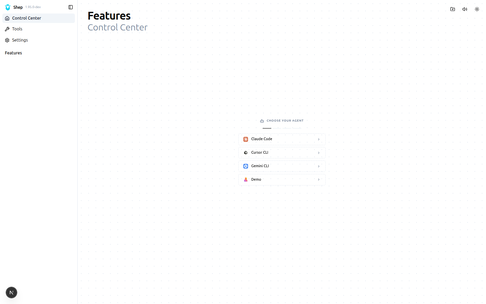

<table>
<tr>
<td>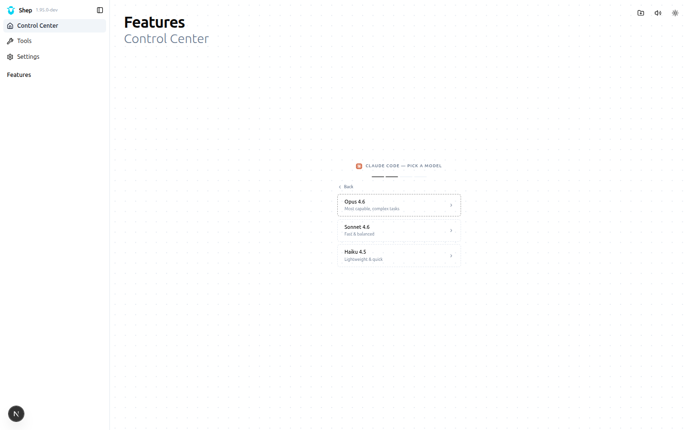</td>
<td>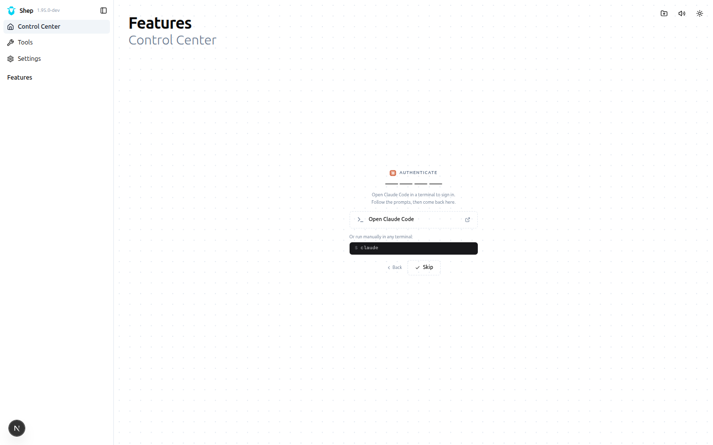</td>
<td>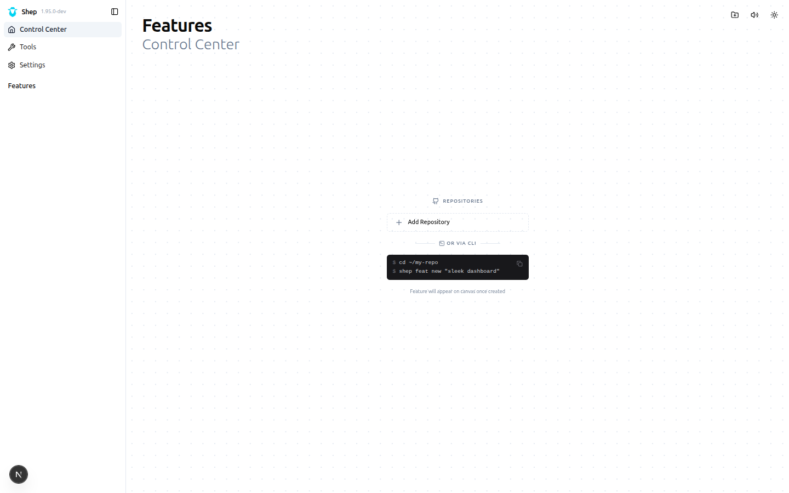</td>
</tr>
<tr>
<td align="center"><em>Select a model</em></td>
<td align="center"><em>Authenticate</em></td>
<td align="center"><em>Add your first repo</em></td>
</tr>
</table>

---

## The Dashboard

The Control Center is your command hub. A real-time interactive graph visualizes every repository and feature, showing their relationships and current status at a glance.


### What you see

- **Repository nodes** (left) — Each connected repo with quick-action buttons: open in IDE, open shell, open folder, start dev server, or add a new feature
- **Feature nodes** (right) — Cards showing feature name, description, current phase, and status badge
- **Edge connections** — Visual lines linking features to their parent repository
- **Sidebar** — Grouped feature list by status: Action Needed, Error, Done — with count badges
- **Zoom controls** — Zoom in/out, fit view, reset — for navigating large graphs

### Feature Status at a Glance

The sidebar groups features by their current state:

| Status            | Meaning                          |
| ----------------- | -------------------------------- |
| **Action Needed** | Waiting for your review/approval |
| **In Progress**   | Agent actively working           |
| **Error**         | Agent encountered an issue       |
| **Done**          | Feature completed successfully   |

---

## Creating Features

Click the **+** button on any repository node to open the feature creation drawer. Describe your feature in natural language and configure how autonomous the process should be.

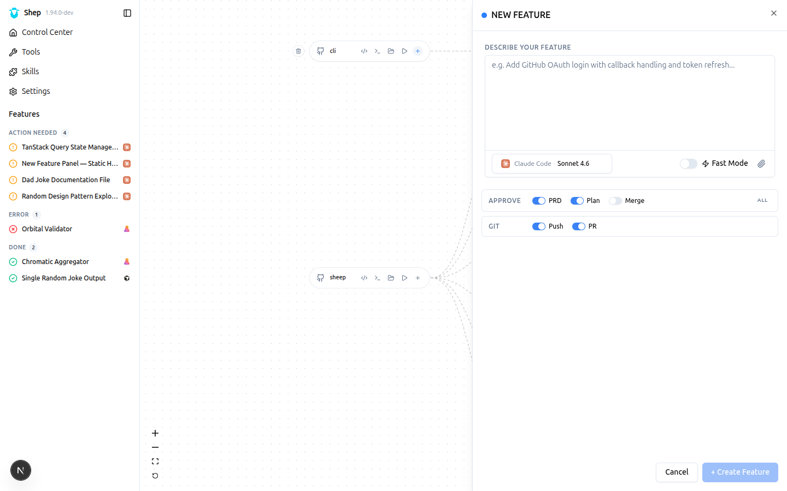

### Creation Options

| Option              | Description                                                                  |
| ------------------- | ---------------------------------------------------------------------------- |
| **Description**     | Natural language description of what you want built                          |
| **Agent & Model**   | Choose which AI agent and model to use (Claude Code, Cursor CLI, Gemini CLI) |
| **Fast Mode**       | Skip detailed planning — go straight from description to implementation      |
| **Approve toggles** | **PRD** — Review requirements before implementation                          |
|                     | **Plan** — Review the implementation plan before coding                      |
|                     | **Merge** — Review the PR diff before merging                                |
| **Git toggles**     | **Push** — Automatically push the feature branch                             |
|                     | **PR** — Automatically open a pull request                                   |
| **Attachments**     | Drag & drop reference files (designs, specs, screenshots)                    |

### From CLI

```bash
# Minimal — just describe it
shep feat new "Add search functionality to the products page"

# Full control — specify every option
shep feat new "Implement WebSocket real-time notifications" \
  --repo /path/to/project \
  --model claude-opus-4-6 \
  --allow-prd \
  --push \
  --pr \
  --attach design-spec.pdf
```

---

## Feature Lifecycle

Every feature flows through a structured pipeline with optional human approval gates at critical decision points:

```
Started → Analyze → Requirements → Research → Planning → Implementation → Review → Maintain
                    ▲ PRD Gate                ▲ Plan Gate              ▲ Merge Gate
```

### Lifecycle Phases

| Phase              | What Happens                                                   | Approval Gate |
| ------------------ | -------------------------------------------------------------- | ------------- |
| **Started**        | Feature initialized, branch created                            | —             |
| **Analyze**        | AI analyzes codebase structure, patterns, and conventions      | —             |
| **Requirements**   | PRD generated from your description with clarifying questions  | PRD Review    |
| **Research**       | Technical research, library evaluation, architecture decisions | —             |
| **Planning**       | Implementation plan with task breakdown and estimates          | Plan Review   |
| **Implementation** | Autonomous code generation, tests, and documentation           | —             |
| **Review**         | PR created, CI/CD runs, code ready for review                  | Merge Review  |
| **Maintain**       | Feature deployed, branch merged                                | —             |

### Activity Timeline

Track exactly how long each phase takes with the Activity tab. Green bars show execution time, orange bars show time waiting for human approval.

**Full lifecycle view** — every phase from start to completion:

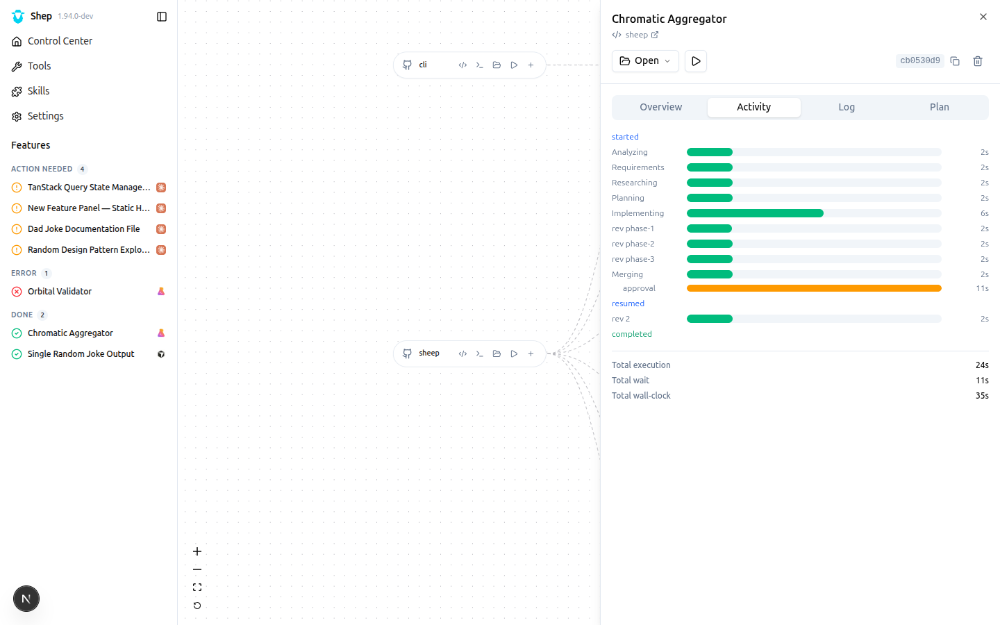

**Fast mode view** — skips planning phases for quick implementations:

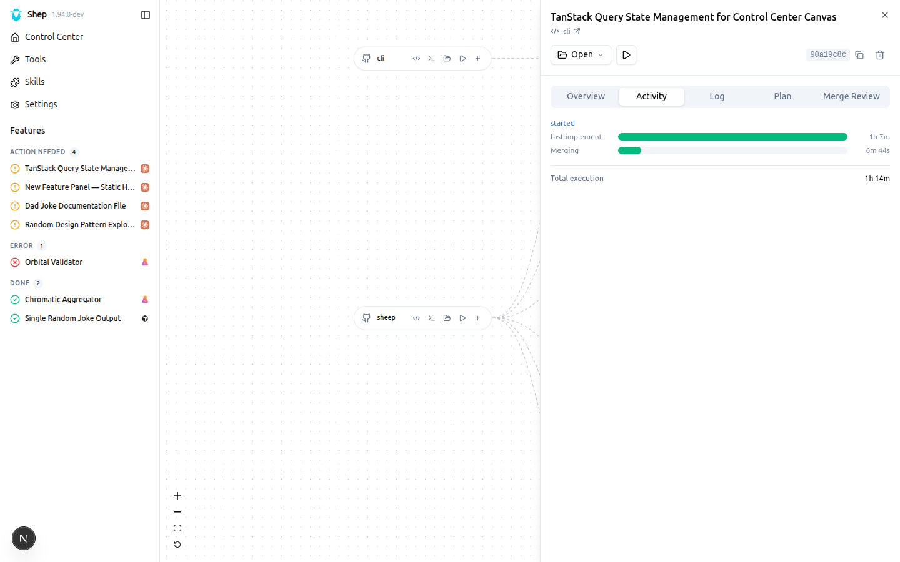

The timeline shows:

- **Total execution** — Time the agent spent working
- **Total wait** — Time waiting for human approval
- **Total wall-clock** — End-to-end elapsed time

---

## Approval Gates & Merge Review

The Merge Review is where you verify the AI's work before it lands in your codebase. A full PR review experience built right into the dashboard.

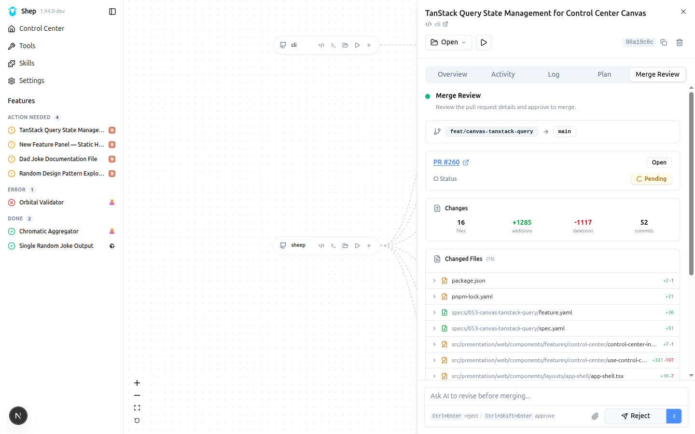

### What the Merge Review shows

- **Branch flow** — Visual indicator showing source → target branch (e.g., `feat/canvas-tanstack-query` → `main`)
- **PR link** — Direct link to the GitHub PR with status badge (Open/Closed/Merged)
- **CI Status** — Real-time CI/CD pipeline status (Pending/Passing/Failing)
- **Change summary** — Files changed, additions, deletions, and commit count
- **Changed files list** — Every modified file with addition/deletion counts
- **Expandable diffs** — Click any file to see the unified diff inline
- **Approval controls** — Approve to merge, reject with feedback, or ask the AI to revise

### Inline Diff View

Expand any changed file to see the full unified diff with line numbers, additions (green), and deletions (red):

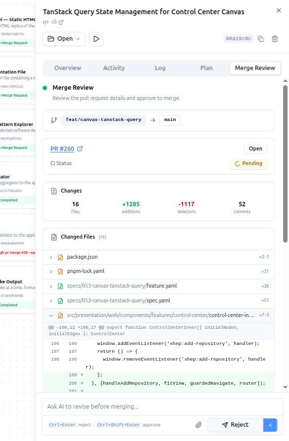

### Approval Actions

| Action            | Shortcut           | Effect                                                   |
| ----------------- | ------------------ | -------------------------------------------------------- |
| **Approve Merge** | `Ctrl+Shift+Enter` | Merges the PR and completes the feature                  |
| **Reject**        | `Ctrl+Enter`       | Sends feedback to the agent, which revises and resubmits |
| **Attach files**  | —                  | Add screenshots or reference files to your feedback      |

---

## Feature Detail Tabs

Click any feature to open a detail drawer with multiple tabs for deep inspection.

### Overview Tab

The Overview tab shows all metadata about a feature: status, branch, user query, AI-generated summary, timestamps, PR link, CI status, execution mode, and which agent is running it.

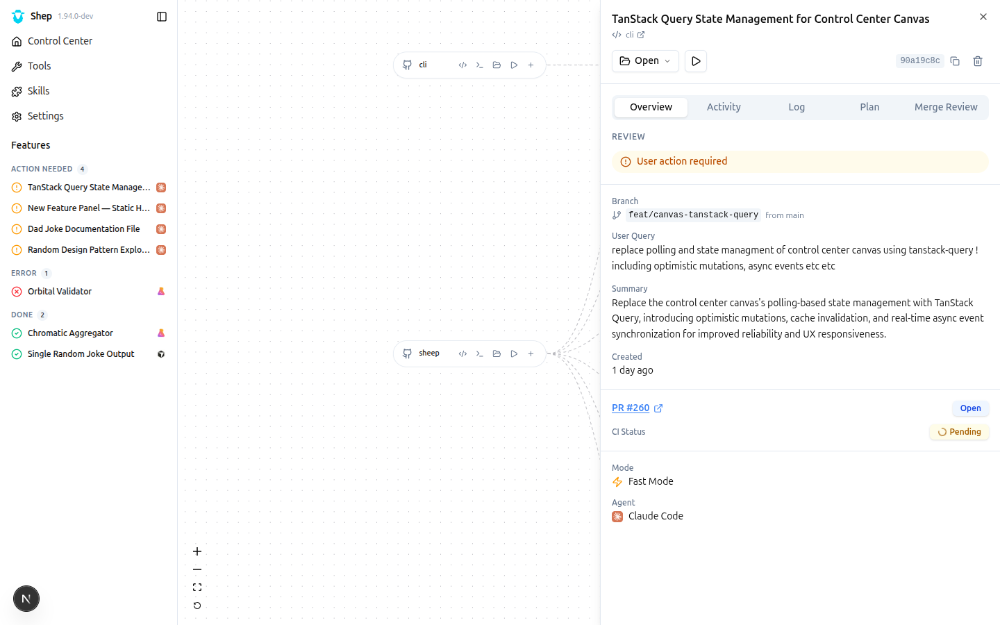

Key information displayed:

- **Status & Phase** — Current lifecycle phase with action-required indicator
- **Branch** — Git branch name with base branch reference
- **User Query** — Your original natural language description
- **Summary** — AI-generated summary of what will be built
- **PR & CI** — Pull request link and CI pipeline status
- **Mode & Agent** — Fast/standard mode and which AI agent is assigned

### Log Tab

Real-time streaming logs from the agent's execution. Watch the AI work in real-time with live SSE (Server-Sent Events) streaming.

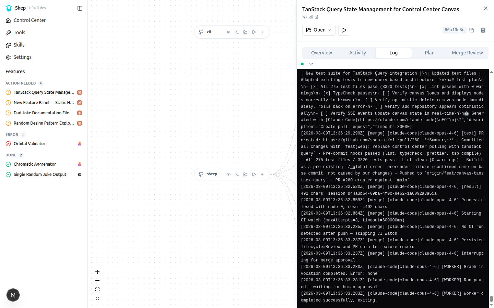

The log shows:

- Timestamped entries for every agent action
- Phase transitions and lifecycle events
- Git operations (commits, pushes, PR creation)
- CI monitoring and fix attempts
- Human-readable status messages

### Tab Visibility

Not all tabs are visible at all times. Tabs appear dynamically based on the feature's current lifecycle phase:

| Tab                   | When Visible                                |
| --------------------- | ------------------------------------------- |
| **Overview**          | Always                                      |
| **Activity**          | Always (lazy-loaded)                        |
| **Log**               | Always                                      |
| **Plan**              | After planning phase                        |
| **PRD Review**        | During requirements phase (action-required) |
| **Tech Decisions**    | During implementation phase                 |
| **Product Decisions** | During implementation phase                 |
| **Merge Review**      | During review phase                         |

---

## Quick Actions & Dev Server

Shep integrates directly with your development tools. Every repository node and feature drawer provides one-click access to your IDE, terminal, file system, and local dev server.

### Repository Quick Actions

Each repository node on the canvas displays a toolbar with five action buttons:

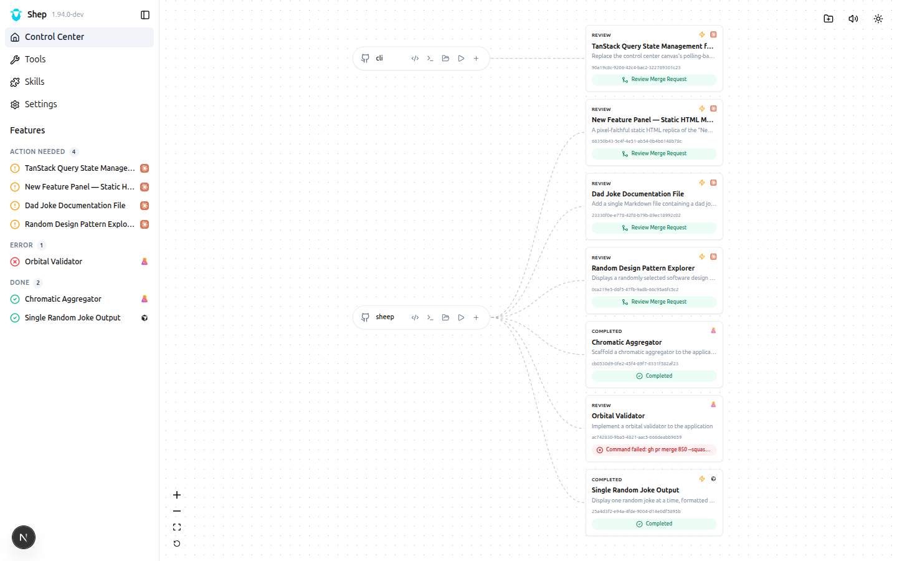

| Button               | Action                                                                           |
| -------------------- | -------------------------------------------------------------------------------- |
| **Open in IDE**      | Launch the repository in your configured editor (VS Code, Cursor, Windsurf, Zed) |
| **Open in Shell**    | Open a terminal session in the repository directory                              |
| **Open Folder**      | Open the repository folder in your system file manager                           |
| **Start Dev Server** | Launch the project's dev server (`npm run dev`, `pnpm dev`, etc.)                |
| **Add Feature**      | Open the feature creation drawer for this repository                             |

### Feature Quick Actions

The feature detail drawer includes an **Open** dropdown with context-aware actions for the feature's spec and branch:

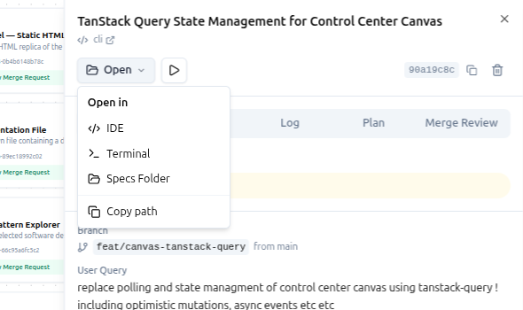

| Action           | Description                                                   |
| ---------------- | ------------------------------------------------------------- |
| **IDE**          | Open the feature's spec directory in your configured editor   |
| **Terminal**     | Open a terminal session at the feature's branch/spec location |
| **Specs Folder** | Open the feature's spec folder in your file manager           |
| **Copy path**    | Copy the feature's spec directory path to your clipboard      |

### Local Dev Server Preview

Click **Start Dev Server** on any repository node to launch the project's dev server. Each repo gets its own port, and green clickable links appear directly on the nodes — run multiple dev servers in parallel without switching windows or remembering port numbers.

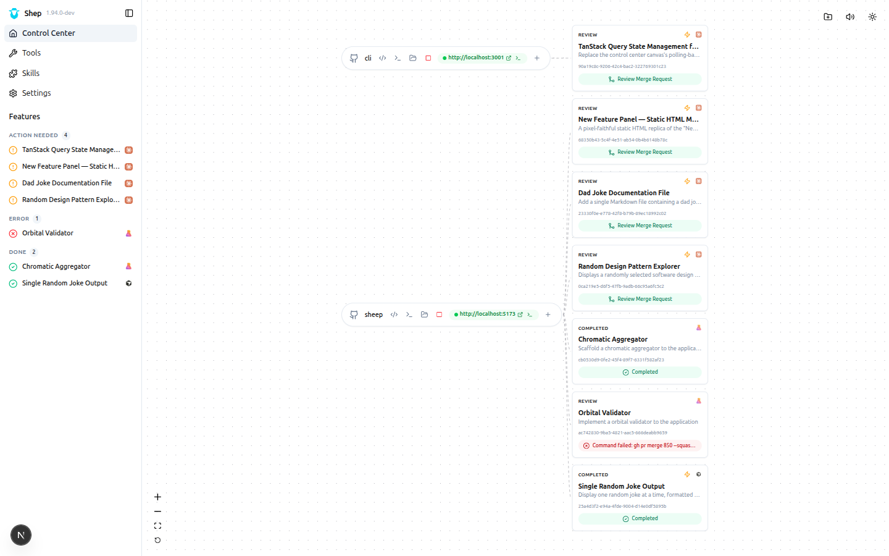

When a dev server is running, each repository node shows:

- **Green localhost link** — Click to open the dev server in your browser (e.g., `http://localhost:3001`, `http://localhost:5173`)
- **Stop button** — Replaces the play icon to stop the server
- **View server logs** — Inspect the dev server output via the terminal icon

---

## Settings & Configuration

A comprehensive settings panel with seven sections for complete control over Shep's behavior.

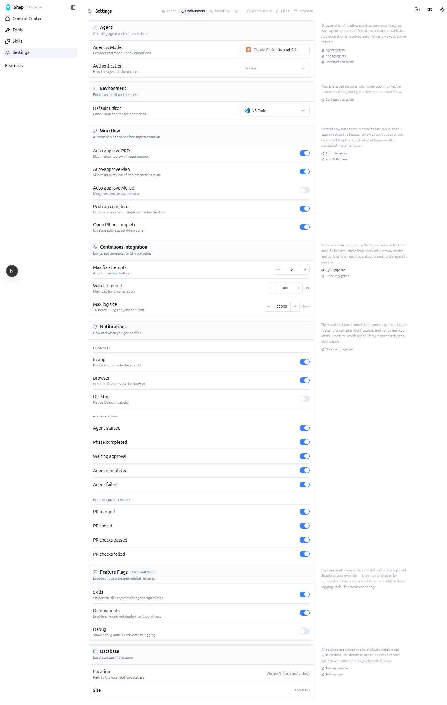

### Settings Sections

#### Agent

Configure which AI coding agent powers your features and how it authenticates.

- **Agent & Model** — Choose from Claude Code, Cursor CLI, or Gemini CLI with model selection
- **Authentication** — Session-based or token-based auth

#### Environment

- **Default Editor** — VS Code, Cursor, Windsurf, Zed — launched for file operations

#### Workflow

Control how autonomous each feature run is:

- **Auto-approve PRD** — Skip manual review of requirements
- **Auto-approve Plan** — Skip manual review of implementation plan
- **Auto-approve Merge** — Merge without manual review
- **Push on complete** — Automatically push to remote
- **Open PR on complete** — Automatically create a pull request

#### Continuous Integration

- **Max fix attempts** — How many times the agent retries on failing CI
- **Watch timeout** — Maximum wait time for CI completion (seconds)
- **Max log size** — Truncate CI logs beyond this character limit

#### Notifications

Three channels with granular event control:

- **Channels** — In-app toasts, browser push, native desktop alerts
- **Agent Events** — Started, phase completed, waiting approval, completed, failed
- **PR Events** — Merged, closed, checks passed, checks failed

#### Feature Flags

Toggle experimental features:

- **Skills** — Agent capability system
- **Deployments** — Environment deployment workflows
- **Debug** — Verbose logging and debug panels

#### Database

View local SQLite database info:

- **Location** — Path to `~/.shep/` data directory
- **Size** — Current database file size

---

## Tool Management

Shep detects, installs, and launches your development tools. The Tools page shows every supported tool with its install status, category, and quick actions.

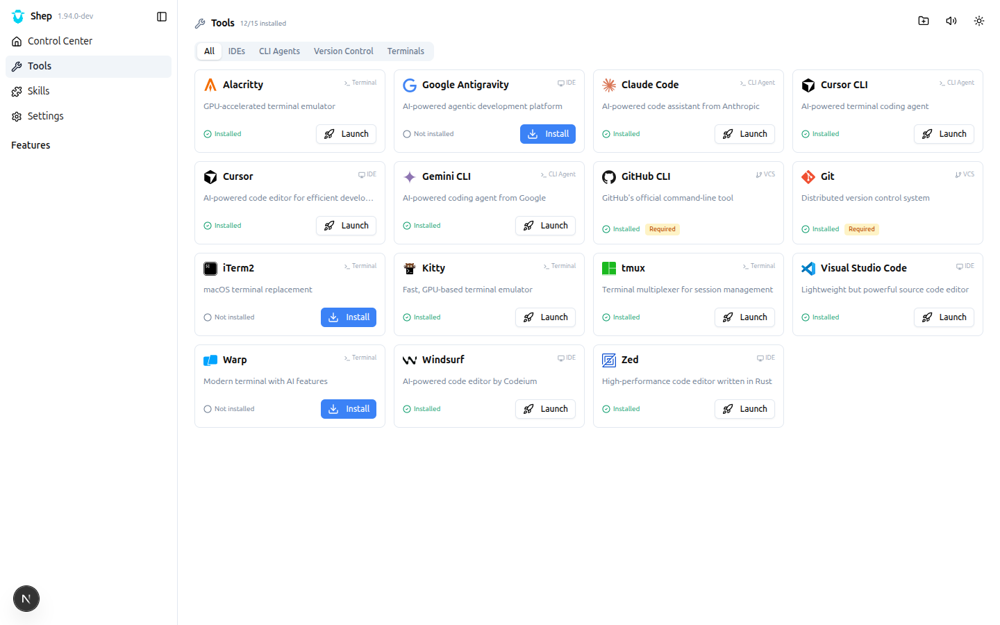

### Tool Categories

| Category            | Tools                                              |
| ------------------- | -------------------------------------------------- |
| **IDEs**            | VS Code, Cursor, Windsurf, Zed, Google Antigravity |
| **CLI Agents**      | Claude Code, Cursor CLI, Gemini CLI                |
| **Version Control** | Git (required), GitHub CLI (required)              |
| **Terminals**       | Alacritty, Kitty, tmux, Warp, iTerm2               |

### Tool Detail Drawer

Click any tool card to open a detail drawer with full description, install command, platform support, documentation link, and a one-click Launch button.

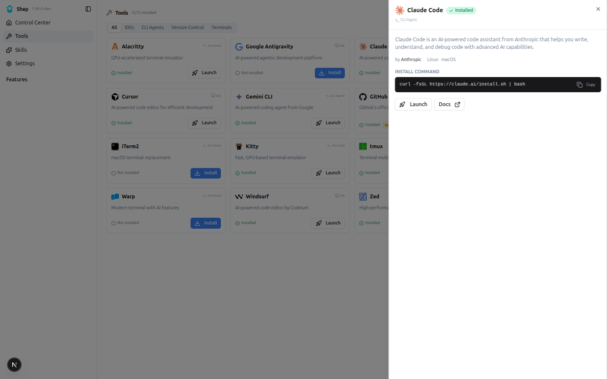

### Tool Actions

- **Launch** — Open installed tools directly from the dashboard
- **Install** — One-click installation for missing tools
- **Required badge** — Git and GitHub CLI are marked as required dependencies

### From CLI

```bash
# List all tools with install status
shep tools list

# Install a specific tool
shep install cursor

# See installation instructions without installing
shep install warp --how
```

---

## Dark Mode

Full dark mode support across the entire UI. Toggle with the sun/moon icon in the top-right corner.

### Dashboard — Dark Mode

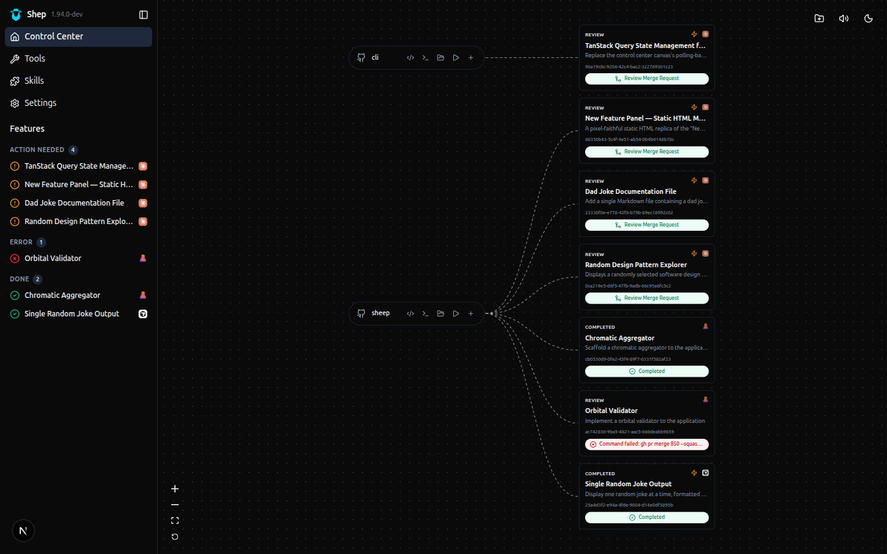

### Merge Review — Dark Mode

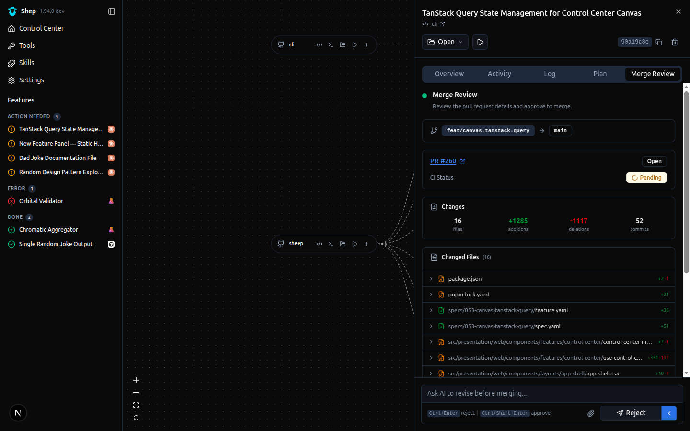

Dark mode is persisted across sessions and applies to all pages: dashboard, feature drawers, settings, tools, and all tabs.

---

## CLI Reference

### Core Commands

```bash
shep                              # Start daemon + onboarding
shep start [--port <number>]      # Start web UI daemon (default: 4050)
shep stop                         # Stop the running daemon
shep restart                      # Restart the daemon
shep status                       # Show daemon status and metrics
shep ui [--port] [--no-open]      # Start web UI in foreground
```

### Feature Management

```bash
shep feat new <description>       # Create a new feature
  --repo <path>                   #   Target repository
  --push                          #   Push branch on completion
  --pr                            #   Open PR on completion
  --allow-prd                     #   Auto-approve PRD phase
  --allow-plan                    #   Auto-approve planning phase
  --allow-merge                   #   Auto-approve merge phase
  --allow-all                     #   Auto-approve all gates
  --parent <id>                   #   Set parent feature (dependency)
  --fast                          #   Fast mode (skip detailed planning)
  --model <name>                  #   Specify AI model
  --attach <path>                 #   Attach reference files

shep feat ls [--repo]             # List features
shep feat show <id>               # Show feature details
shep feat del <id>                # Delete a feature
shep feat resume <id>             # Resume paused feature
shep feat review <id>             # Review feature
shep feat approve <id>            # Approve current phase
shep feat reject <id>             # Reject with feedback
shep feat logs <id>               # View feature logs
```

### Agent Management

```bash
shep agent ls                     # List all agents
shep agent show <id>              # Show agent details
shep agent stop <id>              # Stop running agent
shep agent logs <id>              # View agent logs
shep agent delete <id>            # Delete agent
shep agent approve <id>           # Approve agent action
shep agent reject <id>            # Reject agent action
```

### Repository & Session Management

```bash
shep repo ls                      # List repositories
shep repo show <id>               # Show repository details
shep session ls                   # List sessions
shep session show <id>            # Show session details
```

### Settings & Configuration

```bash
shep settings                     # Launch setup wizard
shep settings show                # Display current config
shep settings init                # Initialize settings
shep settings agent               # Configure AI agent
shep settings ide                 # Configure IDE
shep settings workflow            # Configure workflow
shep settings model               # Configure model
```

### Tools & Utilities

```bash
shep tools list                   # List tools with install status
shep install <tool> [--how]       # Install a dev tool
shep ide-open [--ide] [--dir]     # Open IDE in directory
shep version                      # Show version info
shep upgrade                      # Upgrade to latest version
shep run <agent> [-p prompt]      # Run agent directly
```

---

## Architecture

### Clean Architecture

Shep follows Clean Architecture principles with four layers (dependencies point inward):

```
Presentation (CLI, TUI, Web UI)
    ↓
Application (Use cases, port interfaces)
    ↓
Infrastructure (DB, agents, services)
    ↓
Domain (Core business logic, no external deps)
```

### Tech Stack

| Component               | Technology                                                |
| ----------------------- | --------------------------------------------------------- |
| **Language**            | TypeScript (ES2022)                                       |
| **CLI Framework**       | Commander.js                                              |
| **Web UI**              | Next.js 16 + React 19                                     |
| **Styling**             | Tailwind CSS 4 + shadcn/ui                                |
| **Graph Visualization** | React Flow v12 (DAG layout via dagre)                     |
| **Database**            | SQLite (better-sqlite3, local per-repo)                   |
| **Agent Orchestration** | LangGraph (@langchain/langgraph)                          |
| **Domain Models**       | TypeSpec → generated TypeScript                           |
| **DI Container**        | tsyringe                                                  |
| **Testing**             | Vitest + Playwright (e2e)                                 |
| **Design System**       | Storybook 8.x                                             |
| **Real-time Updates**   | Server-Sent Events (SSE) with Service Worker multiplexing |

### Key Technical Highlights

- **Optimistic UI** — Features appear on the canvas instantly, reconciled when the server confirms
- **SSE multiplexing** — Single connection shared across all browser tabs via Service Worker
- **Agent-agnostic** — No component hardcodes an agent type; all resolution flows through `IAgentExecutorProvider`
- **TypeSpec-first** — Domain models defined in TypeSpec, compiled to TypeScript (never edit generated files)
- **Fully local** — SQLite database at `~/.shep/`, no cloud dependency

---

## Supported Integrations

| Category             | Tools                                              | Status                |
| -------------------- | -------------------------------------------------- | --------------------- |
| **IDEs**             | VS Code, Cursor, Windsurf, Zed, Google Antigravity | Detect + Launch       |
| **AI Coding Agents** | Claude Code, Cursor CLI, Gemini CLI                | Full integration      |
| **Version Control**  | Git, GitHub CLI                                    | Required              |
| **Terminals**        | Alacritty, Kitty, tmux, Warp, iTerm2               | Detect + Launch       |
| **CI/CD**            | GitHub Actions                                     | Auto-detect + monitor |

---

## Use Cases

### Solo Developer

```bash
# Fully autonomous — describe and walk away
shep feat new "Add Stripe payment integration" --allow-all --push --pr
```

Shep handles everything: analyzes your codebase, writes a PRD, researches Stripe's API, plans the implementation, writes the code with tests, opens a PR, and monitors CI.

### Team Lead

```bash
# Review at every checkpoint
shep feat new "Refactor authentication to use JWT tokens"
```

Review the PRD, approve the plan, then inspect the final PR diff before merging. Full human oversight with AI doing the heavy lifting.

### Rapid Prototyping

```bash
# Fast mode — skip planning, go straight to code
shep feat new "Create a landing page with hero section" --fast --allow-all
```

Get a working implementation in minutes, not hours. Perfect for prototypes and MVPs.

### Multi-Repo Development

```bash
# Target specific repositories
shep feat new "Add shared auth middleware" --repo ./backend
shep feat new "Add login page component" --repo ./frontend
```

Manage features across multiple repositories from a single dashboard.

---

_Generated with live screenshots from Shep AI v1.94.0_
