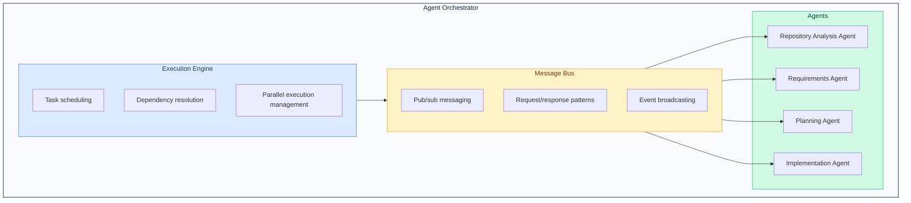

# Agent System Architecture

Multi-agent system implementation inspired by CrewAI, built in TypeScript.

## Design Philosophy

The agent system follows these principles:

1. **Specialization**: Each agent has a focused responsibility
2. **Autonomy**: Agents make decisions within their domain
3. **Collaboration**: Agents communicate through a message bus
4. **Observability**: All agent actions are logged and traceable

## System Components



## Core Interfaces

### IAgent

Base interface all agents implement:

```typescript
export interface IAgent {
  readonly id: string;
  readonly type: AgentType;
  readonly status: AgentStatus;
  readonly capabilities: AgentCapability[];

  initialize(context: AgentContext): Promise<void>;
  execute(task: AgentTask): Promise<AgentResult>;
  handleMessage(message: AgentMessage): Promise<void>;
  pause(): Promise<void>;
  resume(): Promise<void>;
  shutdown(): Promise<void>;
}

export type AgentType =
  | 'repository-analysis'
  | 'requirements'
  | 'planning'
  | 'implementation';

export type AgentStatus =
  | 'idle'
  | 'initializing'
  | 'executing'
  | 'paused'
  | 'error'
  | 'shutdown';
```

### AgentContext

Shared context provided to agents:

```typescript
export interface AgentContext {
  repoPath: string;
  analysisPath: string;
  config: AgentConfig;
  logger: ILogger;
  messageBus: IMessageBus;
  llmClient: ILLMClient;
}
```

### AgentTask

Work unit for agents:

```typescript
export interface AgentTask {
  id: string;
  type: string;
  payload: unknown;
  priority: number;
  timeout?: number;
  retryPolicy?: RetryPolicy;
}
```

### AgentResult

Execution outcome:

```typescript
export interface AgentResult {
  taskId: string;
  status: 'success' | 'failure' | 'partial';
  data?: unknown;
  error?: AgentError;
  metrics: ExecutionMetrics;
}
```

## Message Bus

### Message Types

```typescript
export interface AgentMessage {
  id: string;
  timestamp: Date;
  from: string;          // Agent ID or 'orchestrator'
  to: string;            // Agent ID, 'orchestrator', or 'broadcast'
  type: MessageType;
  payload: unknown;
  correlationId?: string;
  replyTo?: string;
}

export type MessageType =
  | 'task_assigned'
  | 'task_started'
  | 'task_progress'
  | 'task_completed'
  | 'task_failed'
  | 'clarification_request'
  | 'clarification_response'
  | 'context_update'
  | 'status_change'
  | 'abort';
```

### Communication Patterns

**Fire and Forget:**
```typescript
messageBus.publish({
  to: 'broadcast',
  type: 'context_update',
  payload: { analysisComplete: true }
});
```

**Request/Response:**
```typescript
const response = await messageBus.request({
  to: 'requirements-agent',
  type: 'clarification_request',
  payload: { question: 'Which auth method?' }
});
```

**Subscribe:**
```typescript
messageBus.subscribe('task_completed', (message) => {
  console.log(`Task ${message.payload.taskId} completed`);
});
```

## Agent Implementations

### BaseAgent

Abstract base class:

```typescript
export abstract class BaseAgent implements IAgent {
  readonly id: string;
  readonly type: AgentType;
  protected status: AgentStatus = 'idle';
  protected context: AgentContext | null = null;

  constructor(type: AgentType) {
    this.id = `${type}-${generateId()}`;
    this.type = type;
  }

  async initialize(context: AgentContext): Promise<void> {
    this.status = 'initializing';
    this.context = context;
    await this.onInitialize();
    this.status = 'idle';
  }

  async execute(task: AgentTask): Promise<AgentResult> {
    this.status = 'executing';
    const startTime = Date.now();

    try {
      const result = await this.onExecute(task);
      this.status = 'idle';
      return {
        taskId: task.id,
        status: 'success',
        data: result,
        metrics: { durationMs: Date.now() - startTime }
      };
    } catch (error) {
      this.status = 'error';
      return {
        taskId: task.id,
        status: 'failure',
        error: this.wrapError(error),
        metrics: { durationMs: Date.now() - startTime }
      };
    }
  }

  protected abstract onInitialize(): Promise<void>;
  protected abstract onExecute(task: AgentTask): Promise<unknown>;
}
```

### RepositoryAnalysisAgent

Analyzes repository structure and patterns:

```typescript
export class RepositoryAnalysisAgent extends BaseAgent {
  readonly capabilities = [
    'file_traversal',
    'pattern_detection',
    'dependency_analysis',
    'documentation_generation'
  ];

  protected async onExecute(task: AgentTask): Promise<AnalysisResult> {
    const { repoPath } = task.payload as AnalysisPayload;

    // Parallel analysis of different perspectives
    const [
      structure,
      dependencies,
      patterns,
      conventions
    ] = await Promise.all([
      this.analyzeStructure(repoPath),
      this.analyzeDependencies(repoPath),
      this.detectPatterns(repoPath),
      this.extractConventions(repoPath)
    ]);

    // Generate documentation
    const docs = await this.generateDocs({
      structure,
      dependencies,
      patterns,
      conventions
    });

    // Persist to analysis path
    await this.persistAnalysis(docs);

    return { docs, summary: this.createSummary(docs) };
  }
}
```

### RequirementsAgent

Gathers requirements through conversation:

```typescript
export class RequirementsAgent extends BaseAgent {
  readonly capabilities = [
    'conversation',
    'option_generation',
    'ambiguity_detection',
    'requirement_validation'
  ];

  protected async onExecute(task: AgentTask): Promise<Requirement[]> {
    const { feature, analysisContext } = task.payload as RequirementsPayload;
    const requirements: Requirement[] = [];

    // Generate initial options based on analysis
    const options = await this.generateOptions(analysisContext, feature);

    // Conversational loop
    while (true) {
      const response = await this.promptUser(options);

      if (response.type === 'selection') {
        requirements.push(...this.extractRequirements(response));
      }

      const openQuestions = this.detectAmbiguities(requirements);

      if (openQuestions.length === 0) {
        break; // All requirements clear
      }

      options = await this.generateClarifyingQuestions(openQuestions);
    }

    return this.validateRequirements(requirements);
  }
}
```

### PlanningAgent

Creates Tasks, ActionItems, and Artifacts:

```typescript
export class PlanningAgent extends BaseAgent {
  readonly capabilities = [
    'task_decomposition',
    'dependency_analysis',
    'artifact_generation',
    'effort_estimation'
  ];

  protected async onExecute(task: AgentTask): Promise<Plan> {
    const { feature, requirements } = task.payload as PlanningPayload;

    // Decompose into tasks
    const tasks = await this.decomposeTasks(feature, requirements);

    // Analyze and set dependencies
    const taskGraph = await this.analyzeDependencies(tasks);
    this.validateNoCycles(taskGraph);

    // Break tasks into action items
    for (const task of tasks) {
      task.actionItems = await this.createActionItems(task);
    }

    // Generate artifacts
    const artifacts = await this.generateArtifacts(feature, requirements, tasks);

    return { tasks, artifacts };
  }

  private async generateArtifacts(
    feature: Feature,
    requirements: Requirement[],
    tasks: Task[]
  ): Promise<Artifact[]> {
    return Promise.all([
      this.generatePRD(feature, requirements),
      this.generateRFC(feature, tasks),
      this.generateTechPlan(feature, tasks)
    ]);
  }
}
```

### ImplementationAgent

Executes code changes:

```typescript
export class ImplementationAgent extends BaseAgent {
  readonly capabilities = [
    'code_generation',
    'code_modification',
    'test_creation',
    'parallel_execution'
  ];

  protected async onExecute(task: AgentTask): Promise<ImplementationResult> {
    const { plan } = task.payload as ImplementationPayload;

    const results: TaskResult[] = [];
    const taskGraph = this.buildExecutionGraph(plan.tasks);

    while (taskGraph.hasExecutable()) {
      // Get tasks with satisfied dependencies
      const executable = taskGraph.getExecutable();

      // Execute in parallel where safe
      const batchResults = await Promise.all(
        executable.map(t => this.executeTask(t))
      );

      results.push(...batchResults);
      taskGraph.markCompleted(executable.map(t => t.id));
    }

    return { results, summary: this.createSummary(results) };
  }

  private async executeTask(task: Task): Promise<TaskResult> {
    // Execute action items sequentially within task
    for (const actionItem of task.actionItems) {
      await this.executeActionItem(actionItem);
    }
    return { taskId: task.id, status: 'completed' };
  }
}
```

## Orchestrator

Coordinates agent lifecycle and execution:

```typescript
export class AgentOrchestrator {
  private agents: Map<string, IAgent> = new Map();
  private messageBus: MessageBus;

  async executeWorkflow(workflow: Workflow): Promise<WorkflowResult> {
    const context = await this.createContext(workflow);

    // Initialize required agents
    for (const agentType of workflow.requiredAgents) {
      const agent = this.createAgent(agentType);
      await agent.initialize(context);
      this.agents.set(agent.id, agent);
    }

    // Execute workflow steps
    const results: StepResult[] = [];
    for (const step of workflow.steps) {
      const agent = this.getAgentForStep(step);
      const result = await agent.execute(step.task);
      results.push({ step, result });

      // Broadcast context updates
      this.messageBus.publish({
        to: 'broadcast',
        type: 'context_update',
        payload: result.data
      });
    }

    return { results };
  }
}
```

## Error Handling

### Retry Policies

```typescript
export interface RetryPolicy {
  maxAttempts: number;
  backoffMs: number;
  backoffMultiplier: number;
  retryableErrors: string[];
}

const defaultRetryPolicy: RetryPolicy = {
  maxAttempts: 3,
  backoffMs: 1000,
  backoffMultiplier: 2,
  retryableErrors: ['TIMEOUT', 'RATE_LIMIT', 'TRANSIENT']
};
```

### Error Recovery

Agents implement recovery strategies:

```typescript
protected async executeWithRetry(
  fn: () => Promise<unknown>,
  policy: RetryPolicy
): Promise<unknown> {
  let lastError: Error;
  let delay = policy.backoffMs;

  for (let attempt = 1; attempt <= policy.maxAttempts; attempt++) {
    try {
      return await fn();
    } catch (error) {
      lastError = error;

      if (!this.isRetryable(error, policy)) {
        throw error;
      }

      await this.sleep(delay);
      delay *= policy.backoffMultiplier;
    }
  }

  throw lastError;
}
```

## Observability

### Logging

```typescript
// Structured logging for all agent actions
this.context.logger.info('agent.task.started', {
  agentId: this.id,
  taskId: task.id,
  taskType: task.type
});
```

### Metrics

```typescript
export interface ExecutionMetrics {
  durationMs: number;
  llmCalls?: number;
  tokensUsed?: number;
  filesProcessed?: number;
  retryCount?: number;
}
```

---

## Maintaining This Document

**Update when:**
- New agent types are added
- Message types change
- Orchestration patterns evolve
- Error handling strategies change

**Related docs:**
- [AGENTS.md](../../AGENTS.md) - High-level agent reference
- [../api/agent-interfaces.md](../api/agent-interfaces.md) - Full interface specs
