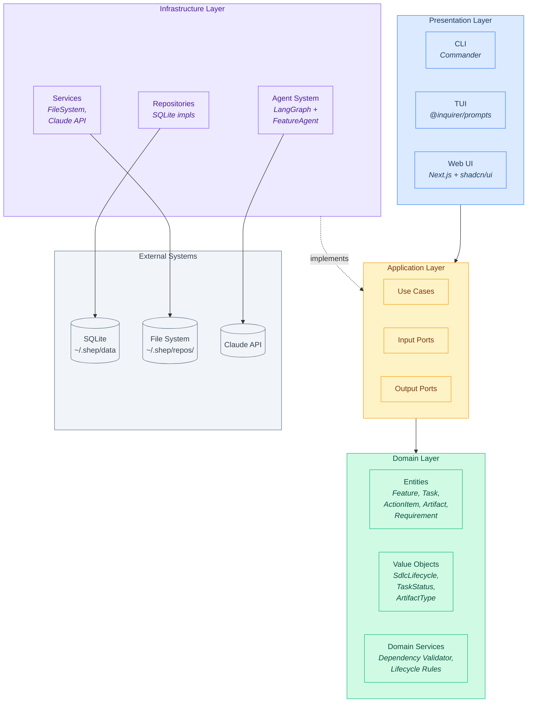
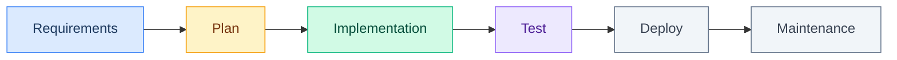
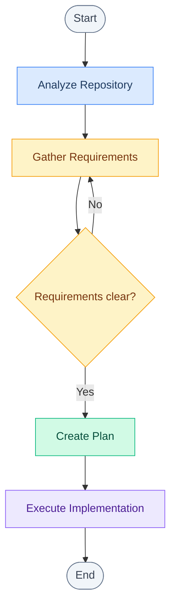
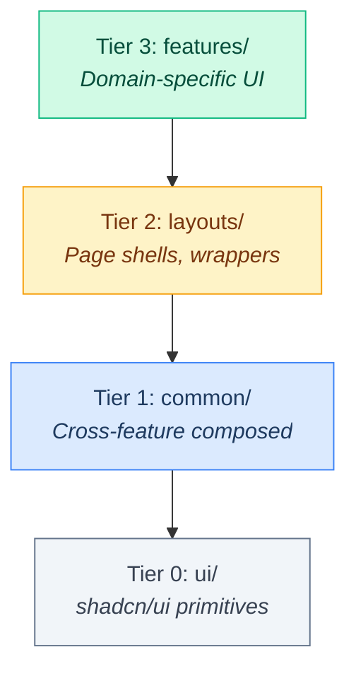

# Architecture Diagram

Comprehensive architecture diagram for the Shep AI CLI platform.

## System Architecture



## Dependency Rule

```
Presentation --> Application --> Domain <-- Infrastructure
```

- **Domain** depends on nothing (pure business logic)
- **Application** depends only on Domain (use cases, ports)
- **Infrastructure** implements Application interfaces (repositories, agents, services)
- **Presentation** depends on Application (calls use cases)

## Feature Lifecycle Flow



## Agent Workflow (LangGraph)



## Web UI Component Tiers



## Technology Stack

| Concern | Choice | Layer |
|---------|--------|-------|
| Language | TypeScript | All |
| Package Manager | pnpm | Build |
| CLI Framework | Commander | Presentation |
| TUI Framework | @inquirer/prompts | Presentation |
| Web Framework | Next.js 16+ | Presentation |
| UI Components | shadcn/ui + Radix | Presentation |
| Design System | Storybook | Presentation |
| Domain Models | TypeSpec | Domain |
| Agent Orchestration | LangGraph | Infrastructure |
| Database | SQLite | Infrastructure |
| Build | tsc + tsc-alias | Build |
| Unit Testing | Vitest | All |
| E2E Testing | Playwright | Presentation |
| Methodology | TDD (Red-Green-Refactor) | All |

## Data Storage

```
~/.shep/
├── data                           # Global SQLite database
└── repos/
    └── <base64-encoded-repo-path>/
        ├── data                   # Per-repo SQLite database
        ├── docs/                  # Repository analysis docs
        └── artifacts/             # Generated feature artifacts
            └── <feature-id>/
                ├── prd.md
                ├── rfc.md
                └── ...
```
