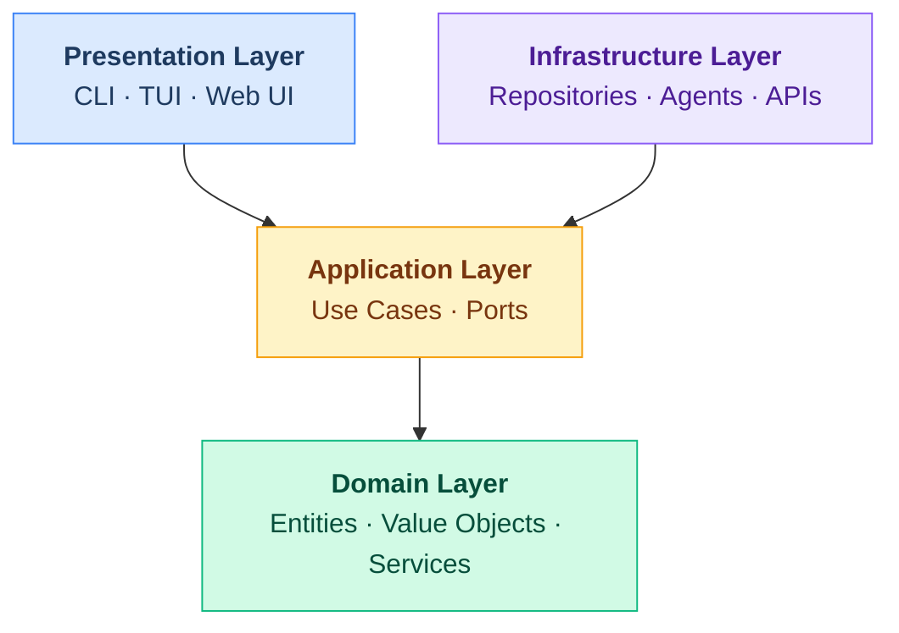

# Clean Architecture

Shep AI CLI implements Clean Architecture to ensure testability, maintainability, and independence from external concerns.

## Layer Overview



## The Dependency Rule

Dependencies only point inward:

```
Presentation → Application → Domain ← Infrastructure
```

- **Domain** depends on nothing
- **Application** depends only on Domain
- **Infrastructure** depends on Application (implements its interfaces)
- **Presentation** depends on Application (calls use cases)

## Layer Details

### Domain Layer (`packages/core/src/domain/`)

The innermost layer containing pure business logic.

```
packages/core/src/domain/
├── entities/
│   ├── feature.ts          # Feature aggregate root
│   ├── task.ts             # Task entity
│   ├── action-item.ts      # ActionItem entity
│   ├── artifact.ts         # Artifact entity
│   └── requirement.ts      # Requirement entity
├── value-objects/
│   ├── sdlc-lifecycle.ts   # Enum: Requirements|Plan|Implementation|Test|Deploy|Maintenance
│   ├── task-status.ts      # Enum: Pending|InProgress|Completed|Blocked
│   └── artifact-type.ts    # Enum: PRD|RFC|Design|TechPlan|Other
└── services/
    ├── dependency-validator.ts    # Validates dependency graphs
    └── lifecycle-rules.ts         # Lifecycle transition rules
```

**Rules:**

- No imports from other layers
- No framework dependencies
- No I/O operations
- Pure functions and classes
- Rich domain models (behavior + data)

**Example Entity:**

```typescript
// packages/core/src/domain/entities/feature.ts
export class Feature {
  constructor(
    public readonly id: string,
    public readonly name: string,
    public readonly description: string,
    private _lifecycle: SdlcLifecycle,
    private _requirements: Requirement[],
    private _tasks: Task[],
    private _artifacts: Artifact[]
  ) {}

  get lifecycle(): SdlcLifecycle {
    return this._lifecycle;
  }

  canTransitionTo(target: SdlcLifecycle): boolean {
    // Domain logic for valid transitions
    return LifecycleRules.canTransition(this._lifecycle, target);
  }

  transitionTo(target: SdlcLifecycle): void {
    if (!this.canTransitionTo(target)) {
      throw new InvalidLifecycleTransitionError(this._lifecycle, target);
    }
    this._lifecycle = target;
  }
}
```

### Application Layer (`packages/core/src/application/`)

Orchestrates domain logic through Use Cases.

```
packages/core/src/application/
├── use-cases/
│   ├── init-repository.ts
│   ├── analyze-repository.ts
│   ├── gather-requirements.ts
│   ├── create-plan.ts
│   ├── execute-implementation.ts
│   └── transition-lifecycle.ts
├── ports/
│   ├── input/              # Use case interfaces (driven)
│   │   ├── init-repository.port.ts
│   │   └── ...
│   └── output/             # Repository interfaces (driving)
│       ├── feature-repository.port.ts
│       ├── task-repository.port.ts
│       └── ...
└── services/
    └── orchestration.service.ts
```

**Rules:**

- Depends only on Domain layer
- Defines interfaces (ports) for external concerns
- One use case per file
- Use cases have single `execute()` method
- No knowledge of how ports are implemented

**Example Use Case:**

```typescript
// packages/core/src/application/use-cases/create-plan.ts
export class CreatePlanUseCase {
  constructor(
    private readonly featureRepository: IFeatureRepository,
    private readonly planningAgent: IPlanningAgent
  ) {}

  async execute(featureId: string): Promise<CreatePlanResult> {
    const feature = await this.featureRepository.findById(featureId);

    if (!feature) {
      throw new FeatureNotFoundError(featureId);
    }

    if (!feature.canTransitionTo(SdlcLifecycle.Plan)) {
      throw new InvalidLifecycleError(feature.lifecycle, SdlcLifecycle.Plan);
    }

    const plan = await this.planningAgent.generatePlan(feature);

    feature.transitionTo(SdlcLifecycle.Plan);
    feature.setTasks(plan.tasks);
    feature.setArtifacts(plan.artifacts);

    await this.featureRepository.save(feature);

    return { feature, plan };
  }
}
```

**Example Port:**

```typescript
// packages/core/src/application/ports/output/feature-repository.port.ts
export interface IFeatureRepository {
  findById(id: string): Promise<Feature | null>;
  findByRepoPath(repoPath: string): Promise<Feature[]>;
  save(feature: Feature): Promise<void>;
  delete(id: string): Promise<void>;
}
```

### Infrastructure Layer (`packages/core/src/infrastructure/`)

Implements Application layer interfaces.

```
packages/core/src/infrastructure/
├── repositories/
│   ├── sqlite/
│   │   ├── feature.repository.ts
│   │   ├── task.repository.ts
│   │   └── ...
│   └── mappers/
│       ├── feature.mapper.ts    # Domain ↔ Persistence mapping
│       └── ...
├── persistence/
│   ├── database.ts              # SQLite connection
│   └── migrations/
├── agents/
│   ├── base-agent.ts
│   ├── repository-analysis.agent.ts
│   ├── requirements.agent.ts
│   ├── planning.agent.ts
│   └── implementation.agent.ts
└── services/
    ├── file-system.service.ts
    └── claude-api.service.ts
```

**Rules:**

- Implements interfaces from Application layer
- Contains all external dependencies
- Handles data mapping between layers
- No business logic (only technical concerns)

**Example Repository:**

```typescript
// packages/core/src/infrastructure/repositories/sqlite/feature.repository.ts
export class SqliteFeatureRepository implements IFeatureRepository {
  constructor(private readonly db: Database) {}

  async findById(id: string): Promise<Feature | null> {
    const row = await this.db.get('SELECT * FROM features WHERE id = ?', id);
    return row ? FeatureMapper.toDomain(row) : null;
  }

  async save(feature: Feature): Promise<void> {
    const data = FeatureMapper.toPersistence(feature);
    await this.db.run(
      'INSERT OR REPLACE INTO features (id, name, description, lifecycle, repo_path) VALUES (?, ?, ?, ?, ?)',
      [data.id, data.name, data.description, data.lifecycle, data.repoPath]
    );
  }
}
```

### Presentation Layer (`src/presentation/`)

User interface implementations.

```
src/presentation/
├── cli/                     # Commander-based CLI
│   ├── index.ts             # Commander setup
│   ├── commands/
│   │   ├── init.command.ts
│   │   ├── status.command.ts
│   │   └── ...
│   └── formatters/          # Output formatting
├── tui/                     # @inquirer/prompts interactive wizards
│   ├── wizards/             # Multi-step wizard flows
│   ├── prompts/             # Reusable prompt configurations
│   └── themes/              # Custom Inquirer themes
└── web/                     # Next.js + shadcn/ui
    ├── app/                 # Next.js App Router
    │   ├── layout.tsx
    │   ├── page.tsx
    │   └── features/
    ├── components/
    │   ├── ui/              # shadcn/ui components
    │   └── features/        # Feature-specific components
    └── stories/             # Storybook stories
```

**Technologies:**
| Component | Framework | Purpose |
|-----------|-----------|---------|
| CLI | Commander | Command parsing and execution |
| TUI | @inquirer/prompts | Interactive prompts (select, confirm, input, password) |
| Web UI | Next.js 16+ | App Router, Server Components |
| Components | shadcn/ui | Accessible UI primitives |
| Design System | Storybook | Component documentation and testing |

**Rules:**

- Only interacts with Application layer
- Handles user input/output formatting
- No business logic
- Thin layer - delegates to use cases

## Dependency Injection

Use a DI container to wire layers together:

```typescript
// packages/core/src/container.ts
export function createContainer(config: Config): Container {
  const db = new Database(config.dbPath);

  // Repositories
  const featureRepository = new SqliteFeatureRepository(db);
  const taskRepository = new SqliteTaskRepository(db);

  // Agents
  const planningAgent = new PlanningAgent(config.agentConfig);

  // Use Cases
  const createPlanUseCase = new CreatePlanUseCase(featureRepository, planningAgent);

  return {
    useCases: { createPlanUseCase },
    repositories: { featureRepository, taskRepository },
  };
}
```

## Testing Strategy (TDD)

We follow **Test-Driven Development** (Red-Green-Refactor) across all layers.

| Layer              | Test Type   | Framework  | Dependencies               |
| ------------------ | ----------- | ---------- | -------------------------- |
| Domain             | Unit        | Vitest     | None (pure)                |
| Application        | Unit        | Vitest     | Mock ports                 |
| Infrastructure     | Integration | Vitest     | Real DB (in-memory SQLite) |
| Presentation (CLI) | E2E         | Vitest     | CLI execution              |
| Presentation (Web) | E2E         | Playwright | Full browser stack         |
| Components         | Visual      | Storybook  | Component isolation        |

**TDD Workflow:**

1. **RED** - Write a failing test that defines expected behavior
2. **GREEN** - Write minimal code to make the test pass
3. **REFACTOR** - Improve code while keeping tests green

See [docs/development/tdd-guide.md](../development/tdd-guide.md) for detailed TDD workflow with examples.

---

## Maintaining This Document

**Update when:**

- New layers or sublayers are added
- Dependency rules change
- New patterns are introduced
- Example code becomes outdated

**Related docs:**

- [repository-pattern.md](./repository-pattern.md) - Data access details
- [../api/repository-interfaces.md](../api/repository-interfaces.md) - Port specifications
