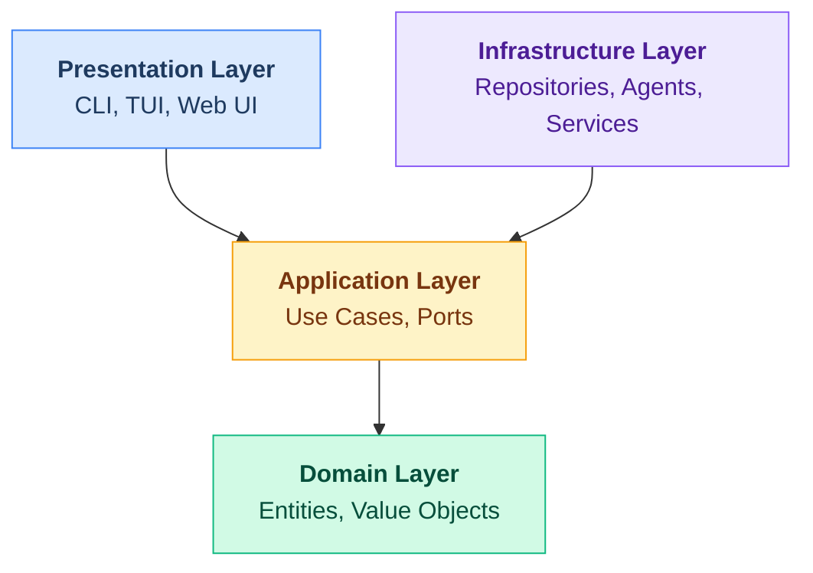

# Clean Architecture

Shep AI CLI implements Clean Architecture to ensure testability, maintainability, and independence from external concerns.

## Layer Overview


```mermaid
flowchart TB
    P["<b>Presentation Layer</b><br/>CLI, TUI, Web UI"]
    A["<b>Application Layer</b><br/>Use Cases, Ports"]
    D["<b>Domain Layer</b><br/>Entities, Value Objects"]
    I["<b>Infrastructure Layer</b><br/>Repositories, Agents, Services"]

    P --> A --> D
    I --> A

    style P fill:#dbeafe,stroke:#3b82f6,color:#1e3a5f
    style A fill:#fef3c7,stroke:#f59e0b,color:#78350f
    style D fill:#d1fae5,stroke:#10b981,color:#064e3b
    style I fill:#ede9fe,stroke:#8b5cf6,color:#4c1d95
```

## The Dependency Rule

Dependencies only point inward:

```
Presentation -> Application -> Domain <- Infrastructure
```

- **Domain** depends on nothing
- **Application** depends only on Domain
- **Infrastructure** depends on Application (implements its interfaces)
- **Presentation** depends on Application (calls use cases)

## Layer Details

### Domain Layer (`packages/core/src/domain/`)

The innermost layer containing pure business types. Domain models are generated from TypeSpec definitions.

```
packages/core/src/domain/
+-- generated/
    +-- output.ts              # TypeSpec-generated types (Feature, Task, Settings, etc.)
```

**Rules:**

- No imports from other layers
- No framework dependencies
- No I/O operations
- Types are generated from TypeSpec (`tsp/`) -- never edit output.ts directly

**Key Types:** Feature, Task, ActionItem, Artifact, Requirement, Plan, Settings, Repository, Message, SdlcLifecycle, TaskState, AgentType

### Application Layer (`packages/core/src/application/`)

Defines interfaces (ports) for external concerns and orchestrates domain logic.

```
packages/core/src/application/
+-- ports/
    +-- output/
        +-- repositories/
        |   +-- feature-repository.interface.ts
        |   +-- settings.repository.interface.ts
        |   +-- repository-repository.interface.ts
        +-- agents/
        |   +-- agent-executor.interface.ts
        |   +-- agent-executor-factory.interface.ts
        |   +-- agent-executor-provider.interface.ts
        |   +-- agent-registry.interface.ts
        |   +-- agent-runner.interface.ts
        |   +-- agent-run-repository.interface.ts
        |   +-- agent-session-repository.interface.ts
        |   +-- agent-validator.interface.ts
        |   +-- feature-agent-process.interface.ts
        |   +-- phase-timing-repository.interface.ts
        |   +-- structured-agent-caller.interface.ts
        +-- services/
            +-- daemon-service.interface.ts
            +-- deployment-service.interface.ts
            +-- git-pr-service.interface.ts
            +-- ide-launcher-service.interface.ts
            +-- notification-service.interface.ts
            +-- spec-initializer.interface.ts
            +-- tool-installer.service.ts
            +-- version-service.interface.ts
            +-- web-server-service.interface.ts
            +-- worktree-service.interface.ts
            +-- external-issue-fetcher.interface.ts
```

**Rules:**

- Depends only on Domain layer
- Defines interfaces (ports) for external concerns
- No knowledge of how ports are implemented

### Infrastructure Layer (`packages/core/src/infrastructure/`)

Implements Application layer interfaces.

```
packages/core/src/infrastructure/
+-- di/
|   +-- container.ts               # tsyringe DI container setup
+-- persistence/
|   +-- sqlite/
|       +-- connection.ts          # Database connection (~/.shep/data)
|       +-- migrations.ts          # Schema migrations (user_version pragma)
|       +-- mappers/               # Domain <-> Persistence mapping
+-- repositories/
|   +-- sqlite-feature.repository.ts
|   +-- sqlite-settings.repository.ts
|   +-- sqlite-repository.repository.ts
|   +-- agent-run.repository.ts
|   +-- sqlite-phase-timing.repository.ts
+-- services/
    +-- agents/
    |   +-- analyze-repo/          # Repository analysis LangGraph
    |   +-- feature-agent/         # Feature SDLC LangGraph
    |   +-- sessions/              # Agent session management
    |   +-- streaming/             # Agent output streaming
    |   +-- common/                # Shared agent utilities
    +-- settings.service.ts        # Singleton settings service
    +-- ... (other service implementations)
```

**Rules:**

- Implements interfaces from Application layer
- Contains all external dependencies (SQLite, LangGraph, better-sqlite3)
- Handles data mapping between layers
- No business logic (only technical concerns)

### Presentation Layer (`src/presentation/`)

User interface implementations.

```
src/presentation/
+-- cli/                     # Commander-based CLI
|   +-- index.ts             # Commander setup + bootstrap
|   +-- commands/            # CLI command implementations
+-- tui/                     # @inquirer/prompts interactive wizards
|   +-- wizards/             # Multi-step wizard flows
|   +-- prompts/             # Reusable prompt configurations
+-- web/                     # Next.js + shadcn/ui
    +-- app/                 # Next.js App Router
    +-- components/          # React components (with colocated .stories.tsx)
    +-- hooks/               # React hooks
    +-- lib/                 # Utility libraries
```

**Technologies:**

| Component     | Framework         | Purpose                                                |
| ------------- | ----------------- | ------------------------------------------------------ |
| CLI           | Commander         | Command parsing and execution                          |
| TUI           | @inquirer/prompts | Interactive prompts (select, confirm, input, password) |
| Web UI        | Next.js 16+       | App Router, Server Components                          |
| Components    | shadcn/ui         | Accessible UI primitives                               |
| Design System | Storybook         | Component documentation and testing                    |

**Rules:**

- Only interacts with Application layer
- Handles user input/output formatting
- No business logic
- Thin layer - delegates to use cases

## Dependency Injection

Uses tsyringe IoC container to wire layers together:

```typescript
// packages/core/src/infrastructure/di/container.ts
export async function initializeContainer(): Promise<typeof container> {
  const db = await getSQLiteConnection();
  await runSQLiteMigrations(db);

  container.registerInstance<Database.Database>('Database', db);

  container.register<ISettingsRepository>('ISettingsRepository', {
    useFactory: (c) => new SQLiteSettingsRepository(c.resolve('Database')),
  });

  // ... register other repositories, services, use cases
  return container;
}
```

## Testing Strategy (TDD)

We follow **Test-Driven Development** (Red-Green-Refactor) across all layers.

| Layer              | Test Type   | Framework  | Dependencies               |
| ------------------ | ----------- | ---------- | -------------------------- |
| Domain             | Unit        | Vitest     | None (pure)                |
| Application        | Unit        | Vitest     | Mock ports                 |
| Infrastructure     | Integration | Vitest     | Real DB (in-memory SQLite) |
| Presentation (CLI) | E2E         | Vitest     | CLI execution              |
| Presentation (Web) | E2E         | Playwright | Full browser stack         |
| Components         | Visual      | Storybook  | Component isolation        |

See [docs/development/tdd-guide.md](../development/tdd-guide.md) for detailed TDD workflow with examples.

---

## Maintaining This Document

**Update when:**

- New layers or sublayers are added
- Dependency rules change
- New patterns are introduced

**Related docs:**

- [repository-pattern.md](./repository-pattern.md) - Data access details
- [../api/repository-interfaces.md](../api/repository-interfaces.md) - Port specifications
