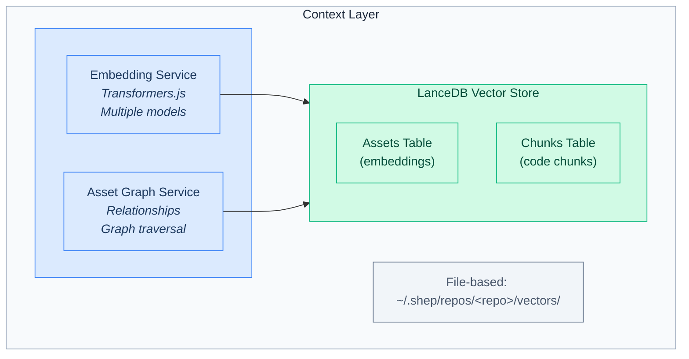

# Context Layer Architecture

The Context Layer provides rich codebase knowledge to agents through vector search and an asset graph.

## Overview



## Technology Stack

| Component | Technology | Purpose |
|-----------|------------|---------|
| Vector DB | [LanceDB](https://lancedb.com/) | File-based vector storage with SQL-like queries |
| Embeddings | [Transformers.js](https://huggingface.co/docs/transformers.js) | Local embedding generation |
| Models | Multiple (configurable) | MiniLM, BGE, E5, GTE |

### Why LanceDB?

- **File-based**: Single folder storage, no server needed
- **TypeScript native**: First-class SDK support
- **SQL-like queries**: Filter by metadata fields
- **Used by Continue**: Proven for codebase indexing
- **Multimodal**: Can store code, docs, images

### Why Local Embeddings?

- **No API costs**: Free, unlimited embeddings
- **Privacy**: Code never leaves the machine
- **Fast**: ~20ms per embedding
- **Offline**: Works without internet

## File Structure

```
~/.shep/repos/<repo-id>/
├── data              # SQLite (relational domain data)
├── docs/             # Analysis markdown documents
├── vectors/          # LanceDB vector storage
│   ├── assets.lance  # Asset embeddings table
│   └── chunks.lance  # Code chunk embeddings table
└── graph/            # Asset relationship graph
    └── graph.json    # Serialized graph structure
```

## Components

### LocalEmbeddingService

Generates embeddings locally using Transformers.js with configurable models.

```typescript
// src/infrastructure/services/embedding.service.ts

import { pipeline, type Pipeline } from '@huggingface/transformers';

export type EmbeddingModel =
  | 'Xenova/all-MiniLM-L6-v2'      // 22MB, 384-dim, fast (default)
  | 'Xenova/bge-small-en-v1.5'     // 33MB, 384-dim, better quality
  | 'Xenova/e5-small-v2'           // 33MB, 384-dim, good for retrieval
  | 'Xenova/gte-small';            // 33MB, 384-dim, general purpose

export const EMBEDDING_MODELS: Record<EmbeddingModel, EmbeddingConfig> = {
  'Xenova/all-MiniLM-L6-v2': { dimensions: 384, maxTokens: 256 },
  'Xenova/bge-small-en-v1.5': { dimensions: 384, maxTokens: 512 },
  'Xenova/e5-small-v2': { dimensions: 384, maxTokens: 512 },
  'Xenova/gte-small': { dimensions: 384, maxTokens: 512 }
};

export class LocalEmbeddingService implements IEmbeddingService {
  private extractor: Pipeline | null = null;
  private config: EmbeddingConfig;

  constructor(modelName: EmbeddingModel = 'Xenova/all-MiniLM-L6-v2') {
    this.config = EMBEDDING_MODELS[modelName];
  }

  async initialize(): Promise<void> {
    this.extractor = await pipeline('feature-extraction', this.config.model, {
      quantized: true  // Use quantized models for speed
    });
  }

  async embed(text: string): Promise<number[]> {
    if (!this.extractor) await this.initialize();

    const output = await this.extractor!(text, {
      pooling: 'mean',
      normalize: true
    });

    return Array.from(output.data);
  }

  async embedBatch(texts: string[]): Promise<number[][]> {
    // Batch processing for efficiency
  }

  getDimensions(): number {
    return this.config.dimensions;
  }
}
```

### LanceVectorStore

File-based vector database for persistent, queryable embeddings.

```typescript
// src/infrastructure/repositories/lance/vector-store.ts

import * as lancedb from '@lancedb/lancedb';

export class LanceVectorStore implements IVectorStore {
  private db: lancedb.Connection;
  private assetsTable: lancedb.Table;
  private chunksTable: lancedb.Table;

  async connect(dbPath: string): Promise<void> {
    this.db = await lancedb.connect(dbPath);

    // Create or open tables
    try {
      this.assetsTable = await this.db.openTable('assets');
    } catch {
      this.assetsTable = await this.db.createTable('assets', [
        { id: '', type: '', name: '', path: '', vector: new Array(384).fill(0) }
      ]);
    }

    // Similar for chunks table
  }

  async searchAssets(
    queryVector: number[],
    options: SearchOptions = {}
  ): Promise<Asset[]> {
    let query = this.assetsTable
      .search(queryVector)
      .limit(options.limit ?? 10);

    // SQL-like filtering
    if (options.filter) {
      query = query.where(options.filter);
    }

    const results = await query.execute();
    return results.map(this.mapToAsset);
  }

  async upsertAsset(asset: Asset & { vector: number[] }): Promise<void> {
    await this.assetsTable.add([asset]);
  }

  async searchCodeChunks(
    queryVector: number[],
    options?: ChunkSearchOptions
  ): Promise<CodeChunk[]> {
    // Similar implementation for code chunks
  }
}
```

### AssetGraphService

Manages the knowledge graph of codebase assets and their relationships.

```typescript
// src/infrastructure/services/asset-graph.service.ts

export class AssetGraphService implements IAssetGraph {
  private assets: Map<string, Asset> = new Map();
  private relations: AssetRelation[] = [];
  private vectorStore: LanceVectorStore;
  private embeddingService: LocalEmbeddingService;

  async buildFromRepository(repoPath: string): Promise<void> {
    // 1. Scan all files
    const files = await scanFiles(repoPath, config.excludePatterns);

    // 2. Parse and extract assets
    for (const file of files) {
      const fileAsset = await this.extractFileAsset(file);
      await this.addAsset(fileAsset);

      // Extract sub-assets (functions, classes, etc.)
      const subAssets = await this.parseFileContents(file);
      for (const asset of subAssets) {
        await this.addAsset(asset);
        this.relations.push({
          fromId: fileAsset.id,
          toId: asset.id,
          type: 'contains'
        });
      }
    }

    // 3. Build relationships (imports, extends, etc.)
    await this.buildRelationships();

    // 4. Persist graph
    await this.persist();
  }

  async addAsset(asset: Asset): Promise<void> {
    // Generate embedding from description
    const description = `${asset.type}: ${asset.name}. ${asset.description || ''}`;
    const vector = await this.embeddingService.embed(description);

    // Store in LanceDB
    await this.vectorStore.upsertAsset({ ...asset, vector });

    // Store in memory graph
    this.assets.set(asset.id, asset);
  }

  async queryRelated(assetId: string, depth: number = 1): Promise<Asset[]> {
    // Graph traversal using BFS
    const related = new Set<string>();
    const queue = [{ id: assetId, currentDepth: 0 }];

    while (queue.length > 0) {
      const { id, currentDepth } = queue.shift()!;
      if (currentDepth >= depth) continue;

      const directRelations = this.relations.filter(
        r => r.fromId === id || r.toId === id
      );

      for (const rel of directRelations) {
        const otherId = rel.fromId === id ? rel.toId : rel.fromId;
        if (!related.has(otherId)) {
          related.add(otherId);
          queue.push({ id: otherId, currentDepth: currentDepth + 1 });
        }
      }
    }

    return Array.from(related).map(id => this.assets.get(id)!).filter(Boolean);
  }

  async findSimilar(query: string, type?: AssetType): Promise<Asset[]> {
    const queryVector = await this.embeddingService.embed(query);
    return this.vectorStore.searchAssets(queryVector, {
      filter: type ? `type = '${type}'` : undefined,
      limit: 10
    });
  }
}
```

### CodeChunkerService

Chunks code into semantic units for embedding.

```typescript
// src/infrastructure/services/chunker.service.ts

export interface CodeChunk {
  id: string;
  assetId: string;      // Parent file asset
  content: string;      // Chunk text
  startLine: number;
  endLine: number;
  type: 'function' | 'class' | 'block' | 'comment' | 'import';
  embedding?: number[];
}

export class CodeChunkerService {
  constructor(
    private config: ChunkingConfig = {
      chunkSize: 200,       // tokens per chunk
      chunkOverlap: 50,     // overlap between chunks
      respectBoundaries: true  // Don't split functions/classes
    }
  ) {}

  async chunkFile(filePath: string, content: string): Promise<CodeChunk[]> {
    const language = detectLanguage(filePath);
    const ast = await parseAST(content, language);

    // Extract semantic boundaries (functions, classes, etc.)
    const boundaries = extractBoundaries(ast);

    // Chunk respecting boundaries
    return this.createChunks(content, boundaries);
  }

  private createChunks(content: string, boundaries: Boundary[]): CodeChunk[] {
    // Implementation that respects function/class boundaries
    // while keeping chunks under maxTokens
  }
}
```

## Configuration

In `~/.shep/config.json`:

```json
{
  "context": {
    "embedding": {
      "model": "Xenova/all-MiniLM-L6-v2",
      "batchSize": 32
    },
    "indexing": {
      "excludePatterns": [
        "**/node_modules/**",
        "**/dist/**",
        "**/.git/**",
        "**/coverage/**"
      ],
      "maxFileSize": 1048576,
      "chunkSize": 200,
      "chunkOverlap": 50
    },
    "search": {
      "defaultLimit": 10,
      "minScore": 0.5
    }
  }
}
```

## Integration with Agents

The Context Layer integrates with agents via the `context_query` tool:

```typescript
// src/infrastructure/agents/langgraph/tools/context-query.tool.ts

import { tool } from '@langchain/core/tools';
import { z } from 'zod';

export const contextQueryTool = tool(
  async ({ query, assetType, limit }) => {
    const vectorStore = getVectorStore();
    const embedding = await embed(query);

    const results = await vectorStore.searchAssets(embedding, {
      filter: assetType ? `type = '${assetType}'` : undefined,
      limit
    });

    return JSON.stringify(results);
  },
  {
    name: 'context_query',
    description: 'Search the codebase knowledge graph for relevant code, components, or documentation',
    schema: z.object({
      query: z.string().describe('Natural language query'),
      assetType: z.string().optional().describe('Filter by asset type (file, function, class, component, etc.)'),
      limit: z.number().default(10)
    })
  }
);
```

### Usage in Agent Nodes

```typescript
// In analyze node
const relevantComponents = await contextQueryTool.invoke({
  query: 'authentication related components',
  assetType: 'component',
  limit: 5
});

// In requirements node
const existingPatterns = await contextQueryTool.invoke({
  query: 'how is user data handled',
  limit: 10
});

// In implement node
const relatedTests = await contextQueryTool.invoke({
  query: state.currentTask.description,
  assetType: 'test',
  limit: 3
});
```

## Port Interfaces

```typescript
// src/application/ports/output/vector-store.port.ts
export interface IVectorStore {
  connect(path: string): Promise<void>;
  searchByVector(vector: number[], options?: SearchOptions): Promise<SearchResult[]>;
  upsert(items: VectorItem[]): Promise<void>;
  delete(ids: string[]): Promise<void>;
}

// src/application/ports/output/embedding.port.ts
export interface IEmbeddingService {
  embed(text: string): Promise<number[]>;
  embedBatch(texts: string[]): Promise<number[][]>;
  getDimensions(): number;
}

// src/application/ports/output/asset-graph.port.ts
export interface IAssetGraph {
  buildFromRepository(repoPath: string): Promise<void>;
  addAsset(asset: Asset): Promise<void>;
  addRelation(relation: AssetRelation): Promise<void>;
  getAsset(id: string): Promise<Asset | null>;
  queryRelated(assetId: string, depth?: number): Promise<Asset[]>;
  findSimilar(query: string, type?: AssetType): Promise<Asset[]>;
}
```

## Indexing Workflow

```
1. User runs: shep --init
                │
                ▼
2. Scan repository files
   (respecting excludePatterns)
                │
                ▼
3. For each file:
   ├─ Create file asset
   ├─ Parse AST
   ├─ Extract sub-assets (functions, classes, etc.)
   ├─ Generate embeddings
   └─ Store in LanceDB
                │
                ▼
4. Build relationships
   (imports, extends, implements, etc.)
                │
                ▼
5. Persist graph to disk
                │
                ▼
6. Context Layer ready for queries
```

## Performance Considerations

### Embedding Generation

- Models are loaded lazily on first use
- Quantized models reduce memory and increase speed
- Batch processing for multiple texts

### Vector Search

- LanceDB uses IVF-PQ indexing for fast approximate search
- Filtering happens server-side (efficient)
- Results are paginated

### Memory Management

- Graph is loaded on-demand
- Large repos use disk-based iteration
- Embedding model unloaded when idle

---

## Maintaining This Document

**Update when:**
- New embedding models are supported
- Vector store implementation changes
- Indexing workflow changes
- Performance optimizations are added

**Related docs:**
- [AGENTS.md](../../AGENTS.md) - Agent integration
- [../concepts/asset-graph.md](../concepts/asset-graph.md) - Asset types and relations
- [../api/repository-interfaces.md](../api/repository-interfaces.md) - Port specifications
