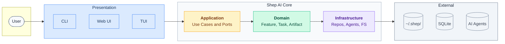

# System Architecture Overview

High-level architecture of the Shep AI CLI platform.

## System Context


```mermaid
flowchart LR
    subgraph Users[" "]
        User(["User"])
    end

    subgraph UI["Presentation"]
        direction TB
        CLI[CLI]
        WebUI[Web UI]
        TUI[TUI]
    end

    subgraph Core["Shep AI Core"]
        direction TB
        App["<b>Application</b><br/>Use Cases and Ports"]
        Dom["<b>Domain</b><br/>Feature, Task, Artifact"]
        Infra["<b>Infrastructure</b><br/>Repos, Agents, FS"]
    end

    subgraph Ext["External"]
        direction TB
        FS[("~/.shep/")]
        DB[("SQLite")]
        AI[("AI Agents")]
    end

    User --> UI
    UI --> App
    App --> Dom
    Dom --> Infra
    Infra --> Ext

    style User fill:#f8fafc,stroke:#64748b,color:#1e293b
    style CLI fill:#dbeafe,stroke:#3b82f6,color:#1e3a5f
    style WebUI fill:#dbeafe,stroke:#3b82f6,color:#1e3a5f
    style TUI fill:#dbeafe,stroke:#3b82f6,color:#1e3a5f
    style UI fill:#dbeafe,stroke:#3b82f6,color:#1e3a5f
    style App fill:#fef3c7,stroke:#f59e0b,color:#78350f
    style Dom fill:#d1fae5,stroke:#10b981,color:#064e3b
    style Infra fill:#ede9fe,stroke:#8b5cf6,color:#4c1d95
    style Core fill:#f8fafc,stroke:#94a3b8,color:#1e293b
    style FS fill:#f1f5f9,stroke:#64748b,color:#374151
    style DB fill:#f1f5f9,stroke:#64748b,color:#374151
    style AI fill:#f1f5f9,stroke:#64748b,color:#374151
    style Ext fill:#f1f5f9,stroke:#64748b,color:#1e293b
```

## Core Subsystems

### 1. Presentation Subsystem

Entry points for user interaction:

| Component | Technology                                                    | Purpose                                                                     |
| --------- | ------------------------------------------------------------- | --------------------------------------------------------------------------- |
| CLI       | Commander                                                     | Command-line interface (`shep` commands)                                    |
| TUI       | [@inquirer/prompts](https://github.com/SBoudrias/Inquirer.js) | Interactive terminal prompts for wizards (select, confirm, input, password) |
| Web UI    | Next.js + shadcn/ui                                           | Browser-based interface at `localhost:4050`                                 |

All presentation components use the Application layer - they never directly access Domain or Infrastructure.

### 2. Application Subsystem

Orchestrates business operations through Use Cases and defines output port interfaces:

**Repositories** (in `packages/core/src/application/ports/output/repositories/`):

- `IFeatureRepository` -- Feature CRUD with slug lookup, prefix search, parent/child hierarchy
- `ISettingsRepository` -- Singleton settings persistence (initialize, load, update)
- `IRepositoryRepository` -- Repository entity management with soft delete

**Agent Ports** (in `packages/core/src/application/ports/output/agents/`):

- `IAgentExecutor` -- Execute prompts against AI coding agents
- `IAgentExecutorFactory` -- Create executors for agent types
- `IAgentExecutorProvider` -- Resolve current executor from settings
- `IAgentRegistry` -- Register and discover agent definitions
- `IAgentRunner` -- Run agent workflows with lifecycle management
- `IAgentRunRepository` -- Persist agent run records
- `IAgentValidator` -- Validate agent tool availability
- `IFeatureAgentProcessService` -- Manage background agent processes
- `IStructuredAgentCaller` -- Make typed calls to agents
- `IPhaseTimingRepository` -- Track SDLC phase durations
- `IAgentSessionRepository` -- Manage agent sessions

**Service Ports** (in `packages/core/src/application/ports/output/services/`):

- `IDaemonService`, `IDeploymentService`, `IGitPrService`, `IIdeLauncherService`
- `INotificationService`, `ISpecInitializer`, `IToolInstallerService`
- `IVersionService`, `IWebServerService`, `IWorktreeService`
- `IExternalIssueFetcher`

### 3. Domain Subsystem

Pure business logic with no external dependencies. Domain types are generated from TypeSpec definitions:

- **Source of truth**: `tsp/` directory (TypeSpec files)
- **Generated types**: `packages/core/src/domain/generated/output.ts`
- **Key entities**: Feature, Task, ActionItem, Artifact, Requirement, Plan, Settings, Repository
- **Key enums**: SdlcLifecycle, TaskState, PlanState, ArtifactCategory, AgentType

### 4. Infrastructure Subsystem

External concerns implementation:

- **Repositories**: SQLite implementations (`sqlite-feature.repository.ts`, `sqlite-settings.repository.ts`, `sqlite-repository.repository.ts`, `agent-run.repository.ts`, `sqlite-phase-timing.repository.ts`)
- **Agent System**: LangGraph-based orchestration (see [agent-system.md](./agent-system.md))
- **Persistence**: SQLite via better-sqlite3 with migration system (28 migrations)
- **DI Container**: tsyringe-based dependency injection

## Data Flow

### Feature Lifecycle Flow

```
Started --> Analyze --> Requirements --> Research --> Planning --> Implementation --> Review --> Maintain
                                                                                                 |
                                                                                         (Blocked possible
                                                                                          from any phase)
```

## File System Structure

```
~/.shep/
+-- data                           # SQLite database (global settings)
+-- repos/
    +-- <base64-encoded-repo-path>/
        +-- data                   # SQLite database file (features, agent_runs, etc.)
        +-- docs/                  # Repository analysis documents
        +-- artifacts/             # Generated feature artifacts
```

## SQLite Schema (actual tables)

| Table           | Purpose                                                                                                      |
| --------------- | ------------------------------------------------------------------------------------------------------------ |
| `settings`      | Singleton global settings (model config, user profile, agent config, notifications, workflow, feature flags) |
| `features`      | Feature entities with full lifecycle tracking, PR data, approval gates, worktree paths                       |
| `agent_runs`    | Agent execution records with status, timing, approval gates                                                  |
| `phase_timings` | SDLC phase duration tracking per agent run                                                                   |
| `repositories`  | Tracked code repositories with soft delete support                                                           |

## Technology Decisions

| Concern         | Choice            | Rationale                                                                      |
| --------------- | ----------------- | ------------------------------------------------------------------------------ |
| Language        | TypeScript        | Type safety, ecosystem, developer experience                                   |
| Package Manager | pnpm              | Fast, disk efficient, strict by default                                        |
| CLI Framework   | Commander         | Mature, well-documented, standard                                              |
| TUI Framework   | @inquirer/prompts | Interactive prompts (select, confirm, input, password), TypeScript-native, ESM |
| Web Framework   | Next.js 16+       | App Router, Server Components, built-in optimizations                          |
| UI Components   | shadcn/ui         | Radix primitives + Tailwind, accessible, customizable                          |
| Design System   | Storybook         | Component documentation, visual testing, design tokens                         |
| Build Tool      | tsc + tsc-alias   | Standard TypeScript compilation with path alias resolution                     |
| Database        | SQLite            | Zero setup, portable, sufficient for local use (via better-sqlite3)            |
| Agent Pattern   | LangGraph         | State-based workflow orchestration with typed graphs                           |
| Unit Testing    | Vitest            | Fast, ESM-native, Vite-compatible                                              |
| E2E Testing     | Playwright        | Cross-browser, reliable, great DX                                              |
| Methodology     | TDD               | Red-Green-Refactor, confidence, design quality                                 |
| DI Container    | tsyringe          | Lightweight IoC container with decorator support                               |
| Domain Models   | TypeSpec          | Single source of truth, generates TypeScript types                             |

## Related Documentation

- [clean-architecture.md](./clean-architecture.md) - Layer details
- [repository-pattern.md](./repository-pattern.md) - Data access patterns
- [agent-system.md](./agent-system.md) - Agent implementation
- [settings-service.md](./settings-service.md) - Settings architecture
- [AGENTS.md](../../AGENTS.md) - Agent reference

---

## Maintaining This Document

**Update when:**

- New subsystems are added
- Major data flow changes
- Technology stack updates
- File system structure changes

**Keep current:**

- Diagrams should reflect actual implementation
- Technology choices should match package.json
- File paths should be accurate
