# System Architecture Overview

High-level architecture of the Shep AI CLI platform.

## System Context

```mermaid
flowchart LR
    subgraph Users[" "]
        User([👤 User])
    end

    subgraph UI["Presentation"]
        direction TB
        CLI[CLI]
        WebUI[Web UI]
        TUI[TUI]
    end

    subgraph Core["Shep AI Core"]
        direction TB
        App["<b>Application</b><br/>Use Cases · Ports"]
        Dom["<b>Domain</b><br/>Feature · Task · Artifact"]
        Infra["<b>Infrastructure</b><br/>Repos · Agents · FS"]
    end

    subgraph Ext["External"]
        direction TB
        FS[("~/.shep/")]
        DB[("SQLite")]
        AI[("Claude API")]
    end

    User --> UI
    UI --> App
    App --> Dom
    Dom --> Infra
    Infra --> Ext

    style User fill:#f8fafc,stroke:#64748b,color:#1e293b
    style CLI fill:#dbeafe,stroke:#3b82f6,color:#1e3a5f
    style WebUI fill:#dbeafe,stroke:#3b82f6,color:#1e3a5f
    style TUI fill:#dbeafe,stroke:#3b82f6,color:#1e3a5f
    style UI fill:#dbeafe,stroke:#3b82f6,color:#1e3a5f
    style App fill:#fef3c7,stroke:#f59e0b,color:#78350f
    style Dom fill:#d1fae5,stroke:#10b981,color:#064e3b
    style Infra fill:#ede9fe,stroke:#8b5cf6,color:#4c1d95
    style Core fill:#f8fafc,stroke:#94a3b8,color:#1e293b
    style FS fill:#f1f5f9,stroke:#64748b,color:#374151
    style DB fill:#f1f5f9,stroke:#64748b,color:#374151
    style AI fill:#f1f5f9,stroke:#64748b,color:#374151
    style Ext fill:#f1f5f9,stroke:#64748b,color:#1e293b
```



## Core Subsystems

### 1. Presentation Subsystem

Entry points for user interaction:

| Component | Technology                      | Purpose                                                            |
| --------- | ------------------------------- | ------------------------------------------------------------------ |
| CLI       | Commander                       | Command-line interface (`shep` commands)                           |
| TUI       | [OpenTUI](https://opentui.com/) | Terminal UI for interactive wizards (Yoga flexbox, React bindings) |
| Web UI    | Next.js + shadcn/ui             | Browser-based interface at `localhost:3030`                        |

All presentation components use the Application layer - they never directly access Domain or Infrastructure.

### 2. Application Subsystem

Orchestrates business operations through Use Cases:

- **InitUseCase** - Initialize Shep in a repository
- **AnalyzeRepositoryUseCase** - Trigger repository analysis
- **GatherRequirementsUseCase** - Run requirements conversation
- **CreatePlanUseCase** - Generate Tasks, ActionItems, Artifacts
- **ExecuteImplementationUseCase** - Run implementation agents
- **TransitionLifecycleUseCase** - Move Feature between phases

### 3. Domain Subsystem

Pure business logic with no external dependencies:

- **Entities**: Feature, Task, ActionItem, Artifact, Requirement
- **Value Objects**: SdlcLifecycle, TaskStatus, ArtifactType
- **Domain Services**: Dependency graph validation, lifecycle rules

### 4. Infrastructure Subsystem

External concerns implementation:

- **Repositories**: SQLite implementations of data access interfaces
- **Agent System**: Multi-agent orchestration (see [agent-system.md](./agent-system.md))
- **File System**: Analysis document persistence
- **External Services**: Claude AI API integration

## Data Flow

### Initialization Flow

```
User runs: shep --init
         │
         ▼
    CLI parses command
         │
         ▼
    InitUseCase.execute()
         │
         ├─→ Check existing config
         │
         ├─→ Launch TUI wizard
         │         │
         │         ├─→ Auth method selection
         │         └─→ Token setup
         │
         ├─→ Persist config to ~/.shep/
         │
         └─→ Trigger AnalyzeRepositoryUseCase
                   │
                   ├─→ Spawn RepositoryAnalysisAgent
                   │
                   └─→ Persist analysis to ~/.shep/repos/<repo>/docs/
```

### Feature Lifecycle Flow

```
Requirements ──→ Plan ──→ Implementation ──→ Test ──→ Deploy ──→ Maintenance
     │            │            │
     ▼            ▼            ▼
 Requirements  Planning   Implementation
    Agent       Agent        Agent
```

## File System Structure

```
~/.shep/
├── config.json                    # Global configuration
└── repos/
    └── <base64-encoded-repo-path>/
        ├── data                   # SQLite database file
        ├── docs/                  # Repository analysis documents
        │   ├── architecture.md
        │   ├── dependencies.md
        │   ├── patterns.md
        │   └── ...
        └── artifacts/             # Generated feature artifacts
            └── <feature-id>/
                ├── prd.md
                ├── rfc.md
                └── ...
```

## Technology Decisions

| Concern         | Choice      | Rationale                                                                   |
| --------------- | ----------- | --------------------------------------------------------------------------- |
| Language        | TypeScript  | Type safety, ecosystem, developer experience                                |
| Package Manager | pnpm        | Fast, disk efficient, strict by default                                     |
| CLI Framework   | Commander   | Mature, well-documented, standard                                           |
| TUI Framework   | OpenTUI     | Yoga-powered flexbox layout, Tree-sitter highlighting, React/Solid bindings |
| Web Framework   | Next.js 14+ | App Router, Server Components, built-in optimizations                       |
| UI Components   | shadcn/ui   | Radix primitives + Tailwind, accessible, customizable                       |
| Design System   | Storybook   | Component documentation, visual testing, design tokens                      |
| Build Tool      | Vite        | Fast builds, modern tooling                                                 |
| Database        | SQLite      | Zero setup, portable, sufficient for local use                              |
| Agent Pattern   | LangGraph   | State-based workflow orchestration with typed graphs                        |
| Unit Testing    | Vitest      | Fast, ESM-native, Vite-compatible                                           |
| E2E Testing     | Playwright  | Cross-browser, reliable, great DX                                           |
| Methodology     | TDD         | Red-Green-Refactor, confidence, design quality                              |

## Related Documentation

- [clean-architecture.md](./clean-architecture.md) - Layer details
- [repository-pattern.md](./repository-pattern.md) - Data access patterns
- [agent-system.md](./agent-system.md) - Agent implementation
- [AGENTS.md](../../AGENTS.md) - Agent reference

---

## Maintaining This Document

**Update when:**

- New subsystems are added
- Major data flow changes
- Technology stack updates
- File system structure changes

**Keep current:**

- ASCII diagrams should reflect actual implementation
- Technology choices should match package.json
- File paths should be accurate
