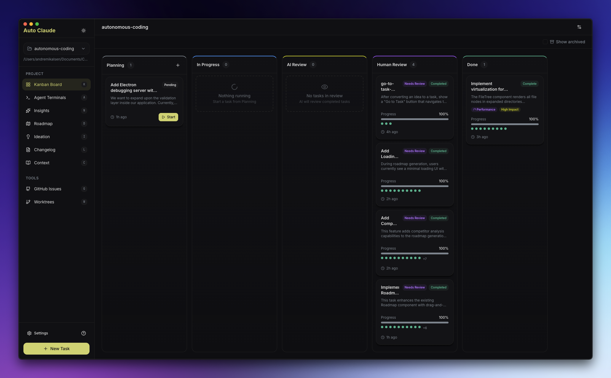

# Auto-Claude



> Multi-session Claude orchestrator with parallel agents and worktree isolation.

|             |                                                                              |
| ----------- | ---------------------------------------------------------------------------- |
| **GitHub**  | [github.com/AndyMik90/Auto-Claude](https://github.com/AndyMik90/Auto-Claude) |
| **By**      | AndyMik90                                                                    |
| **Tagline** | "Autonomous multi-session AI coding"                                         |
| **Type**    | Desktop app (Electron + Python)                                              |
| **Pricing** | Free (open source)                                                           |
| **License** | AGPL-3.0                                                                     |

---

## What It Does

Auto-Claude is a desktop application that orchestrates multiple Claude Code sessions for autonomous development. It manages a pipeline of specialized agents: Spec Creator → Planner → Coder (with parallel subagents) → QA Reviewer → QA Fixer.

### Lifecycle Coverage

```
Task → Spec creation → Planning → Implementation (parallel) → QA review → QA fix → Merge
```

### Key Features

- **Up to 12 parallel agent terminals** — Smart naming and one-click task context injection
- **Git worktree isolation** — All work happens in worktrees, main branch stays safe
- **Multi-account swapping** — Register multiple Claude accounts; auto-switches on rate limits
- **QA pipeline** — Built-in review and fix cycle before merge
- **Semantic merge** — Merges parallel agent outputs intelligently

---

## How Shep Compares

|                        | Auto-Claude                 | Shep                                |
| ---------------------- | --------------------------- | ----------------------------------- |
| **Interface**          | Electron desktop app        | CLI + Web dashboard                 |
| **Agent support**      | Claude Code only            | Claude Code, Cursor CLI, Gemini CLI |
| **Requirements**       | Spec creation (single step) | Interactive PRD with research phase |
| **Planning**           | Task breakdown              | Reviewable plan with approval gate  |
| **Parallel execution** | Up to 12 agents             | Per-feature worktrees               |
| **Approval gates**     | QA review step              | 3 configurable gates                |
| **Account management** | Multi-account auto-swap     | Single account                      |
| **CI integration**     | Not highlighted             | Automatic fix loop                  |

### What We Respect

Auto-Claude's parallel agent management is impressive — 12 simultaneous sessions with intelligent merge is a hard problem to solve. The multi-account swapping for rate limit handling is a practical solution to a real pain point.

### Where Shep Differs

Shep is agent-agnostic (not locked to Claude), covers more lifecycle phases (research, planning with gates), and provides a web dashboard for visual management. Auto-Claude is more focused on maximizing parallel Claude throughput for implementation.

---

_Sources: [GitHub](https://github.com/AndyMik90/Auto-Claude)_
