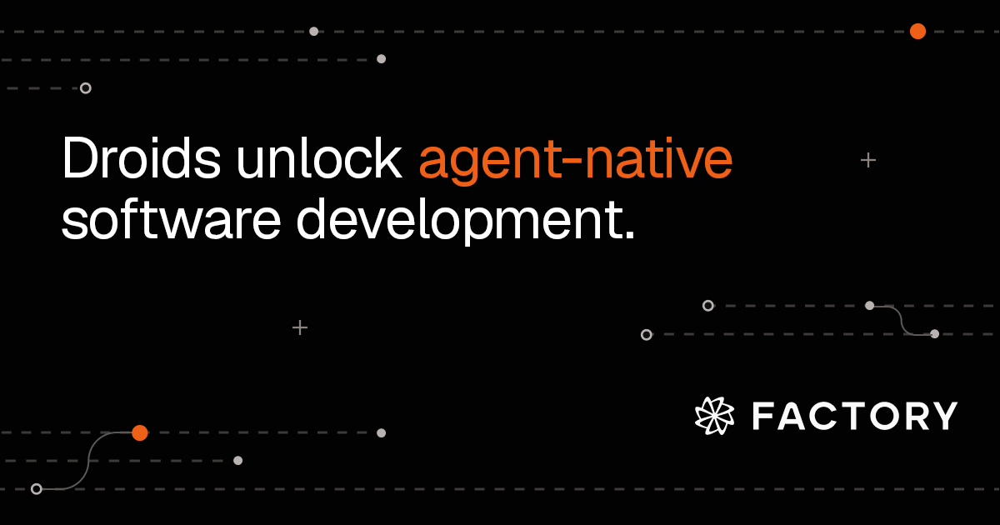

# Factory AI



> Enterprise agent-native development across every surface.

|                 |                                                       |
| --------------- | ----------------------------------------------------- |
| **Website**     | [factory.ai](https://factory.ai)                      |
| **By**          | Factory AI                                            |
| **Tagline**     | "The agent-native development platform"               |
| **Type**        | Multi-surface platform (CLI, web, IDE, mobile, Slack) |
| **Pricing**     | From $20/month                                        |
| **Open Source** | No                                                    |

---

## What It Does

Factory AI builds autonomous coding agents called "Droids" that handle coding, testing, and deployment. What sets it apart is the multi-surface approach — you can delegate work from the terminal, a web dashboard, Slack/Teams, Linear/Jira, or a mobile app.

### Lifecycle Coverage

```
Task delegation → Implementation → Testing → Code review → Deployment
```

### Key Features

- **Droids** — Autonomous agents that produce complete implementations with diffs to review
- **Multi-surface** — Terminal, IDE, web dashboard, Slack/Teams, Linear/Jira, mobile
- **Model-agnostic** — Supports GPT-5, Claude, Gemini
- **Enterprise compliance** — Audit trails, access controls, SOC2
- **Delegation model** — "Hand off work, get back a diff" philosophy

---

## How Shep Compares

|                        | Factory                                 | Shep                            |
| ---------------------- | --------------------------------------- | ------------------------------- |
| **Interface**          | Multi-surface (CLI, web, Slack, mobile) | CLI + Web dashboard             |
| **Requirements phase** | Not highlighted                         | Built-in PRD generation         |
| **Research phase**     | Not highlighted                         | Built-in technical research     |
| **Planning**           | Not highlighted                         | Reviewable implementation plans |
| **Approval gates**     | Diff review                             | 3 configurable gates            |
| **Data location**      | Cloud                                   | 100% local                      |
| **Open source**        | No                                      | Yes (MIT)                       |
| **Pricing**            | From $20/mo                             | Free                            |

### What We Respect

Factory's multi-surface approach is smart — meeting developers where they already are (Slack, Linear, mobile). Their enterprise focus on compliance and auditability is something the whole space needs to take seriously.

### Where Shep Differs

Shep covers more of the lifecycle (requirements, research, planning) before implementation even starts. Factory is more about delegation of implementation tasks; Shep is about orchestrating the entire feature from idea to merged PR.

---

_Sources: [factory.ai](https://factory.ai)_
