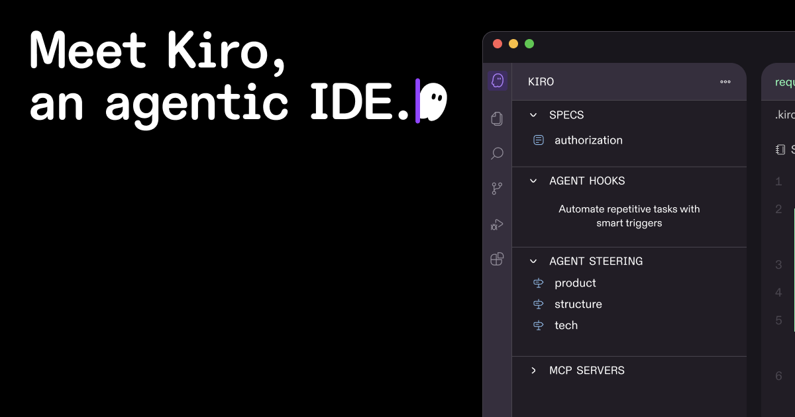

# Kiro



> AWS-backed spec-driven IDE — the most direct competitor to Shep's workflow.

|                 |                                                       |
| --------------- | ----------------------------------------------------- |
| **Website**     | [kiro.dev](https://kiro.dev)                          |
| **By**          | Amazon Web Services                                   |
| **Tagline**     | "Agentic AI development from prototype to production" |
| **Type**        | IDE (VS Code fork)                                    |
| **Pricing**     | Free preview; GA: Free / Pro $19/mo / Pro+ $39/mo     |
| **Open Source** | No                                                    |

---

## What It Does

Kiro is a VS Code-based IDE that structures AI-assisted development around specifications. It generates `requirements.md`, `design.md`, and `tasks.md` as artifacts that guide implementation — similar to Shep's spec-driven workflow.

### Lifecycle Coverage

```
Requirements (EARS notation) → Design docs → Task planning → Implementation → Testing
```

### Key Features

- **Spec-driven workflow** — Requirements in EARS (Easy Approach to Requirements Syntax), architecture in design docs, implementation via task breakdown
- **Agent Hooks** — Event-driven automation: file changes can trigger security scans, style checks, test suites
- **Steering** — Human-in-the-loop guidance during agent execution
- **Built on Amazon Bedrock** — Uses Claude Sonnet models under the hood

---

## How Shep Compares

|                       | Kiro                   | Shep                                    |
| --------------------- | ---------------------- | --------------------------------------- |
| **Interface**         | IDE (VS Code fork)     | CLI + Web dashboard                     |
| **Spec format**       | Markdown files         | YAML specs (machine-readable)           |
| **Requirements**      | EARS notation (static) | Interactive AI conversation             |
| **Research phase**    | Not included           | Built-in technical research             |
| **Approval gates**    | Steering (inline)      | 3 configurable gates (PRD, Plan, Merge) |
| **Parallel features** | Not highlighted        | Git worktree isolation                  |
| **Agent choice**      | Claude Sonnet (fixed)  | Claude Code, Cursor CLI, Gemini CLI     |
| **CI integration**    | Not highlighted        | Automatic CI fix loop                   |
| **Open source**       | No                     | Yes (MIT)                               |
| **Pricing**           | Free-$39/mo            | Free                                    |

### What We Respect

Kiro validated that spec-driven development is a real category, not just a workflow preference. Their EARS notation for requirements is a thoughtful approach to structured specifications. Having AWS distribution behind it brings visibility to the entire space.

### Where Shep Differs

Shep is CLI-first and agent-agnostic — you're not locked into an IDE or a specific model. Our interactive requirements gathering goes deeper than static EARS templates. And worktree isolation means you can run multiple features in parallel without conflicts.

---

_Sources: [kiro.dev](https://kiro.dev), [InfoQ coverage](https://www.infoq.com/news/2025/08/aws-kiro-spec-driven-agent/)_
