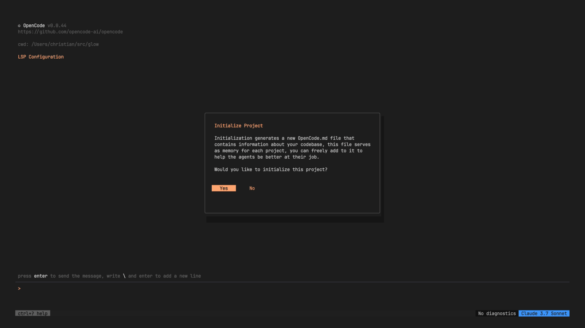

# OpenCode

> The open-source terminal coding agent with the biggest community — 120K+ stars.

|             |                                                                            |
| ----------- | -------------------------------------------------------------------------- |
| **GitHub**  | [github.com/opencode-ai/opencode](https://github.com/opencode-ai/opencode) |
| **Tagline** | "The open source AI coding agent. Built for the terminal."                 |
| **Type**    | CLI (Go + Bubble Tea TUI)                                                  |
| **Pricing** | Free (open source)                                                         |
| **License** | Open source                                                                |

---

## What It Does

OpenCode is a Go-based terminal coding agent with a beautiful TUI built on Bubble Tea. It supports 75+ LLM providers, plan-first development, and approval-based execution. It also has a GitHub agent for automating issues and PRs.

### Key Features

- **120K+ GitHub stars, 5M+ monthly developers** — Largest community
- **75+ LLM providers** — Extremely model-agnostic
- **Plan-first development** — Built-in "build" and "plan" agents
- **Approval-based execution** — Review before agent acts
- **GitHub Actions integration** — Agent for issue/PR automation
- **Beautiful TUI** — Bubble Tea-powered terminal interface

---

## How Shep Compares

|                       | OpenCode               | Shep                   |
| --------------------- | ---------------------- | ---------------------- |
| **Language**          | Go                     | TypeScript             |
| **Interface**         | TUI (Bubble Tea)       | CLI + Web dashboard    |
| **Requirements**      | Not included           | AI-generated PRD       |
| **Research phase**    | Not included           | Built-in               |
| **Full SDLC**         | Implementation-focused | Requirements → Merge   |
| **Parallel features** | Not highlighted        | Git worktree isolation |
| **Dashboard**         | Terminal only          | Interactive web graph  |
| **CI fix loop**       | Not highlighted        | Automatic              |

### What We Respect

OpenCode proved that open-source terminal AI tools can achieve massive scale — 120K stars is remarkable. Their Bubble Tea TUI is beautiful. Supporting 75+ LLM providers shows commitment to developer choice.

### Where Shep Differs

OpenCode focuses on the coding phase. Shep covers the full lifecycle from requirements gathering through CI and merge. OpenCode is a better general-purpose coding agent; Shep is a better feature development orchestrator.

---

_Sources: [GitHub](https://github.com/opencode-ai/opencode)_
