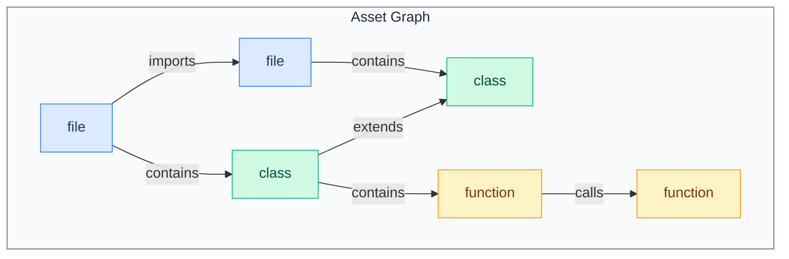

# Asset Graph

The Asset Graph is a knowledge representation of your codebase, enabling semantic search and relationship traversal.

## Overview

The Asset Graph breaks down a codebase into:
- **Assets**: Individual code elements (files, functions, classes, etc.)
- **Relations**: Connections between assets (imports, extends, calls, etc.)
- **Embeddings**: Vector representations for semantic search



## Asset Types

The standard set of 13 asset types:

| Type | Description | Example |
|------|-------------|---------|
| `file` | Source file | `src/auth/login.ts` |
| `module` | Package/module/namespace | `@shep-ai/cli` |
| `component` | UI component | `LoginForm` |
| `function` | Function/method | `validatePassword()` |
| `class` | Class definition | `UserService` |
| `interface` | Interface/type definition | `IUserRepository` |
| `api-endpoint` | REST/GraphQL endpoint | `POST /api/users` |
| `database-table` | Database table/schema | `users` |
| `test` | Test file/suite | `login.test.ts` |
| `config` | Configuration file | `tsconfig.json` |
| `documentation` | Documentation file | `README.md` |
| `person` | Code owner/contributor | `@johndoe` |
| `feature` | Shep feature entity | `feat_auth_oauth` |

## Asset Entity

```typescript
// src/domain/entities/asset.ts

export type AssetType =
  | 'file'
  | 'module'
  | 'component'
  | 'function'
  | 'class'
  | 'interface'
  | 'api-endpoint'
  | 'database-table'
  | 'test'
  | 'config'
  | 'documentation'
  | 'person'
  | 'feature';

export interface Asset {
  id: string;                        // Unique identifier
  type: AssetType;                   // Asset category
  name: string;                      // Display name
  path?: string;                     // File path (if applicable)
  description?: string;              // Human-readable description
  metadata: Record<string, unknown>; // Type-specific metadata
  embedding?: number[];              // 384-dim vector
  createdAt: Date;
  updatedAt: Date;
}
```

### Metadata Examples

```typescript
// File asset
{
  type: 'file',
  name: 'login.ts',
  path: 'src/auth/login.ts',
  metadata: {
    language: 'typescript',
    lines: 150,
    size: 4096
  }
}

// Function asset
{
  type: 'function',
  name: 'validatePassword',
  path: 'src/auth/validators.ts',
  metadata: {
    async: false,
    exported: true,
    parameters: ['password: string'],
    returnType: 'boolean',
    startLine: 24,
    endLine: 35
  }
}

// Component asset
{
  type: 'component',
  name: 'LoginForm',
  path: 'src/components/LoginForm.tsx',
  metadata: {
    framework: 'react',
    props: ['onSubmit', 'loading'],
    hooks: ['useState', 'useEffect']
  }
}

// API endpoint asset
{
  type: 'api-endpoint',
  name: 'POST /api/users',
  path: 'src/routes/users.ts',
  metadata: {
    method: 'POST',
    route: '/api/users',
    auth: 'required',
    requestBody: 'CreateUserDto',
    responseType: 'User'
  }
}
```

## Relation Types

11 relation types connecting assets:

| Type | Description | Example |
|------|-------------|---------|
| `imports` | File imports another | `login.ts` → `utils.ts` |
| `exports` | Module exports | `index.ts` → `LoginForm` |
| `extends` | Class inheritance | `AdminUser` → `User` |
| `implements` | Interface implementation | `UserService` → `IUserRepository` |
| `calls` | Function invocation | `login()` → `validatePassword()` |
| `tests` | Test coverage | `login.test.ts` → `login.ts` |
| `documents` | Documentation describes | `README.md` → `UserService` |
| `owns` | Code ownership | `@johndoe` → `auth/` |
| `depends_on` | Package dependency | `cli` → `lancedb` |
| `contains` | Containment hierarchy | `file` → `function` |
| `references` | General reference | Any cross-reference |

## AssetRelation Entity

```typescript
// src/domain/entities/asset-relation.ts

export type RelationType =
  | 'imports'
  | 'exports'
  | 'extends'
  | 'implements'
  | 'calls'
  | 'tests'
  | 'documents'
  | 'owns'
  | 'depends_on'
  | 'contains'
  | 'references';

export interface AssetRelation {
  fromId: string;                      // Source asset ID
  toId: string;                        // Target asset ID
  type: RelationType;                  // Relation category
  metadata?: Record<string, unknown>;  // Type-specific metadata
}
```

### Relation Examples

```typescript
// Import relation
{
  fromId: 'file:src/auth/login.ts',
  toId: 'file:src/utils/hash.ts',
  type: 'imports',
  metadata: {
    importType: 'named',
    symbols: ['hashPassword', 'compareHash']
  }
}

// Extends relation
{
  fromId: 'class:AdminUser',
  toId: 'class:User',
  type: 'extends'
}

// Tests relation
{
  fromId: 'test:login.test.ts',
  toId: 'function:validatePassword',
  type: 'tests',
  metadata: {
    testCount: 5,
    coverage: 0.92
  }
}
```

## Querying the Asset Graph

### Semantic Search

Find assets similar to a natural language query:

```typescript
const results = await assetGraph.findSimilar(
  'authentication and password validation',
  'function'  // optional type filter
);

// Returns functions related to auth/passwords
// [
//   { name: 'validatePassword', score: 0.89 },
//   { name: 'hashPassword', score: 0.85 },
//   { name: 'checkCredentials', score: 0.78 }
// ]
```

### Relationship Traversal

Find related assets by traversing the graph:

```typescript
// Get direct relations
const related = await assetGraph.queryRelated('file:src/auth/login.ts', 1);

// Get 2-hop relations (related to related)
const extended = await assetGraph.queryRelated('file:src/auth/login.ts', 2);
```

### Filtered Queries

Combine vector search with metadata filters:

```typescript
const results = await vectorStore.searchAssets(queryVector, {
  filter: "type = 'component' AND metadata.framework = 'react'",
  limit: 10
});
```

## Building the Asset Graph

The graph is built during repository indexing:

```
1. Scan files
   │
   ▼
2. Create file assets
   │
   ▼
3. Parse AST for each file
   │
   ▼
4. Extract sub-assets (functions, classes, etc.)
   │
   ▼
5. Generate embeddings for all assets
   │
   ▼
6. Analyze imports/exports
   │
   ▼
7. Build relationships (extends, implements, calls)
   │
   ▼
8. Persist to LanceDB and graph.json
```

### AST Parsing

Different parsers for different languages:

| Language | Parser |
|----------|--------|
| TypeScript/JavaScript | TypeScript compiler API |
| Python | tree-sitter-python |
| Go | tree-sitter-go |
| Rust | tree-sitter-rust |

## Use Cases

### 1. Context for Requirements

When gathering requirements, query related components:

```typescript
const existingAuth = await assetGraph.findSimilar(
  'user authentication',
  'component'
);
// Shows user what auth components already exist
```

### 2. Impact Analysis

Find what might be affected by a change:

```typescript
const affected = await assetGraph.queryRelated(
  'function:validatePassword',
  2  // 2 hops: direct callers + their callers
);
```

### 3. Test Discovery

Find relevant tests for implementation:

```typescript
const tests = await assetGraph.findSimilar(
  task.description,
  'test'
);
// Suggests which tests might need updating
```

### 4. Code Navigation

Navigate codebase semantically:

```typescript
// "Show me everything related to user authentication"
const authAssets = await assetGraph.findSimilar('user authentication');
```

## Storage

### LanceDB Tables

**Assets Table:**
```
| Column    | Type     | Description           |
|-----------|----------|-----------------------|
| id        | string   | Unique asset ID       |
| type      | string   | Asset type            |
| name      | string   | Display name          |
| path      | string   | File path             |
| metadata  | json     | Type-specific data    |
| vector    | float[384] | Embedding vector    |
```

**Chunks Table:**
```
| Column    | Type     | Description           |
|-----------|----------|-----------------------|
| id        | string   | Unique chunk ID       |
| assetId   | string   | Parent file asset     |
| content   | string   | Chunk text            |
| startLine | int      | Starting line number  |
| endLine   | int      | Ending line number    |
| type      | string   | Chunk type            |
| vector    | float[384] | Embedding vector    |
```

### Graph JSON

Relationships stored in `graph/graph.json`:

```json
{
  "relations": [
    {
      "fromId": "file:src/auth/login.ts",
      "toId": "file:src/utils/hash.ts",
      "type": "imports"
    }
  ]
}
```

---

## Maintaining This Document

**Update when:**
- New asset types are added
- New relation types are added
- Query patterns change
- Storage format changes

**Related docs:**
- [../architecture/context-layer.md](../architecture/context-layer.md) - Implementation details
- [../api/domain-models.md](../api/domain-models.md) - Full entity specs
