# Shep-Kit: Spec-Driven Development Toolkit

> Complete reference for the `/shep-kit:*` skill pipeline that powers autonomous feature development in Shep AI CLI.

---

## Pipeline Overview

```mermaid
%%{init: {'theme': 'dark'}}%%
flowchart TD
    NF["🆕 new-feature\nScaffold & Spec"]
    RS["🔬 research\nTechnical Decisions"]
    PL["📐 plan\nArchitecture & Tasks"]
    IM["⚙️ implement\nAutonomous TDD"]
    CP["🚀 commit-pr\nPR + CI Watch"]
    MG["✅ merged\nCleanup"]

    NF -- "spec.yaml + feature.yaml" --> RS
    RS -- "research.yaml" --> PL
    PL -- "plan.yaml + tasks.yaml" --> IM
    IM -- "source code + tests" --> CP
    CP -- "PR created" --> MG

    style NF fill:#7c3aed,stroke:#c4b5fd,color:#fff,stroke-width:2px
    style RS fill:#6d28d9,stroke:#c4b5fd,color:#fff,stroke-width:2px
    style PL fill:#5b21b6,stroke:#c4b5fd,color:#fff,stroke-width:2px
    style IM fill:#4c1d95,stroke:#c4b5fd,color:#fff,stroke-width:2px
    style CP fill:#3730a3,stroke:#c4b5fd,color:#fff,stroke-width:2px
    style MG fill:#1e3a5f,stroke:#c4b5fd,color:#fff,stroke-width:2px
```

---

## Feature Lifecycle

---

## Implementation TDD Cycle (per task)

```mermaid
%%{init: {'theme': 'dark'}}%%
flowchart LR
    R["🔴 RED\nWrite failing test"]
    G["🟢 GREEN\nMinimal code to pass"]
    RF["🔵 REFACTOR\nClean up"]
    V{"✓ Verify"}
    NEXT["Next Task"]
    ERR["⚠️ Retry\nmax 3x"]

    R --> G --> RF --> V
    V -- pass --> NEXT
    V -- fail --> ERR --> R

    style R fill:#991b1b,stroke:#fca5a5,color:#fff,stroke-width:2px
    style G fill:#166534,stroke:#86efac,color:#fff,stroke-width:2px
    style RF fill:#1e40af,stroke:#93c5fd,color:#fff,stroke-width:2px
    style V fill:#4c1d95,stroke:#c4b5fd,color:#fff,stroke-width:2px
    style NEXT fill:#065f46,stroke:#6ee7b7,color:#fff,stroke-width:2px
    style ERR fill:#78350f,stroke:#fbbf24,color:#fff,stroke-width:2px
```

---

## Skill File Map

Each skill lives under `.claude/skills/shep-kit:<name>/`.

---

## CI Fix Loop (commit-pr)

```mermaid
%%{init: {'theme': 'dark'}}%%
flowchart LR
    P["Push"] --> W["Watch CI"]
    W --> D{"Pass?"}
    D -- Yes --> OK["✅ PR Ready"]
    D -- No --> L["Read Logs"] --> F["Fix"] --> C["Commit"] --> P

    style P fill:#7c3aed,stroke:#c4b5fd,color:#fff,stroke-width:2px
    style W fill:#6d28d9,stroke:#c4b5fd,color:#fff,stroke-width:2px
    style D fill:#4c1d95,stroke:#c4b5fd,color:#fff,stroke-width:2px
    style OK fill:#065f46,stroke:#6ee7b7,color:#fff,stroke-width:2px
    style L fill:#7f1d1d,stroke:#fca5a5,color:#fff,stroke-width:2px
    style F fill:#78350f,stroke:#fbbf24,color:#fff,stroke-width:2px
    style C fill:#5b21b6,stroke:#c4b5fd,color:#fff,stroke-width:2px
```

---

## feature.yaml State Tracking

```mermaid
%%{init: {'theme': 'dark'}}%%
flowchart LR
    subgraph YAML ["feature.yaml"]
        A["feature\nid · name · branch · lifecycle"]
        B["status\nphase · progress · currentTask"]
        C["checkpoints\nphase · timestamp · skill"]
        D["errors\ncurrent · history"]
    end

    style YAML fill:#1e1b4b,stroke:#7c3aed,color:#e0e7ff,stroke-width:2px
    style A fill:#312e81,stroke:#a78bfa,color:#e0e7ff,stroke-width:1px
    style B fill:#312e81,stroke:#a78bfa,color:#e0e7ff,stroke-width:1px
    style C fill:#312e81,stroke:#a78bfa,color:#e0e7ff,stroke-width:1px
    style D fill:#312e81,stroke:#a78bfa,color:#e0e7ff,stroke-width:1px
```

---

## Skill Components

### 1. `/shep-kit:new-feature` -- Scaffold & Specify

> Creates feature branch, scaffolds spec directory, and writes initial specification.

| Property         | Value                                                                 |
| ---------------- | --------------------------------------------------------------------- |
| **Trigger**      | "new feature", "start developing", "add functionality", "implement X" |
| **Prerequisite** | None (entry point)                                                    |
| **Branch**       | Creates `feat/NNN-feature-name` from `main`                           |
| **Output**       | `specs/NNN-feature-name/` with all template files                     |
| **Lifecycle**    | Sets `research`                                                       |
| **Checkpoint**   | `feature-created`                                                     |
| **Next**         | `/shep-kit:research`                                                  |

#### Files

| File                           | Type             | Purpose                                                            |
| ------------------------------ | ---------------- | ------------------------------------------------------------------ |
| `SKILL.md`                     | Skill definition | Workflow instructions and principles                               |
| `scripts/init-feature.sh`      | Shell script     | Scaffolds spec directory from templates with variable substitution |
| `templates/spec.yaml`          | YAML template    | Feature specification (source of truth)                            |
| `templates/research.yaml`      | YAML template    | Technical decisions (source of truth)                              |
| `templates/plan.yaml`          | YAML template    | Implementation strategy (source of truth)                          |
| `templates/tasks.yaml`         | YAML template    | Task breakdown (source of truth)                                   |
| `templates/data-model.md`      | Template         | Domain model changes placeholder                                   |
| `templates/feature.yaml`       | Template         | Machine-readable status tracking                                   |
| `examples/001-sample-feature/` | Example          | Reference spec for new features                                    |

#### Workflow Steps

| Step | Action          | Detail                                               |
| ---- | --------------- | ---------------------------------------------------- |
| 1    | Gather input    | Feature name (kebab-case) + one-liner description    |
| 2    | Create branch   | `git checkout -b feat/NNN-feature-name`              |
| 3    | Run init script | `init-feature.sh <NNN> <name>` scaffolds directory   |
| 4    | Analyze context | Scan existing specs, codebase patterns, dependencies |
| 5    | Propose spec    | Infer problem statement, criteria, size estimate     |
| 6    | User confirms   | Allow adjustments before writing                     |
| 7    | Write & commit  | Write spec.yaml, generate Markdown, stage, commit    |

#### Key Principles

| Principle                | Description                                |
| ------------------------ | ------------------------------------------ |
| Branch first             | All spec work on feature branch            |
| Infer, don't interrogate | Analyze codebase to propose smart defaults |
| Dependencies from specs  | Scan `specs/*/spec.yaml` for relationships |
| Open questions block     | Must resolve before proceeding to research |

---

### 2. `/shep-kit:research` -- Technical Analysis

> Evaluates libraries, documents architecture decisions, and resolves technical questions.

| Property         | Value                                                                 |
| ---------------- | --------------------------------------------------------------------- |
| **Trigger**      | "research", "technical analysis", "evaluate options", "which library" |
| **Prerequisite** | `spec.yaml` exists, on feature branch, open questions resolved        |
| **Gate Check**   | Verifies `openQuestions` resolved in `spec.yaml`                      |
| **Output**       | Populated `research.yaml` (Markdown auto-generated)                   |
| **Lifecycle**    | Updates to `planning`                                                 |
| **Checkpoint**   | `research-complete`                                                   |
| **Next**         | `/shep-kit:plan`                                                      |

#### Files

| File                          | Type             | Purpose                                   |
| ----------------------------- | ---------------- | ----------------------------------------- |
| `SKILL.md`                    | Skill definition | Research workflow and evaluation criteria |
| `examples/sample-research.md` | Example          | Reference research document               |

#### Workflow Steps

| Step | Action               | Detail                                                 |
| ---- | -------------------- | ------------------------------------------------------ |
| 1    | Identify feature     | Check branch name or ask user                          |
| 2    | Gate check           | Verify open questions in spec.yaml are resolved        |
| 3    | Identify decisions   | Extract technology/library/architecture choices needed |
| 4    | Research each        | Web search, docs, benchmarks for 2-4 options each      |
| 5    | Evaluate trade-offs  | Pros/cons, compatibility, maintenance burden           |
| 6    | Document security    | Security considerations specific to feature            |
| 7    | Document performance | Performance implications and optimizations             |
| 8    | Write research.yaml  | Fill template with decisions and rationale             |
| 9    | Update status        | `lifecycle: planning`, add checkpoint                  |
| 10   | Commit               | Stage and commit research.yaml + generated .md         |

#### Key Principles

| Principle         | Description                                               |
| ----------------- | --------------------------------------------------------- |
| Gate enforcement  | Never skip open questions check                           |
| Evidence-based    | Use web search, docs, benchmarks -- not assumptions       |
| Project-aware     | Consider existing patterns and constraints from CLAUDE.md |
| Trade-off focused | Every decision documents pros AND cons                    |

---

### 3. `/shep-kit:plan` -- Architecture & Task Breakdown

> Designs implementation architecture and creates detailed task breakdown with mandatory TDD structure.

| Property         | Value                                                             |
| ---------------- | ----------------------------------------------------------------- |
| **Trigger**      | "plan", "implementation plan", "break down tasks", "create tasks" |
| **Prerequisite** | `spec.yaml` + `research.yaml` complete, open questions resolved   |
| **Gate Check**   | Verifies `openQuestions` resolved in `research.yaml`              |
| **Output**       | `plan.yaml` + `tasks.yaml` (+ optional `data-model.md`)           |
| **Lifecycle**    | Updates to `implementation`                                       |
| **Checkpoint**   | `plan-complete`                                                   |
| **Next**         | `/shep-kit:implement`                                             |

#### Files

| File                      | Type             | Purpose                            |
| ------------------------- | ---------------- | ---------------------------------- |
| `SKILL.md`                | Skill definition | Planning workflow with TDD mandate |
| `examples/sample-plan.md` | Example          | Reference plan document            |

#### Workflow Steps

| Step | Action                       | Detail                                                |
| ---- | ---------------------------- | ----------------------------------------------------- |
| 1    | Review spec & research       | Understand requirements, decisions, constraints       |
| 2    | Gate check                   | Verify research questions resolved                    |
| 3    | Design architecture          | Component diagram, data flow, integration points      |
| 4    | Define phases (TDD)          | RED-GREEN-REFACTOR cycles for each layer              |
| 5    | Identify files               | New files to create, existing files to modify         |
| 6    | Testing strategy             | Unit, integration, E2E -- tests written FIRST         |
| 7    | Risks & rollback             | Identify risks, mitigation, rollback plan             |
| 8    | Task breakdown               | Convert phases to actionable tasks with `[P]` markers |
| 9    | Write plan.yaml + tasks.yaml | Fill both YAML files, generate Markdown               |
| 10   | Update data-model.md         | If entity changes needed (TypeSpec definitions)       |
| 11   | Update status                | Count tasks, set `progress.total`, add checkpoint     |
| 12   | Commit                       | Stage and commit all spec files                       |

#### TDD Structure (Mandatory)

| Phase        | Purpose                   | Rule                           |
| ------------ | ------------------------- | ------------------------------ |
| **RED**      | Write failing tests first | Tests define expected behavior |
| **GREEN**    | Minimal implementation    | Only enough code to pass tests |
| **REFACTOR** | Improve code quality      | Keep tests green throughout    |

#### Task Format

| Field               | Required | Description                         |
| ------------------- | -------- | ----------------------------------- |
| Title               | Yes      | `## Task N: <title>`                |
| Description         | Yes      | Clear description of work           |
| Acceptance Criteria | Yes      | Checkboxes with measurable outcomes |
| TDD Phases          | Yes      | RED/GREEN/REFACTOR steps            |
| Dependencies        | Yes      | `task-N` references or "None"       |
| Estimated Effort    | Yes      | Time estimate                       |
| `[P]` marker        | Optional | Indicates parallelizable task       |

---

### 4. `/shep-kit:implement` -- Autonomous Executor

> Validates specs, then autonomously executes all tasks with TDD discipline, real-time tracking, and bounded error recovery.

| Property         | Value                                                                                            |
| ---------------- | ------------------------------------------------------------------------------------------------ |
| **Trigger**      | "implement", "start implementation", "execute tasks"                                             |
| **Prerequisite** | All 5 YAML files exist (`spec.yaml`, `research.yaml`, `plan.yaml`, `tasks.yaml`, `feature.yaml`) |
| **Gate Check**   | 3-tier validation (completeness, architecture, consistency)                                      |
| **Output**       | Source code + tests + passing build                                                              |
| **Lifecycle**    | Tracks through `implementation` to `ready-for-review`                                            |
| **Checkpoint**   | `implementation-complete`                                                                        |
| **Next**         | `/shep-kit:commit-pr`                                                                            |

#### Files

| File                            | Type             | Purpose                                          |
| ------------------------------- | ---------------- | ------------------------------------------------ |
| `SKILL.md`                      | Skill definition | 5-phase autonomous execution workflow            |
| `validation/completeness.md`    | Validation rules | Required files, sections, open questions         |
| `validation/architecture.md`    | Validation rules | Clean Architecture, TypeSpec-first, TDD, DI      |
| `validation/consistency.md`     | Validation rules | Cross-doc consistency, task counts, dependencies |
| `examples/validation-report.md` | Example          | Sample validation output and error scenarios     |

#### Execution Phases

| Phase | Name            | Description                                                |
| ----- | --------------- | ---------------------------------------------------------- |
| **1** | Validation Gate | 3-tier quality check before any code is written            |
| **2** | Session Retry   | Read `feature.yaml`, verify previous work, auto-retry      |
| **3** | Task Execution  | Sequential TDD execution with verification after each task |
| **4** | Error Handling  | Systematic debug with max 3 retries per task               |
| **5** | Completion      | Final status update, summary, next steps                   |

#### Validation Gate Detail

| Gate             | Checks                                                                                                       | Blocking?              |
| ---------------- | ------------------------------------------------------------------------------------------------------------ | ---------------------- |
| **Completeness** | Required files exist, sections present, open questions resolved, acceptance criteria defined                 | Yes                    |
| **Architecture** | Clean Architecture layers, TypeSpec-first for entities, TDD phases defined, repository pattern, DI container | Yes                    |
| **Consistency**  | Task count matches plan, criteria alignment, research referenced, no contradictions, valid dependencies      | Yes                    |
| **Auto-Fix**     | Missing section headers, empty checkboxes, heading levels                                                    | User approval required |

#### Verification Commands (Per Task)

| Command          | Purpose              |
| ---------------- | -------------------- |
| `pnpm test`      | All tests must pass  |
| `pnpm build`     | Build must succeed   |
| `pnpm typecheck` | No TypeScript errors |
| `pnpm lint`      | No lint errors       |

#### Error Handling

| Condition                        | Action                                            |
| -------------------------------- | ------------------------------------------------- |
| Verification passes              | Update `feature.yaml`, continue to next task      |
| Verification fails (attempt < 3) | Capture error, debug, fix, retry                  |
| Verification fails (attempt = 3) | Set `phase: blocked`, add to `tasks.failed`, STOP |
| Blocked state                    | Display error report, require manual intervention |

---

### 5. `/shep-kit:commit-pr` -- Ship & Watch CI

> Creates commit, pushes branch, opens PR, then watches CI in a fix-push-watch loop until green.

| Property         | Value                                              |
| ---------------- | -------------------------------------------------- |
| **Trigger**      | "commit and pr", "push pr", "create pr", "ship it" |
| **Prerequisite** | Implementation complete, tests passing             |
| **Output**       | Git commit + pushed branch + GitHub PR             |
| **Lifecycle**    | Updates to `review`                                |
| **Checkpoint**   | `pr-created`                                       |
| **Next**         | `/shep-kit:merged` (after PR approval)             |

#### Files

| File       | Type             | Purpose                             |
| ---------- | ---------------- | ----------------------------------- |
| `SKILL.md` | Skill definition | Commit/PR/CI workflow with fix loop |

#### Workflow Steps

| Step | Action               | Detail                                                   |
| ---- | -------------------- | -------------------------------------------------------- |
| 1    | Branch check         | If on `main`, create feature branch                      |
| 2    | Stage & commit       | `git add <files>`, conventional commit message           |
| 3    | Push & create PR     | `git push -u`, `gh pr create` with summary + test plan   |
| 4    | Update feature.yaml  | Set `lifecycle: review`, `phase: in-review`, add `prUrl` |
| 5    | Watch CI             | `gh run watch <id> --exit-status`                        |
| 6    | Fix loop (if needed) | Get logs, analyze, fix, commit, push, watch again        |

#### Quick Commands

| Command                           | Purpose                      |
| --------------------------------- | ---------------------------- |
| `gh run list --limit 5`           | List recent CI runs with IDs |
| `gh run watch <id> --exit-status` | Watch CI, exit 1 if fails    |
| `gh run view <id> --log-failed`   | Get failure logs             |
| `gh pr view --web`                | Open PR in browser           |

---

### 6. `/shep-kit:merged` -- Post-Merge Cleanup

> Marks feature complete, switches to main, pulls latest, and deletes local feature branch.

| Property         | Value                                   |
| ---------------- | --------------------------------------- |
| **Trigger**      | "merged", "pr merged", "cleanup branch" |
| **Prerequisite** | PR has been merged on GitHub            |
| **Output**       | Clean local state on `main` branch      |
| **Lifecycle**    | Updates to `complete`                   |
| **Checkpoint**   | `feature-merged`                        |
| **Next**         | None (cycle complete)                   |

#### Files

| File       | Type             | Purpose          |
| ---------- | ---------------- | ---------------- |
| `SKILL.md` | Skill definition | Cleanup workflow |

#### Workflow Steps

| Step | Action               | Detail                                                |
| ---- | -------------------- | ----------------------------------------------------- |
| 1    | Get current branch   | `git branch --show-current`                           |
| 2    | Update feature.yaml  | Set `lifecycle: complete`, add `mergedAt`, checkpoint |
| 3    | Commit status update | Commit feature.yaml to main                           |
| 4    | Switch to main       | `git checkout main && git pull`                       |
| 5    | Delete local branch  | `git branch -d <branch>` (safe delete)                |

---

## Shared Infrastructure

### `feature.yaml` -- State Machine

Central status tracking file updated by all skills. Lives at `specs/NNN-feature-name/feature.yaml`. See the **feature.yaml State Tracking** diagram above for schema overview.

#### Lifecycle Transitions

| Skill               | Sets `lifecycle` | Sets `phase`         | Checkpoint                |
| ------------------- | ---------------- | -------------------- | ------------------------- |
| `new-feature`       | `research`       | `research`           | `feature-created`         |
| `research`          | `planning`       | `planning`           | `research-complete`       |
| `plan`              | `implementation` | `ready-to-implement` | `plan-complete`           |
| `implement` (start) | `implementation` | `implementation`     | `implementation-started`  |
| `implement` (done)  | `implementation` | `ready-for-review`   | `implementation-complete` |
| `implement` (error) | `implementation` | `blocked`            | --                        |
| `commit-pr`         | `review`         | `in-review`          | `pr-created`              |
| `merged`            | `complete`       | `complete`           | `feature-merged`          |

### Gate System

Every skill (except `new-feature`) enforces a mandatory gate check before proceeding.

| Skill       | Gate          | What It Checks                                                     |
| ----------- | ------------- | ------------------------------------------------------------------ |
| `research`  | Spec gate     | `openQuestions` resolved in `spec.yaml`                            |
| `plan`      | Research gate | `openQuestions` resolved in `research.yaml`                        |
| `implement` | Completeness  | All 5 YAML files exist, required keys, open questions resolved     |
| `implement` | Architecture  | Clean Architecture, TypeSpec-first, TDD phases, repository pattern |
| `implement` | Consistency   | Task counts match, criteria alignment, valid dependencies          |

### Template Variable Substitution

The `init-feature.sh` script replaces these variables in all templates:

| Variable             | Example Value          | Description                |
| -------------------- | ---------------------- | -------------------------- |
| `{{NNN}}`            | `007`                  | Zero-padded feature number |
| `{{FEATURE_NAME}}`   | `user-auth`            | Kebab-case feature name    |
| `{{DATE}}`           | `2026-02-08`           | Current date               |
| `{{FEATURE_ID}}`     | `007-user-auth`        | Combined identifier        |
| `{{FEATURE_NUMBER}}` | `7`                    | Integer feature number     |
| `{{BRANCH_NAME}}`    | `feat/007-user-auth`   | Git branch name            |
| `{{TIMESTAMP}}`      | `2026-02-08T12:00:00Z` | ISO 8601 timestamp         |

---

## Complete File Inventory

| Skill         | File                                  | Purpose                          |
| ------------- | ------------------------------------- | -------------------------------- |
| `new-feature` | `SKILL.md`                            | Skill definition                 |
| `new-feature` | `scripts/init-feature.sh`             | Directory scaffolding script     |
| `new-feature` | `templates/spec.yaml`                 | Feature specification (YAML)     |
| `new-feature` | `templates/research.yaml`             | Research document (YAML)         |
| `new-feature` | `templates/plan.yaml`                 | Implementation plan (YAML)       |
| `new-feature` | `templates/tasks.yaml`                | Task breakdown (YAML)            |
| `new-feature` | `templates/data-model.md`             | Domain model template            |
| `new-feature` | `templates/feature.yaml`              | Status tracking template         |
| `new-feature` | `examples/001-sample-feature/spec.md` | Example spec                     |
| `research`    | `SKILL.md`                            | Skill definition                 |
| `research`    | `examples/sample-research.md`         | Example research doc             |
| `plan`        | `SKILL.md`                            | Skill definition                 |
| `plan`        | `examples/sample-plan.md`             | Example plan doc                 |
| `implement`   | `SKILL.md`                            | Skill definition                 |
| `implement`   | `validation/completeness.md`          | File & section validation rules  |
| `implement`   | `validation/architecture.md`          | Clean Architecture & TDD rules   |
| `implement`   | `validation/consistency.md`           | Cross-document consistency rules |
| `implement`   | `examples/validation-report.md`       | Example validation output        |
| `commit-pr`   | `SKILL.md`                            | Skill definition                 |
| `merged`      | `SKILL.md`                            | Skill definition                 |

**Total: 20 files across 6 skills**

---

## Reference Documentation

| Document              | Location                                    | Content                                       |
| --------------------- | ------------------------------------------- | --------------------------------------------- |
| Spec-Driven Workflow  | `docs/development/spec-driven-workflow.md`  | End-to-end workflow guide                     |
| feature.yaml Protocol | `docs/development/feature-yaml-protocol.md` | YAML schema, update patterns, troubleshooting |
| TDD Guide             | `docs/development/tdd-guide.md`             | RED-GREEN-REFACTOR discipline                 |
| CLAUDE.md             | `CLAUDE.md`                                 | Project conventions and architecture rules    |
