# Getting Started

This guide walks you through installing Shep AI CLI and creating your first feature.

## Prerequisites

- **Node.js** 18 or higher
- **pnpm** 8 or higher (`npm install -g pnpm`)
- A repository to work with
- Claude API access (Pro subscription or API key)

## Installation

Install Shep globally via pnpm:

```bash
pnpm add -g @shep-ai/cli
```

Or with npm:

```bash
npm install -g @shep-ai/cli
```

Verify installation:

```bash
shep --version
```

## First Run

Navigate to your project directory and run Shep:

```bash
cd ~/projects/my-app
shep
```

### Initial Setup Wizard

On first run, Shep launches a TUI wizard to configure authentication:

```mermaid
flowchart TD
    subgraph Setup["Shep AI CLI Setup"]
        Welcome["Welcome to Shep!<br/>Let's set up your Claude Code access."]
        Question["How would you like to authenticate?"]
        Welcome --> Question
        Question --> Option1["○ Use existing Claude session"]
        Question --> Option2["○ Set up new token"]
    end

    style Setup fill:#f8fafc,stroke:#64748b,stroke-width:2px,color:#1e293b
    style Welcome fill:#ede9fe,stroke:#8b5cf6,color:#4c1d95
    style Question fill:#ffffff,stroke:#94a3b8,color:#374151
    style Option1 fill:#ffffff,stroke:#94a3b8,stroke-dasharray: 5 5,color:#374151
    style Option2 fill:#ffffff,stroke:#94a3b8,stroke-dasharray: 5 5,color:#374151
```



> **Note:** User selects one authentication option to proceed.

#### Option 1: Use Existing Session

If you're already logged into Claude Code, Shep can use that session:

1. Select "Use existing Claude session"
2. Shep detects your existing authentication
3. Setup complete

#### Option 2: Set Up New Token

To use a new API token:

1. Select "Set up new token"
2. Enter your Claude API key
3. Shep validates and stores the token securely

### Repository Analysis

After authentication, Shep analyzes your repository:

```mermaid
flowchart TD
    subgraph Analysis["Analyzing Repository... (75%)"]
        direction TB
        Step1["✓ Architecture analysis complete"]
        Step2["✓ Dependency analysis complete"]
        Step3["● Pattern detection in progress..."]
        Step4["○ Convention extraction pending"]

        Step1 --> Step2 --> Step3 --> Step4
    end

    style Analysis fill:#f8fafc,stroke:#64748b,stroke-width:2px,color:#1e293b
    style Step1 fill:#d1fae5,stroke:#10b981,color:#064e3b
    style Step2 fill:#d1fae5,stroke:#10b981,color:#064e3b
    style Step3 fill:#fef3c7,stroke:#f59e0b,color:#78350f
    style Step4 fill:#f1f5f9,stroke:#94a3b8,stroke-dasharray: 5 5,color:#64748b
```



> **Note:** Progress bar shows 75% completion. Green = complete, Yellow = in progress, Gray = pending.

This analysis runs once per repository and is cached for future sessions.

### Web UI Launch

After analysis completes, Shep starts the web server:

```
✓ Analysis complete
✓ Web server started

  Open in your browser:
  http://localhost:3030/

  Press Ctrl+C to stop
```

## Creating Your First Feature

### 1. Open the Web UI

Navigate to `http://localhost:3030/` in your browser.

### 2. Start a New Feature

The AI greets you with contextual options based on your repository:


> **Note:** User selects a suggested feature or describes a custom one.

### 3. Gather Requirements

Select an option or describe your feature. The AI guides you through requirements:

```mermaid
flowchart TD
    subgraph Chat["Requirements Gathering Conversation"]
        U1["👤 User: Add user authentication"]
        S1["🤖 Shep: Great! Let's define the authentication requirements.<br/>Which authentication method would you like?"]
        O1["□ Email/password<br/>□ OAuth (Google, GitHub)<br/>□ Magic links<br/>□ All of the above"]
        U2["👤 User: OAuth (Google, GitHub)"]
        S2["🤖 Shep: Got it. For OAuth, I'll need to know:<br/>Should users be able to link multiple OAuth providers?"]
        O2["□ Yes, allow linking multiple accounts<br/>□ No, one provider per user"]
        More["...continued..."]

        U1 --> S1 --> O1 --> U2 --> S2 --> O2 --> More
    end

    style Chat fill:#f8fafc,stroke:#64748b,stroke-width:2px,color:#1e293b
    style U1 fill:#dbeafe,stroke:#3b82f6,color:#1e3a5f
    style U2 fill:#dbeafe,stroke:#3b82f6,color:#1e3a5f
    style S1 fill:#ede9fe,stroke:#8b5cf6,color:#4c1d95
    style S2 fill:#ede9fe,stroke:#8b5cf6,color:#4c1d95
    style O1 fill:#ffffff,stroke:#94a3b8,color:#374151
    style O2 fill:#ffffff,stroke:#94a3b8,color:#374151
    style More fill:#f1f5f9,stroke:#94a3b8,stroke-dasharray: 5 5,color:#64748b
```



> **Note:** Conversational flow where Shep asks clarifying questions based on user selections.

### 4. Review the Plan

Once requirements are complete, Shep generates a plan:

```mermaid
flowchart TD
    subgraph PlanReview["Feature: User Authentication | Lifecycle: Plan"]
        direction TB

        subgraph Tasks["TASKS (5)"]
            T1["□ Set up OAuth provider configuration"]
            T2["□ Create user model and migrations"]
            T3["□ Implement OAuth callback handlers"]
            T4["□ Add authentication middleware"]
            T5["□ Create login/logout UI components"]
        end

        subgraph Docs["DOCUMENTATION (3)"]
            D1["📄 Product Requirements Document"]
            D2["📄 Technical RFC"]
            D3["📄 Implementation Tech Plan"]
        end

        subgraph Actions["Actions"]
            Implement["[Implement]"]
            EditPlan["[Edit Plan]"]
        end

        Tasks --> Docs --> Actions
    end

    style PlanReview fill:#f8fafc,stroke:#64748b,stroke-width:2px,color:#1e293b
    style Tasks fill:#d1fae5,stroke:#10b981,color:#064e3b
    style Docs fill:#fef3c7,stroke:#f59e0b,color:#78350f
    style Actions fill:#dbeafe,stroke:#3b82f6,color:#1e3a5f
    style Implement fill:#d1fae5,stroke:#10b981,color:#064e3b
    style EditPlan fill:#ffffff,stroke:#94a3b8,color:#374151
    style T1 fill:#ffffff,stroke:#94a3b8,color:#374151
    style T2 fill:#ffffff,stroke:#94a3b8,color:#374151
    style T3 fill:#ffffff,stroke:#94a3b8,color:#374151
    style T4 fill:#ffffff,stroke:#94a3b8,color:#374151
    style T5 fill:#ffffff,stroke:#94a3b8,color:#374151
    style D1 fill:#ffffff,stroke:#94a3b8,color:#374151
    style D2 fill:#ffffff,stroke:#94a3b8,color:#374151
    style D3 fill:#ffffff,stroke:#94a3b8,color:#374151
```



> **Note:** User can click [Implement] to start autonomous code generation or [Edit Plan] to modify tasks.

### 5. Start Implementation

Click "Implement" to begin autonomous code generation:

```mermaid
flowchart TD
    subgraph Implementation["Implementing: User Authentication | Progress: 2/5 tasks complete"]
        direction TB
        T1["✓ Set up OAuth provider configuration"]
        T2["✓ Create user model and migrations"]
        T3["● Implement OAuth callback handlers"]
        T3Detail["└─ Creating src/routes/auth.ts"]
        T4["○ Add authentication middleware"]
        T5["○ Create login/logout UI components"]

        T1 --> T2 --> T3
        T3 --> T3Detail
        T3 --> T4 --> T5
    end

    style Implementation fill:#f8fafc,stroke:#64748b,stroke-width:2px,color:#1e293b
    style T1 fill:#d1fae5,stroke:#10b981,color:#064e3b
    style T2 fill:#d1fae5,stroke:#10b981,color:#064e3b
    style T3 fill:#fef3c7,stroke:#f59e0b,color:#78350f
    style T3Detail fill:#fef3c7,stroke:#f59e0b,stroke-dasharray: 3 3,color:#78350f
    style T4 fill:#f1f5f9,stroke:#94a3b8,stroke-dasharray: 5 5,color:#64748b
    style T5 fill:#f1f5f9,stroke:#94a3b8,stroke-dasharray: 5 5,color:#64748b
```



> **Note:** Green = completed tasks, Yellow = in progress (with current file being modified), Gray = pending tasks.

## Next Steps

- Learn about [configuration options](./configuration.md)
- Explore the [CLI commands](./cli-commands.md)
- Master the [web UI](./web-ui.md)

## Troubleshooting

### Analysis Takes Too Long

Large repositories may take longer. You can:

1. Add exclusions to `.shep/config.json`:
   ```json
   {
     "analysis": {
       "additionalExcludes": ["**/large-folder/**"]
     }
   }
   ```

2. Use shallow analysis:
   ```bash
   shep --init --shallow
   ```

### Authentication Failed

If authentication fails:

1. Check your API key is valid
2. Ensure you have Claude API access
3. Try re-authenticating:
   ```bash
   shep --auth
   ```

### Port Already in Use

If port 3030 is busy:

```bash
shep --port 3031
```

---

## Maintaining This Document

**Update when:**
- Installation process changes
- Setup wizard flow changes
- New features affect getting started
- Troubleshooting items are discovered

**Related docs:**
- [configuration.md](./configuration.md) - Detailed config
- [cli-commands.md](./cli-commands.md) - CLI reference
