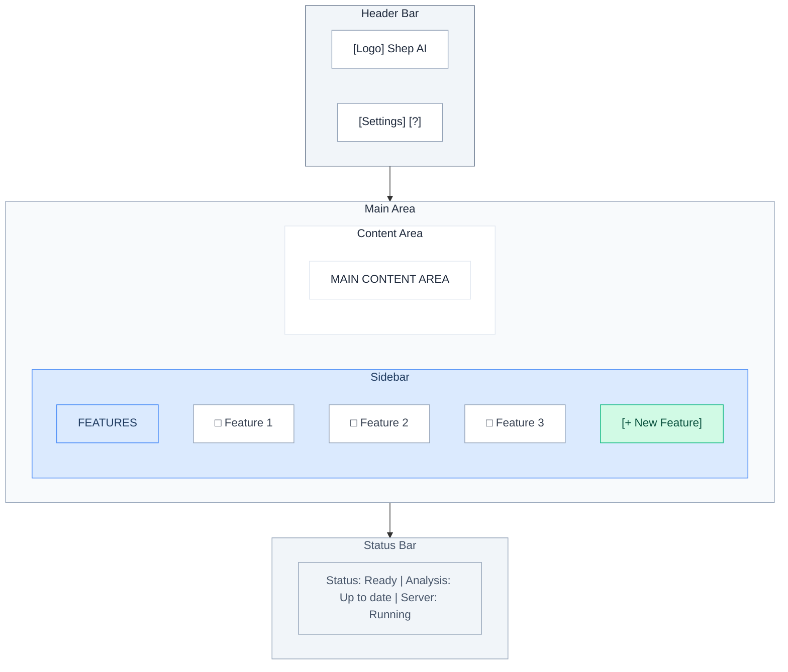
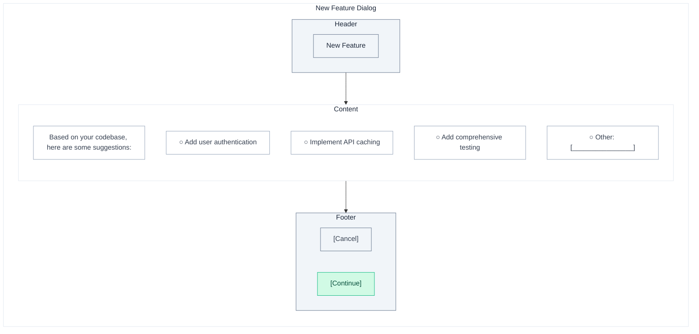
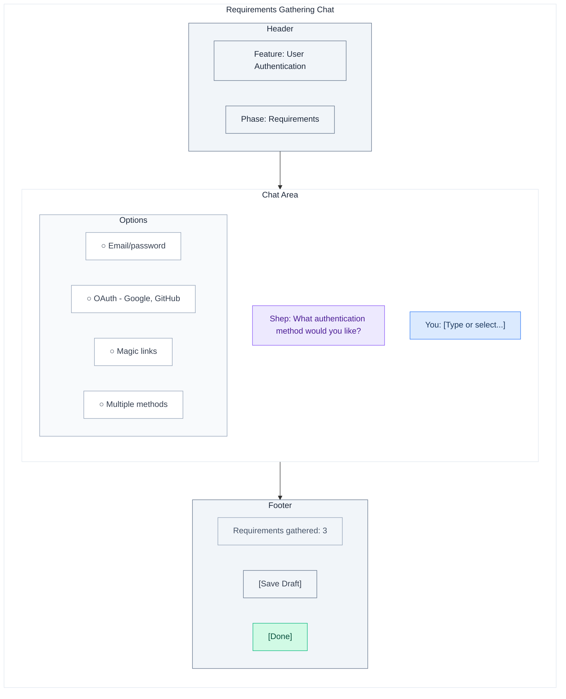
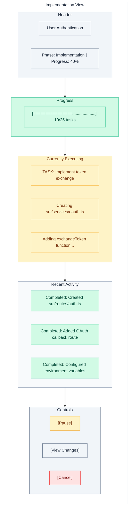
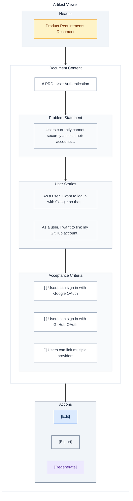
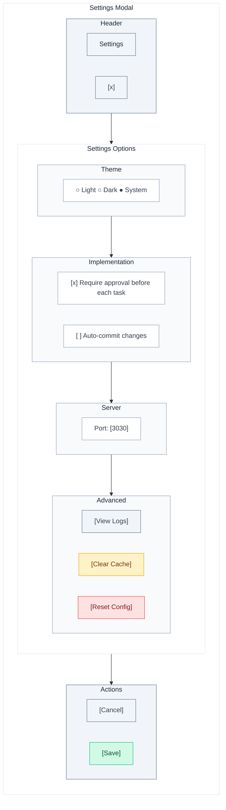

# Web UI Guide

Guide to using Shep's browser-based interface.

## Overview

The web UI provides a visual interface for:
- Creating and managing features
- Interactive requirements gathering
- Plan visualization and editing
- Implementation progress tracking
- Artifact viewing and editing

## Technology Stack

| Component | Technology | Purpose |
|-----------|------------|---------|
| Framework | Next.js 14+ | App Router, Server Components |
| UI Components | shadcn/ui | Radix primitives + Tailwind CSS |
| Design System | Storybook | Component documentation and testing |
| E2E Testing | Playwright | Browser-based automated tests |

The Web UI is built with modern React patterns:
- **Server Components** for data fetching and initial renders
- **Client Components** for interactivity (chat, real-time updates)
- **shadcn/ui** for accessible, customizable UI primitives
- **Tailwind CSS** for styling with design tokens

## Accessing the UI

Start Shep and the UI opens automatically:

```bash
shep
```

Default URL: `http://localhost:3030/`

To start without opening browser:

```bash
shep --no-browser
```

## Interface Layout



## Feature Workflow

### Creating a Feature

1. Click **[+ New Feature]** in the sidebar
2. The AI greets you with contextual options:



3. Select or describe your feature
4. Continue to requirements gathering

### Requirements Gathering

The chat interface guides you through requirements:



Chat features:
- Click options to select
- Type custom responses
- Review gathered requirements on the side
- Save drafts to continue later

### Plan View

After requirements, view the generated plan:

```mermaid
flowchart TB
    subgraph PlanView["Plan View"]
        direction TB
        subgraph PlanHeader["Header"]
            Title["User Authentication"]
            ReqBtn["[Requirements]"]
            Preview["Preview"]
        end
        subgraph EpicInfo["Epic Summary"]
            EpicStats["EPIC: 5 stories - 25 subtasks"]
        end
        subgraph PlanContent["Plan Content"]
            direction TB
            Epic["Implement OAuth Authentication"]
            EpicDesc["Introduce OAuth support with Google and GitHub..."]
            subgraph Story1["STORY: Setup OAuth Provider Config - 3 tasks"]
                T1["□ Create provider configuration file"]
                T2["□ Add environment variable handling"]
                T3["□ Implement provider factory"]
            end
            subgraph Story2["STORY: Implement Callback Handlers - 4 tasks"]
                T4["□ Create OAuth callback route"]
                T5["□ Implement token exchange"]
                T6["□ Handle user creation/linking"]
                T7["□ Add error handling"]
            end
        end
        subgraph PlanTabs["Tabs"]
            Tab1["TICKETS 25"]
            Tab2["DOCUMENTATION 3"]
            Tab3["REQUIREMENTS 8"]
        end
    end

    PlanHeader --> EpicInfo
    EpicInfo --> PlanContent
    Epic --> EpicDesc
    EpicDesc --> Story1
    Story1 --> Story2
    PlanContent --> PlanTabs

    style PlanView fill:#ffffff,stroke:#e2e8f0,color:#1e293b
    style PlanHeader fill:#f1f5f9,stroke:#64748b,color:#1e293b
    style EpicInfo fill:#f8fafc,stroke:#94a3b8,color:#1e293b
    style PlanContent fill:#ffffff,stroke:#e2e8f0,color:#1e293b
    style Story1 fill:#d1fae5,stroke:#10b981,color:#064e3b
    style Story2 fill:#d1fae5,stroke:#10b981,color:#064e3b
    style PlanTabs fill:#f1f5f9,stroke:#64748b,color:#1e293b
    style Title fill:#f1f5f9,stroke:#64748b,color:#1e293b
    style ReqBtn fill:#f1f5f9,stroke:#64748b,color:#374151
    style Preview fill:#f1f5f9,stroke:#64748b,color:#374151
    style EpicStats fill:#f8fafc,stroke:#94a3b8,color:#1e293b
    style Epic fill:#dbeafe,stroke:#3b82f6,color:#1e3a5f
    style EpicDesc fill:#ffffff,stroke:#94a3b8,color:#374151
    style T1 fill:#ffffff,stroke:#94a3b8,color:#374151
    style T2 fill:#ffffff,stroke:#94a3b8,color:#374151
    style T3 fill:#ffffff,stroke:#94a3b8,color:#374151
    style T4 fill:#ffffff,stroke:#94a3b8,color:#374151
    style T5 fill:#ffffff,stroke:#94a3b8,color:#374151
    style T6 fill:#ffffff,stroke:#94a3b8,color:#374151
    style T7 fill:#ffffff,stroke:#94a3b8,color:#374151
    style Tab1 fill:#d1fae5,stroke:#10b981,color:#064e3b
    style Tab2 fill:#fef3c7,stroke:#f59e0b,color:#78350f
    style Tab3 fill:#dbeafe,stroke:#3b82f6,color:#1e3a5f
```



#### Tabs

| Tab | Content |
|-----|---------|
| TICKETS | Tasks and action items |
| DOCUMENTATION | Generated artifacts (PRD, RFC, etc.) |
| REQUIREMENTS | Gathered requirements list |

#### Actions

- **Expand/Collapse** stories to see tasks
- **Click tasks** to view details
- **Edit** tasks inline
- **Reorder** by dragging
- **Add** new tasks or action items

### Implementation View

During implementation, track progress:



#### Controls

| Button | Action |
|--------|--------|
| Pause | Pause execution after current task |
| View Changes | Open diff viewer |
| Cancel | Stop execution (requires confirmation) |

### Artifact Viewer

View and edit generated documentation:



Features:
- Markdown rendering
- Inline editing
- Export to file
- Regenerate with AI

## Settings

Access via gear icon:



## Keyboard Shortcuts

| Shortcut | Action |
|----------|--------|
| `Ctrl/Cmd + N` | New feature |
| `Ctrl/Cmd + S` | Save current |
| `Ctrl/Cmd + Enter` | Submit in chat |
| `Escape` | Close modal/cancel |
| `?` | Show all shortcuts |

## Responsive Design

The UI adapts to screen size:

- **Desktop** (>1200px): Full sidebar + content
- **Tablet** (768-1200px): Collapsible sidebar
- **Mobile** (<768px): Bottom navigation

## Development

### Running Locally

```bash
# Start the web UI in development mode
pnpm web:dev

# Build for production
pnpm web:build

# Run E2E tests
pnpm test:e2e
```

### Storybook

View and develop components in isolation:

```bash
# Start Storybook dev server
pnpm storybook

# Build Storybook for deployment
pnpm storybook:build
```

Storybook includes:
- All shadcn/ui component variants
- Feature-specific components
- Interactive documentation
- Visual regression testing

### Project Structure

```
src/presentation/web/
├── app/                     # Next.js App Router
│   ├── layout.tsx          # Root layout
│   ├── page.tsx            # Home page
│   ├── features/           # Feature pages
│   │   ├── [id]/
│   │   │   ├── page.tsx
│   │   │   └── requirements/
│   │   └── new/
│   └── settings/
├── components/
│   ├── ui/                 # shadcn/ui components
│   │   ├── button.tsx
│   │   ├── card.tsx
│   │   └── ...
│   ├── features/           # Feature components
│   │   ├── feature-card.tsx
│   │   └── feature-list.tsx
│   ├── chat/              # Chat components
│   │   ├── chat-messages.tsx
│   │   └── chat-input.tsx
│   └── layout/            # Layout components
│       ├── sidebar.tsx
│       └── header.tsx
├── lib/                   # Utilities
│   └── utils.ts
└── stories/               # Storybook stories
    ├── Button.stories.tsx
    └── FeatureCard.stories.tsx
```

---

## Maintaining This Document

**Update when:**
- UI layout changes
- New features are added
- Keyboard shortcuts change
- New views are introduced
- Component library updates

**Related docs:**
- [getting-started.md](./getting-started.md) - First-time setup
- [cli-commands.md](./cli-commands.md) - Server commands
- [../development/testing.md](../development/testing.md) - E2E testing guide
