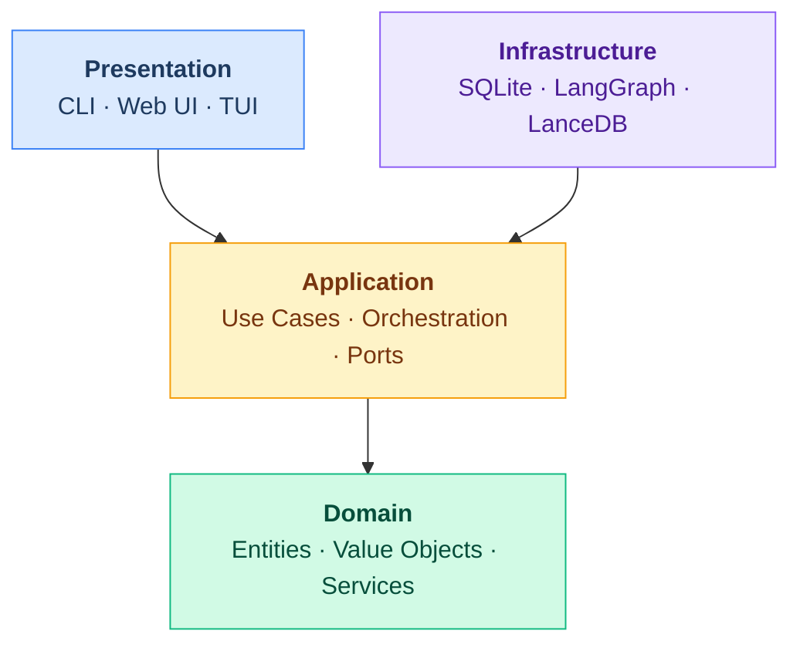

<div align="center">

# Shep AI

### The Autonomous SDLC Platform

_From idea to deploy — orchestrate parallel feature development across repos with full visibility_

[](https://github.com/shep-ai/cli/actions/workflows/ci.yml)
[](https://www.npmjs.com/package/@shepai/cli)
[](https://opensource.org/licenses/MIT)
[](https://www.typescriptlang.org/)
[](https://nodejs.org/)
[](https://github.com/shep-ai/cli/pulls)
[](https://conventionalcommits.org)

<br />

[Features](#features) · [Quick Start](#quick-start) · [CLI Reference](#cli) · [Architecture](#architecture) · [Contributing](#contributing)

<br />


<br />

</div>

---

Most AI coding tools help you write code faster. Shep manages the **entire development lifecycle** — requirements gathering, planning, autonomous implementation, testing, and deployment — across multiple repositories, in parallel, with you in control.

```bash
npm i -g @shepai/cli
cd your-repo/
shep feat new "Implement SSO with SAML 2.0"
# Agent starts working in a dedicated worktree.
# Open the control center to watch progress, intervene, or switch context.
shep ui
```

---

## Features

<table>
<tr>
<td width="55%"></td>
<td width="45%">

### Feature Properties & Attachments

- **Rich feature detail panel** with name, description, and metadata
- **File attachments** — requirements PDFs, mockup images, API specs linked directly to features
- **Team & metadata** tracking for ownership and collaboration
- **Dependency mapping** between features across repos
- **Iterative refinement** — update properties as requirements evolve through the lifecycle

</td>
</tr>

<tr>
<td width="55%"></td>
<td width="45%">

### Feature Cards with Quick Actions

- **One-click dev server** launch directly from any card
- **Action toolbar** — GitHub, web preview, terminal, code editor at your fingertips
- **Live progress** tracking with percentage and lifecycle stage badge
- **Unique IDs** for instant cross-referencing across CLI and UI

</td>
</tr>

<tr>
<td width="55%"></td>
<td width="45%">

### AI-Guided Requirements Discovery

- **Smart questionnaires** that surface the right questions for your feature
- **Categorized inputs** — business, technical, and UX problem classification
- **Priority tiers** (P1–P3) with clear impact descriptions
- **Domain tagging** to scope the affected areas of your codebase
- **Human breakpoint** — agent pauses here until you finalize

</td>
</tr>

<tr>
<td width="55%"></td>
<td width="45%">

### Technical Plan Review

- **AI-generated implementation plans** with full architecture rationale
- **Technical decision cards** — see the chosen approach and alternatives side-by-side
- **Architecture pattern selection** (microservices, monolith, serverless) with trade-off analysis
- **Approve & continue** or send back for revision — you control the direction

</td>
</tr>

<tr>
<td width="55%"></td>
<td width="45%">

### Tasks & Generated Artifacts

- **Auto-generated documents** — plan.md, tasks.md, data_model.md created from your approved spec
- **Task breakdown** with dependency tracking and status badges
- **Artifact browser** — inspect any generated document directly in the panel
- **Draft indicator** — nothing ships until you explicitly approve

</td>
</tr>

<tr>
<td width="55%"></td>
<td width="45%">

### Quality Assurance Gate

- **Automated QA checklist** — functional, performance, security, compatibility, accessibility
- **OWASP Top 10** security scan results inline
- **Performance benchmarks** — API response time p95 thresholds
- **WCAG 2.5** accessibility compliance verification
- **One-click Pass QA** when all checks are green

</td>
</tr>

<tr>
<td width="55%"></td>
<td width="45%">

### Integrated Dev Environment — Web Preview

- **Live localhost preview** embedded in the control center
- **Isolated ports** — each feature runs its own dev server
- **Server status** indicator with start/stop controls
- **Open in Browser** for full-screen testing
- **PR context** — branch, worktree path, and PR link always visible

</td>
</tr>

<tr>
<td width="55%"></td>
<td width="45%">

### Integrated Dev Environment — Code Editor

- **Embedded VS Code** with full editor capabilities
- **Git worktree isolation** — each feature in its own directory, no branch conflicts
- **File explorer** with project structure at a glance
- **PR badge** with commits ahead/behind and changed file count
- **Zero context-switch** — edit code without leaving the control center

</td>
</tr>

<tr>
<td width="55%"></td>
<td width="45%">

### Integrated Dev Environment — Terminal

- **Full terminal access** inside the feature workspace
- **Build output, test results, agent logs** in one place
- **Pre-configured** in the feature's worktree directory
- **Dev server output** — see Next.js/Vite/Express startup and compile times
- **Three-tab workflow** — preview, code, and terminal without leaving the UI

</td>
</tr>
</table>

---

### Multi-Session Parallel Execution

Run multiple features simultaneously across any number of repositories. Each feature gets its own **git worktree** and **dedicated agent session**, so there's zero interference between parallel workstreams.

```bash
# Start three features across two repos — they all run concurrently
shep feat new "API rate limiting"
shep feat new "Dashboard redesign"
shep feat new --repo ~/other-project "Fix PR-933"

# Check what's running
shep feat ls
# ┌──────┬─────────────────────────────┬──────────────────────┐
# │ ID   │ Name                        │ Status               │
# ├──────┼─────────────────────────────┼──────────────────────┤
# │ #001 │ api-rate-limiting           │ ▶ Implementation     │
# │ #002 │ dashboard-redesign          │ ⚠ Plan Review        │
# │ #003 │ fix-pr-933                  │ ✓ Deployed           │
# └──────┴─────────────────────────────┴──────────────────────┘
```

- **Isolated worktrees** — no branch juggling, no stash conflicts
- **Independent agent sessions** — each feature runs its own AI agent
- **Cross-repo support** — manage features across your entire org from one place
- **Background execution** — agents continue working while you context-switch

### CLI and UI — Same API

Everything you can do in the control center, you can do from the terminal. Same data, same lifecycle, same results.

```bash
# Create features
shep feat new "Cool dashboards"
shep feat new --interactive --allow-prd --allow-plan

# Manage features
shep feat ls                          # List all features
shep feat show <id>                   # Feature details
shep feat preview <id> --web          # Open web preview
shep feat preview <id> --ide          # Open in VS Code
shep feat preview <id> --terminal     # Open terminal

# Integrate with external tools
shep feat new "Fix it!" --tool-jira-ticket PR-933 --allow-all
shep feat new "Fix it!" --tool-github-issue "#24" --allow-all

# Agent memories — teach it your preferences
shep mem add "PRs must follow conventional commits" --global
shep mem add "Always use JSDoc on public APIs" --repo
shep mem add "Check for latest dependency versions" --research
```

### Seamless Context Switching

Jump between features, tasks, and repos without losing your place. The control center maintains your navigation state — drill into a task's implementation details, switch to another feature, come back, and you're exactly where you left off.

- **Onion-layer navigation** — Escape key peels back one layer at a time (commit → task → feature → canvas)
- **Environment persistence** — running dev servers stay alive across navigation
- **Multi-repo canvas** — all repositories and their features on a single scrollable canvas
- **Keyboard-driven** — navigate, approve, and switch context without touching the mouse

### Intelligent Repository Analysis

When you run `shep` on a repository for the first time, it performs deep multi-perspective analysis that powers all downstream AI decisions:

- Architecture patterns, module boundaries, and entry points
- Technology stack, frameworks, and build tooling
- Code conventions, naming patterns, and documentation style
- Dependency graph with version analysis
- Testing patterns and coverage assessment

Analysis is cached in `~/.shep/repos/` — instant on subsequent runs.

### Memory System

Teach the agent your team's standards once. It remembers across sessions and features.

```bash
# Global memories apply to all repos
shep mem add "Always write tests first" --global

# Repo memories apply to a specific project
shep mem add "Use Tailwind, not CSS modules" --repo

# Phase-specific memories guide agent behavior at each stage
shep mem add "Research latest library versions" --research
shep mem add "Include rollback plan in every deploy" --deploy
```

---

## Quick Start

```bash
# Install
npm i -g @shepai/cli

# Start the background service
shep start
#  ➜  Local:   http://localhost:5173/
#  Shep service is running in background, have fun!

# Navigate to any repo
cd ~/repos/your-project

# Create your first feature
shep feat new "Add user authentication with OAuth 2.0"

# Open the control center
shep ui
```

## CLI

```
shep start                            Start background service
shep feat new <description>           Create a new feature
shep feat new --interactive           Interactive mode with human checkpoints
shep feat new --allow-all             Full autonomous mode
shep feat ls                          List features across repos
shep feat show <id>                   Show feature details
shep feat preview <id>                Preview feature dev environment
shep ui                               Open the web control center
shep settings show                    Display current configuration
shep settings agent                   Configure AI coding agent
shep mem add <text> --global|--repo   Add agent memory
shep mem ls                           List memories
shep version                          Version info
```

## Architecture

Clean Architecture with four layers. Dependencies point inward — domain has zero external deps.



### Feature Lifecycle

Every feature progresses through a structured SDLC pipeline:

```
Requirements → Research → Review PRD → Planning → Review Plan → Implementation → QA → Approval → Live
     ↑              ↑           ↑            ↑           ↑             ↑          ↑        ↑
   Agent         Agent       Human        Agent       Human        Agent      Human    Human
                           breakpoint                breakpoint               check    gate
```

Breakpoints are configurable. In `--allow-all` mode, the agent handles everything autonomously.

### Tech Stack

| Layer           | Technology                                                    |
| --------------- | ------------------------------------------------------------- |
| Language        | TypeScript                                                    |
| CLI             | Commander + [@inquirer/prompts](https://github.com/SBoudrias/Inquirer.js) |
| Web UI          | Next.js 16 + React 19 + [shadcn/ui](https://ui.shadcn.com/)  |
| Design System   | Storybook                                                     |
| Database        | SQLite (per-repo)                                             |
| Agent System    | [LangGraph](https://www.langchain.com/langgraph)              |
| Vector Search   | [LanceDB](https://lancedb.com/) + [Transformers.js](https://huggingface.co/docs/transformers.js) |
| Domain Models   | [TypeSpec](https://typespec.io/) (source of truth → generated TS types) |
| Testing         | Vitest + Playwright                                           |
| Security        | Trivy, Gitleaks, Semgrep, Hadolint                            |

### Data Model

```
Repository ──┬── Feature ──┬── Plan ──┬── Task ──── ActionItem
             │             │          └── Artifact
             │             └── Requirement ── Research
             └── Analysis docs (cached)
```

All data lives locally in `~/.shep/`. Per-repo SQLite databases. No cloud dependency.

## Security

Automated scanning runs on every push — all gates must pass before release:

| Scanner      | Purpose                              |
| ------------ | ------------------------------------ |
| **Trivy**    | Dependency & container vulnerabilities |
| **Gitleaks** | Secret detection in git history      |
| **Semgrep**  | SAST for TypeScript/JavaScript       |
| **Hadolint** | Dockerfile best practices            |

## Documentation

| Document                                                     | Description                        |
| ------------------------------------------------------------ | ---------------------------------- |
| [Architecture](../../docs/architecture/)                     | System design and patterns         |
| [Concepts](../../docs/concepts/)                             | Core domain concepts               |
| [UI](../../docs/ui/)                                         | Web UI architecture & design system|
| [CLI](../../docs/cli/)                                       | CLI architecture & command reference|
| [Development](../../docs/development/)                       | Contributing and dev setup         |
| [API Reference](../../docs/api/)                             | Interface and model docs           |
| [AGENTS.md](../../AGENTS.md)                                 | Agent system architecture          |

## Contributing

We welcome contributions from humans and AI agents alike.

- **Humans**: See [CONTRIBUTING.md](../../CONTRIBUTING.md)
- **AI Agents**: See [CONTRIBUTING-AGENTS.md](../../CONTRIBUTING-AGENTS.md)
- **Spec-driven workflow**: All features start with `/shep-kit:new-feature` — see [Spec-Driven Workflow](../../docs/development/spec-driven-workflow.md)

## License

MIT — see [LICENSE](../../LICENSE).
