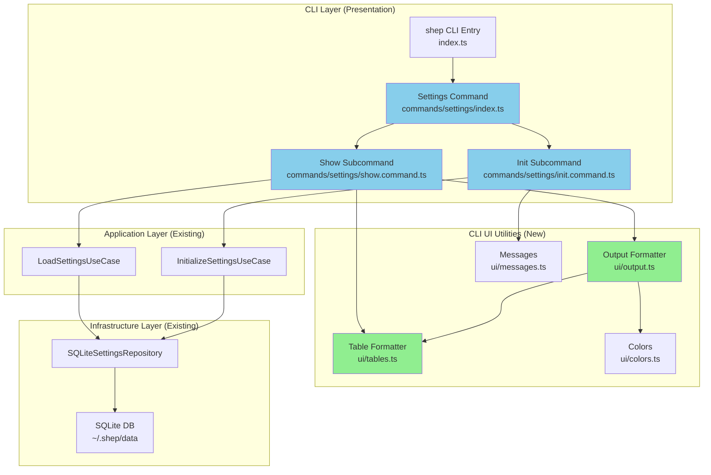

# Plan: cli-settings-commands

> Implementation plan for 006-cli-settings-commands

## Status

- **Phase:** Planning
- **Updated:** 2026-02-05

## Architecture Overview

**Data Flow:**

1. **Show Command**: User → CLI → Show Command → LoadSettingsUseCase → Repository → DB → Format (Table/JSON/YAML) → User
2. **Init Command**: User → CLI → Init Command → Confirmation Prompt → InitializeSettingsUseCase → Repository → DB → Success Message → User

## Implementation Strategy

### Phase 0: Foundation (Non-TDD)

**Objective:** Install dependencies and create CLI UI infrastructure.

**Activities:**

- Install npm packages: `cli-table3`, `js-yaml`, `@types/cli-table3`, `@types/js-yaml`
- Create CLI UI utilities (tables.ts, output.ts)
- No tests needed (utility layer will be tested indirectly through commands)

**Duration:** ~30 min

---

### Phase 1: Show Command (TDD Cycle)

**Objective:** Implement `shep settings show` with output format support.

#### 1.1 RED: Write Failing Tests

**Tests to write FIRST:**

- Unit test: ShowCommandHandler with mocked LoadSettingsUseCase
- Unit test: OutputFormatter for table/JSON/YAML formats
- Unit test: TableFormatter for settings data structure
- E2E test: `shep settings show` displays table output
- E2E test: `shep settings show --output json` displays JSON
- E2E test: `shep settings show --output yaml` displays YAML

**Expected:** All tests fail (RED phase)

#### 1.2 GREEN: Minimal Implementation

**Code to write:**

- `src/presentation/cli/commands/settings/show.command.ts` - Basic show command
- `src/presentation/cli/ui/output.ts` - OutputFormatter class
- `src/presentation/cli/ui/tables.ts` - TableFormatter class

**Expected:** All tests pass with minimal code

#### 1.3 REFACTOR: Improve Code

**Improvements:**

- Extract database metadata logic to separate service
- Improve table styling consistency
- Add helper functions for formatting

**Expected:** All tests remain green

**Duration:** ~2-3 hours

---

### Phase 2: Init Command (TDD Cycle)

**Objective:** Implement `shep settings init` with confirmation prompts.

#### 2.1 RED: Write Failing Tests

**Tests to write FIRST:**

- Unit test: InitCommandHandler with mocked InitializeSettingsUseCase
- Unit test: Confirmation prompt behavior (with/without --force)
- E2E test: `shep settings init` prompts for confirmation
- E2E test: `shep settings init --force` skips confirmation
- E2E test: `shep settings init` handles user cancellation

**Expected:** All tests fail (RED phase)

#### 2.2 GREEN: Minimal Implementation

**Code to write:**

- `src/presentation/cli/commands/settings/init.command.ts` - Basic init command
- Add confirmation prompt logic using Commander.js

**Expected:** All tests pass

#### 2.3 REFACTOR: Improve Code

**Improvements:**

- Extract confirmation logic to reusable utility
- Improve error messages
- Add backup warning to confirmation prompt

**Expected:** All tests remain green

**Duration:** ~1-2 hours

---

### Phase 3: Settings Command Group & Help

**Objective:** Create settings command group with hierarchical help.

**Activities:**

- Create `src/presentation/cli/commands/settings/index.ts` - Command group
- Register settings command in main CLI index
- Add comprehensive help text using `.addHelpText()`
- Test help output at all three tiers

**Testing:** Manual testing of help output (no automated tests for help text)

**Duration:** ~1 hour

---

### Phase 4: CLI Documentation [P]

**Objective:** Document CLI architecture patterns.

**Activities (can be parallelized):**

- Write `docs/cli/README.md` - CLI documentation index
- Write `docs/cli/architecture.md` - Command patterns and structure
- Write `docs/cli/design-system.md` - Output formatting guidelines
- Write `docs/cli/commands.md` - Command reference
- Update `CLAUDE.md` with CLI architecture section

**Duration:** ~2-3 hours

---

### Phase 5: Integration & Polish

**Objective:** Final integration testing and refinements.

**Activities:**

- Run full test suite (`pnpm test`)
- Run E2E tests manually
- Test all output formats with real database
- Fix any integration issues
- Update success criteria checkboxes in spec.md

**Duration:** ~1 hour

---

## Files to Create/Modify

### New Files (16 files)

| File                                                                  | Purpose                             |
| --------------------------------------------------------------------- | ----------------------------------- |
| `src/presentation/cli/commands/settings/index.ts`                     | Settings command group registration |
| `src/presentation/cli/commands/settings/show.command.ts`              | Show subcommand implementation      |
| `src/presentation/cli/commands/settings/init.command.ts`              | Init subcommand implementation      |
| `src/presentation/cli/ui/tables.ts`                                   | Table formatting utility            |
| `src/presentation/cli/ui/output.ts`                                   | Output formatter (JSON/YAML/table)  |
| `tests/unit/presentation/cli/commands/settings/show.command.test.ts`  | Show command unit tests             |
| `tests/unit/presentation/cli/commands/settings/init.command.test.ts`  | Init command unit tests             |
| `tests/unit/presentation/cli/ui/tables.test.ts`                       | Table formatter unit tests          |
| `tests/unit/presentation/cli/ui/output.test.ts`                       | Output formatter unit tests         |
| `tests/e2e/cli/settings-show.test.ts`                                 | E2E tests for show command          |
| `tests/e2e/cli/settings-init.test.ts`                                 | E2E tests for init command          |
| `docs/cli/README.md`                                                  | CLI documentation index             |
| `docs/cli/architecture.md`                                            | CLI architecture patterns           |
| `docs/cli/design-system.md`                                           | CLI output formatting guidelines    |
| `docs/cli/commands.md`                                                | Command reference documentation     |
| `src/infrastructure/services/database-metadata.service.ts` (optional) | Database metadata extraction        |

### Modified Files (4 files)

| File                               | Changes                                      |
| ---------------------------------- | -------------------------------------------- |
| `src/presentation/cli/index.ts`    | Register settings command group              |
| `src/presentation/cli/ui/index.ts` | Export new table and output utilities        |
| `package.json`                     | Add cli-table3, js-yaml, @types dependencies |
| `CLAUDE.md`                        | Add CLI architecture section                 |

## Testing Strategy

### TDD Approach: Tests FIRST

**CRITICAL:** Write failing tests BEFORE implementation in each TDD cycle.

### Unit Tests (Phase 1.1 & 2.1 - RED first)

**Write tests for:**

- `ShowCommandHandler` class
  - Test with mocked LoadSettingsUseCase
  - Test output format selection (table/json/yaml)
  - Test database metadata display
  - Test error handling when settings not found
- `InitCommandHandler` class
  - Test with mocked InitializeSettingsUseCase
  - Test confirmation prompt behavior
  - Test --force flag bypass
  - Test user cancellation handling
- `OutputFormatter` class
  - Test table output formatting
  - Test JSON stringification
  - Test YAML dumping
  - Test invalid format handling
- `TableFormatter` class
  - Test settings table generation
  - Test nested object rendering
  - Test color integration
  - Test multi-column layout

**Test Framework:** Vitest (already configured)

**Mocking:** Use Vitest's `vi.mock()` for use case dependencies

### Integration Tests (Deferred to E2E)

Since CLI commands integrate use cases with UI, E2E tests serve as integration tests.

### E2E Tests (Phase 1.1 & 2.1 - RED first)

**Write tests for:**

- `shep settings show`
  - Displays formatted table with all settings sections
  - Includes database metadata (path, size, schema version)
- `shep settings show --output json`
  - Outputs valid JSON to stdout
  - JSON structure matches Settings type
- `shep settings show --output yaml`
  - Outputs valid YAML to stdout
  - YAML structure matches Settings type
- `shep settings init`
  - Prompts for confirmation with warning message
  - Accepts "y" and initializes settings
  - Accepts "n" and cancels operation
- `shep settings init --force`
  - Skips confirmation prompt
  - Initializes settings immediately
- `shep settings --help`
  - Displays subcommand list (show, init)
- `shep settings show --help`
  - Displays show command help with examples

**Test Framework:** Playwright (already configured for E2E)

**Test Setup:** Use test database in `~/.shep-test/`

## Risk Mitigation

| Risk                                       | Likelihood | Impact | Mitigation                                                   |
| ------------------------------------------ | ---------- | ------ | ------------------------------------------------------------ |
| cli-table3 API incompatibility             | Low        | Medium | Thoroughly test table rendering; cli-table3 has stable API   |
| YAML serialization errors                  | Low        | Low    | js-yaml handles Settings type well; add error handling       |
| Database file size calculation incorrect   | Low        | Low    | Use Node.js fs.statSync (well-tested); validate manually     |
| Confirmation prompt breaks in CI           | Medium     | High   | Mock stdin/stdout in E2E tests; test locally with real term  |
| Help text formatting inconsistency         | Low        | Low    | Commander.js handles formatting; follow established patterns |
| Bundle size increase from new dependencies | Low        | Medium | cli-table3 + js-yaml add ~90KB; acceptable for CLI tool      |

## Rollback Plan

**Simple rollback:** All changes are additive (no breaking changes to existing code).

### Rollback Steps:

1. **Remove command registration**:
   - Revert changes to `src/presentation/cli/index.ts`
   - Remove settings command import/registration
2. **Remove dependencies**:
   - Run `pnpm remove cli-table3 js-yaml @types/cli-table3 @types/js-yaml`
3. **Delete new files**:
   - `rm -rf src/presentation/cli/commands/settings/`
   - `rm src/presentation/cli/ui/{tables.ts,output.ts}`
   - `rm -rf tests/unit/presentation/cli/commands/settings/`
   - `rm -rf tests/e2e/cli/settings-*.test.ts`
   - `rm -rf docs/cli/`
4. **Revert CLAUDE.md**:
   - Remove CLI architecture section

### Validation:

- Run `pnpm build` - should succeed
- Run `pnpm test` - all tests should pass
- Run `shep --help` - settings command should not appear

**Risk:** Low - feature is completely isolated from existing functionality.

---

_Updated by `/shep-kit:plan` — see tasks.md for detailed breakdown_
