# Tasks: cli-settings-commands

> Task breakdown for 006-cli-settings-commands

## Status

- **Phase:** Implementation
- **Updated:** 2026-02-05

## Project Timeline

```mermaid
gantt
    title CLI Settings Commands - Parallelized Implementation Timeline
    dateFormat HH:mm
    axisFormat %H:%M

    section Phase 0: Foundation
    Install dependencies                :p0_1, 00:00, 5m
    Create tables.ts skeleton           :crit, p0_2, after p0_1, 5m
    Create output.ts skeleton           :crit, p0_3, after p0_1, 5m
    Export utilities                    :p0_4, after p0_2 p0_3, 5m
    Verify build                        :p0_5, after p0_4, 5m
    Commit foundation                   :p0_6, after p0_5, 5m

    section Phase 1.1: RED [P]
    Create output.test.ts               :crit, p1_1_1, after p0_6, 10m
    Create tables.test.ts               :crit, p1_1_2, after p0_6, 10m
    Create show.command.test.ts         :crit, p1_1_3, after p0_6, 10m
    Create settings-show.test.ts        :crit, p1_1_4, after p0_6, 10m
    Run tests (verify FAIL)             :p1_1_5, after p1_1_1 p1_1_2 p1_1_3 p1_1_4, 3m
    Commit RED tests                    :p1_1_6, after p1_1_5, 2m

    section Phase 1.2: GREEN [P]
    Implement output.ts                 :crit, p1_2_1, after p1_1_6, 15m
    Implement tables.ts                 :crit, p1_2_2, after p1_1_6, 20m
    Implement show.command.ts           :p1_2_3, after p1_2_1 p1_2_2, 20m
    Run tests (verify PASS)             :p1_2_4, after p1_2_3, 3m
    Commit GREEN impl                   :p1_2_5, after p1_2_4, 2m

    section Phase 1.3: REFACTOR [P]
    Extract metadata service            :p1_3_1, after p1_2_5, 10m
    Improve table styling               :crit, p1_3_2, after p1_2_5, 8m
    Add file size helpers               :crit, p1_3_3, after p1_2_5, 5m
    Add timestamp formatting            :crit, p1_3_4, after p1_2_5, 5m
    Run tests & lint                    :p1_3_5, after p1_3_1 p1_3_2 p1_3_3 p1_3_4, 2m
    Commit REFACTOR                     :p1_3_6, after p1_3_5, 2m

    section Phase 2.1: RED [P]
    Create init.command.test.ts         :crit, p2_1_1, after p1_3_6, 12m
    Create settings-init.test.ts        :crit, p2_1_2, after p1_3_6, 12m
    Run tests (verify FAIL)             :p2_1_3, after p2_1_1 p2_1_2, 3m
    Commit RED tests                    :p2_1_4, after p2_1_3, 3m

    section Phase 2.2: GREEN
    Implement init.command.ts           :p2_2_1, after p2_1_4, 40m
    Run tests (verify PASS)             :p2_2_2, after p2_2_1, 3m
    Commit GREEN impl                   :p2_2_3, after p2_2_2, 2m

    section Phase 2.3: REFACTOR [P]
    Extract prompts utility             :p2_3_1, after p2_2_3, 10m
    Improve error messages              :crit, p2_3_2, after p2_2_3, 8m
    Add backup warning                  :crit, p2_3_3, after p2_2_3, 5m
    Run tests & lint                    :p2_3_4, after p2_3_1 p2_3_2 p2_3_3, 5m
    Commit REFACTOR                     :p2_3_5, after p2_3_4, 2m

    section Phase 3: Command Group [P]
    Create settings index.ts            :p3_1, after p2_3_5, 15m
    Register settings command           :p3_2, after p3_1, 10m
    Add show help text                  :crit, p3_3a, after p3_2, 8m
    Add init help text                  :crit, p3_3b, after p3_2, 8m
    Add group help text                 :crit, p3_3c, after p3_2, 4m
    Test help output                    :p3_4, after p3_3a p3_3b p3_3c, 10m
    Commit command group                :p3_5, after p3_4, 5m

    section Phase 4: Docs [P]
    Write README.md                     :crit, p4_1, after p2_3_5, 30m
    Write architecture.md               :crit, p4_2, after p2_3_5, 45m
    Write design-system.md              :crit, p4_3, after p2_3_5, 45m
    Write commands.md                   :crit, p4_4, after p2_3_5, 40m
    Update CLAUDE.md                    :crit, p4_5, after p2_3_5, 15m
    Commit documentation                :crit, p4_6, after p4_1 p4_2 p4_3 p4_4 p4_5, 5m

    section Phase 5: Integration [P]
    Run full test suite                 :p5_1, after p3_5 p4_6, 10m
    Manual E2E testing                  :p5_2, after p5_1, 20m
    Run lint check                      :crit, p5_3a, after p5_2, 3m
    Run typecheck                       :crit, p5_3b, after p5_2, 4m
    Run format check                    :crit, p5_3c, after p5_2, 3m
    Update spec.md                      :crit, p5_4a, after p5_3a p5_3b p5_3c, 3m
    Update research.md                  :crit, p5_4b, after p5_3a p5_3b p5_3c, 3m
    Update plan.md                      :crit, p5_4c, after p5_3a p5_3b p5_3c, 4m
    Final commit                        :p5_5, after p5_4a p5_4b p5_4c, 5m
    Create PR                           :p5_6, after p5_5, 5m
```

**Legend:**

- **Red (crit)** = Parallel tasks running concurrently
- **[P]** = Phase contains parallelization
- **Critical path** = p0_1 → p0_4 → p1_1_5 → p1_2_3 → p1_3_5 → p2_1_3 → p2_2_1 → p2_3_4 → p3_2 → p3_4 → p5_2 → p5_5
- **Total Sequential Time:** ~7.5 hours (old) → **~4.5 hours (parallelized)**
- **Parallelization Gains:** ~40% time reduction through concurrent execution
- **Total Tasks:** 64 individual action items (refined for parallel execution)

**Parallelization Breakdown:**

- **Phase 0:** 2 file creations in parallel
- **Phase 1.1 RED:** 4 test files in parallel (10m → 10m)
- **Phase 1.2 GREEN:** 2 implementations in parallel
- **Phase 1.3 REFACTOR:** 3 improvements in parallel
- **Phase 2.1 RED:** 2 test files in parallel
- **Phase 2.3 REFACTOR:** 2 improvements in parallel
- **Phase 3:** 3 help texts in parallel
- **Phase 4:** 5 documentation files in parallel (runs during Phase 3)
- **Phase 5:** 3 quality checks + 3 spec updates in parallel

## Task List

### Phase 0: Foundation (~30 min)

- [ ] Install npm dependencies: `pnpm add cli-table3 js-yaml @types/cli-table3 @types/js-yaml`
- [ ] Create `src/presentation/cli/ui/tables.ts` skeleton (basic structure, no logic yet)
- [ ] Create `src/presentation/cli/ui/output.ts` skeleton (basic structure, no logic yet)
- [ ] Export new utilities from `src/presentation/cli/ui/index.ts`
- [ ] Verify build passes: `pnpm build`
- [ ] Commit: `feat(cli): add CLI UI foundation for settings commands`

---

### Phase 1: Show Command (TDD Cycle) (~2-3 hours)

#### 1.1 RED: Write Failing Tests (~30-45 min)

- [ ] Create `tests/unit/presentation/cli/ui/output.test.ts` with failing tests:
  - [ ] Test `formatAsTable()` returns string
  - [ ] Test `formatAsJSON()` returns valid JSON
  - [ ] Test `formatAsYAML()` returns valid YAML
  - [ ] Test invalid format throws error
- [ ] Create `tests/unit/presentation/cli/ui/tables.test.ts` with failing tests:
  - [ ] Test `createSettingsTable()` returns cli-table3 instance
  - [ ] Test table has correct headers
  - [ ] Test nested objects are formatted correctly
- [ ] Create `tests/unit/presentation/cli/commands/settings/show.command.test.ts` with failing tests:
  - [ ] Test show command calls LoadSettingsUseCase
  - [ ] Test output format flag (table/json/yaml) is respected
  - [ ] Test database metadata is displayed
  - [ ] Test error handling when settings not found
- [ ] Create `tests/e2e/cli/settings-show.test.ts` with failing tests:
  - [ ] Test `shep settings show` displays table
  - [ ] Test `shep settings show --output json` displays JSON
  - [ ] Test `shep settings show --output yaml` displays YAML
- [ ] Run tests: `pnpm test` - **Verify all new tests FAIL (RED)**
- [ ] Commit: `test(cli): add failing tests for show command (RED)`

#### 1.2 GREEN: Minimal Implementation (~45-60 min)

- [ ] Implement `src/presentation/cli/ui/output.ts`:
  - [ ] Add `OutputFormatter` class with `format()` method
  - [ ] Implement table/JSON/YAML formatting
- [ ] Implement `src/presentation/cli/ui/tables.ts`:
  - [ ] Add `TableFormatter` class
  - [ ] Implement `createSettingsTable()` method
  - [ ] Add database metadata section
- [ ] Implement `src/presentation/cli/commands/settings/show.command.ts`:
  - [ ] Create `createShowCommand()` function
  - [ ] Inject LoadSettingsUseCase via container
  - [ ] Add `--output` flag with Commander.js
  - [ ] Call OutputFormatter with selected format
- [ ] Run tests: `pnpm test` - **Verify all tests PASS (GREEN)**
- [ ] Commit: `feat(cli): implement show command minimal (GREEN)`

#### 1.3 REFACTOR: Improve Code (~30 min)

- [ ] Extract database metadata logic to `src/infrastructure/services/database-metadata.service.ts`
- [ ] Improve table styling with colors from `ui/colors.ts`
- [ ] Add helper functions for human-readable file sizes
- [ ] Add timestamp formatting for "Last Modified"
- [ ] Run tests: `pnpm test` - **Verify all tests still PASS**
- [ ] Run linter: `pnpm lint && pnpm typecheck`
- [ ] Commit: `refactor(cli): improve show command formatting (REFACTOR)`

---

### Phase 2: Init Command (TDD Cycle) (~1-2 hours)

#### 2.1 RED: Write Failing Tests (~30 min)

- [ ] Create `tests/unit/presentation/cli/commands/settings/init.command.test.ts` with failing tests:
  - [ ] Test init command calls InitializeSettingsUseCase
  - [ ] Test confirmation prompt is shown (mock readline)
  - [ ] Test `--force` flag skips confirmation
  - [ ] Test user can cancel operation
  - [ ] Test success message is displayed
- [ ] Create `tests/e2e/cli/settings-init.test.ts` with failing tests:
  - [ ] Test `shep settings init` prompts for confirmation
  - [ ] Test user accepts with "y" - settings initialized
  - [ ] Test user cancels with "n" - operation cancelled
  - [ ] Test `shep settings init --force` skips prompt
- [ ] Run tests: `pnpm test` - **Verify all new tests FAIL (RED)**
- [ ] Commit: `test(cli): add failing tests for init command (RED)`

#### 2.2 GREEN: Minimal Implementation (~30-45 min)

- [ ] Implement `src/presentation/cli/commands/settings/init.command.ts`:
  - [ ] Create `createInitCommand()` function
  - [ ] Add `--force` flag with Commander.js
  - [ ] Implement confirmation prompt using readline
  - [ ] Inject InitializeSettingsUseCase via container
  - [ ] Display success/error messages
- [ ] Run tests: `pnpm test` - **Verify all tests PASS (GREEN)**
- [ ] Commit: `feat(cli): implement init command minimal (GREEN)`

#### 2.3 REFACTOR: Improve Code (~15-30 min)

- [ ] Extract confirmation prompt to reusable `src/presentation/cli/ui/prompts.ts` utility
- [ ] Improve error messages with actionable guidance
- [ ] Add backup warning to confirmation prompt: "Consider backing up ~/.shep/data first"
- [ ] Run tests: `pnpm test` - **Verify all tests still PASS**
- [ ] Run linter: `pnpm lint && pnpm typecheck`
- [ ] Commit: `refactor(cli): improve init command UX (REFACTOR)`

---

### Phase 3: Settings Command Group & Help (~1 hour)

- [ ] Create `src/presentation/cli/commands/settings/index.ts`:
  - [ ] Export `createSettingsCommand()` function
  - [ ] Create settings command group using `new Command('settings')`
  - [ ] Add subcommands: `show` and `init`
  - [ ] Add description: "Manage Shep global settings"
- [ ] Register settings command in `src/presentation/cli/index.ts`:
  - [ ] Import `createSettingsCommand()`
  - [ ] Add to main CLI program: `program.addCommand(createSettingsCommand())`
- [ ] Add hierarchical help text:
  - [ ] `show.command.ts`: Add `.addHelpText('after', ...)` with examples
  - [ ] `init.command.ts`: Add `.addHelpText('after', ...)` with examples
  - [ ] `index.ts` (settings group): Add description for subcommand list
- [ ] Test help output manually:
  - [ ] Run `shep --help` - verify settings command listed
  - [ ] Run `shep settings --help` - verify subcommands listed
  - [ ] Run `shep settings show --help` - verify detailed help with examples
  - [ ] Run `shep settings init --help` - verify detailed help with examples
- [ ] Commit: `feat(cli): add settings command group with hierarchical help`

---

### Phase 4: CLI Documentation (~2-3 hours) [P]

**Note:** These tasks can be done in parallel by multiple team members or in any order.

- [ ] Write `docs/cli/README.md`:
  - [ ] Overview of CLI architecture
  - [ ] Links to other CLI docs
  - [ ] Quick reference table
- [ ] Write `docs/cli/architecture.md`:
  - [ ] Command structure patterns (using Commander.js)
  - [ ] Command file organization (commands/ directory structure)
  - [ ] DI container integration for use cases
  - [ ] Error handling patterns
  - [ ] Help text conventions
- [ ] Write `docs/cli/design-system.md`:
  - [ ] Output formatting guidelines
  - [ ] Table formatting with cli-table3
  - [ ] Color usage from ui/colors.ts
  - [ ] Message formatting with ui/messages.ts
  - [ ] Consistency patterns
- [ ] Write `docs/cli/commands.md`:
  - [ ] Command reference for all CLI commands
  - [ ] Usage examples
  - [ ] Flag documentation
  - [ ] Output format examples
- [ ] Update `CLAUDE.md`:
  - [ ] Add "CLI Architecture" section (parallel to "Presentation Layer Technologies")
  - [ ] Document command patterns
  - [ ] Link to docs/cli/ documentation
  - [ ] Add to table of contents
- [ ] Commit: `docs(cli): add comprehensive CLI architecture documentation`

---

### Phase 5: Integration & Polish (~1 hour)

- [ ] Run full test suite: `pnpm test`
  - [ ] Verify all unit tests pass
  - [ ] Verify all E2E tests pass
  - [ ] Fix any failing tests
- [ ] Run E2E tests manually in real terminal:
  - [ ] Test `shep settings show` with real ~/.shep/data
  - [ ] Test `shep settings show --output json` - verify valid JSON
  - [ ] Test `shep settings show --output yaml` - verify valid YAML
  - [ ] Test `shep settings init` - go through confirmation flow
  - [ ] Test `shep settings init --force` - verify skip confirmation
- [ ] Code quality checks:
  - [ ] Run `pnpm lint` - fix any issues
  - [ ] Run `pnpm typecheck` - fix any type errors
  - [ ] Run `pnpm format` - format all files
- [ ] Update `specs/006-cli-settings-commands/spec.md`:
  - [ ] Check off all success criteria checkboxes
  - [ ] Update Phase to "Complete"
- [ ] Update `specs/006-cli-settings-commands/research.md`:
  - [ ] Update Phase to "Complete"
- [ ] Update `specs/006-cli-settings-commands/plan.md`:
  - [ ] Update Phase to "Complete"
- [ ] Commit: `feat(cli): complete settings commands feature`
- [ ] Create PR: `feat: add CLI settings commands with hierarchical help`

---

## Parallelization Notes

- **Phase 4 (Documentation)** is fully parallelizable - all doc files can be written concurrently
- **Phase 0** must complete before Phase 1
- **Phase 1** must complete before Phase 2 (init command may reference show command patterns)
- **Phase 3** depends on Phase 1 & 2 (needs both commands implemented)
- **Phase 4** can run in parallel with Phase 3
- **Phase 5** must be last (integration of all phases)

## TDD Reminders

⚠️ **MANDATORY TDD Workflow for Phase 1 & 2:**

1. **RED**: Write failing tests FIRST - never skip this step!
2. **GREEN**: Write minimal code to make tests pass
3. **REFACTOR**: Improve code while keeping tests green

**After each phase:**

- Commit and push
- Watch CI: `gh run watch --exit-status`
- Fix any CI failures before proceeding
- Only move to next phase after CI is green

## Acceptance Checklist

Before marking feature complete:

- [ ] All tasks above completed and checked off
- [ ] All tests passing (`pnpm test`) - 152+ tests
- [ ] Linting clean (`pnpm lint`)
- [ ] Types valid (`pnpm typecheck`)
- [ ] All documentation updated (4 new docs + CLAUDE.md)
- [ ] Manual testing complete (all commands work in real terminal)
- [ ] Success criteria in spec.md checked off
- [ ] All spec files updated to Phase: Complete
- [ ] PR created and ready for review

---

_Task breakdown for implementation tracking - Update checkboxes as you complete tasks!_
