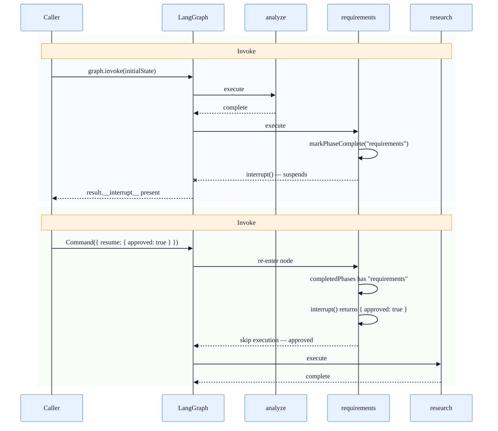
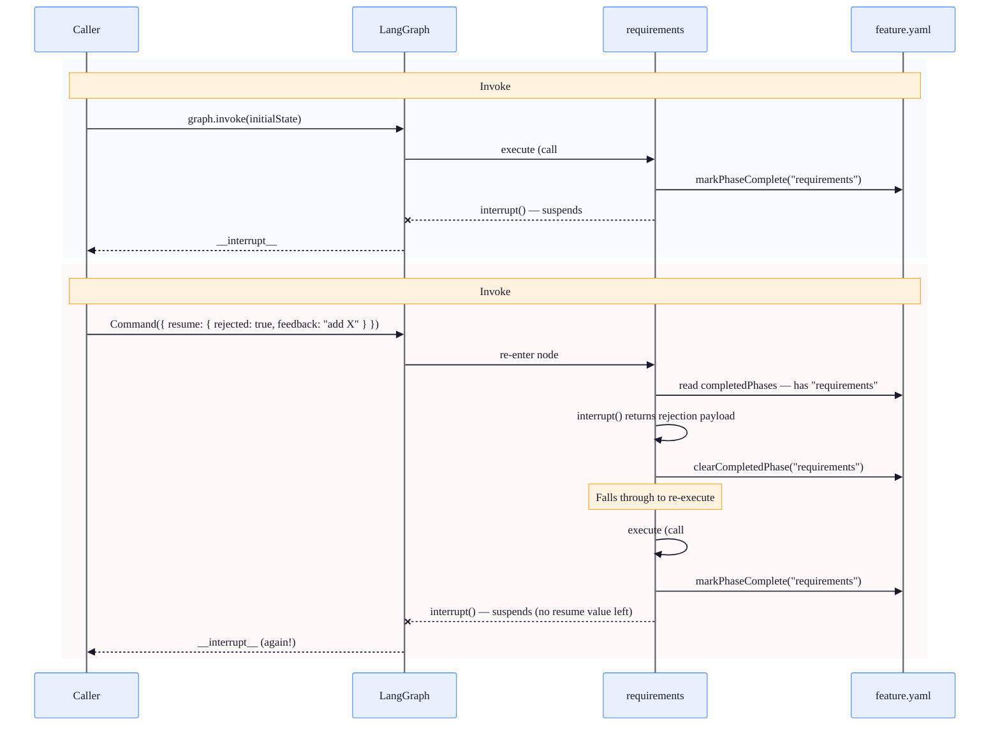
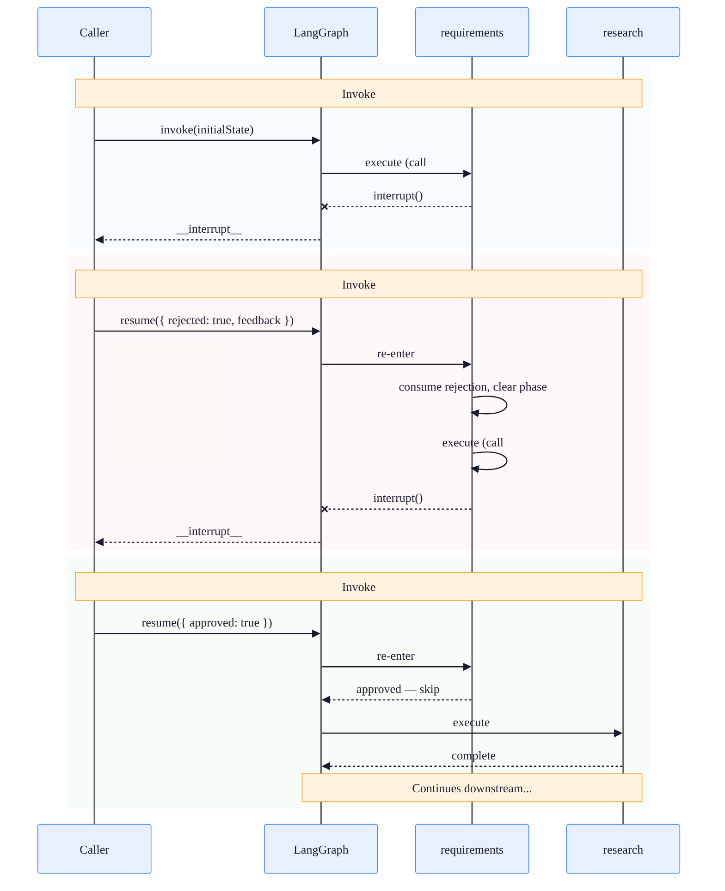
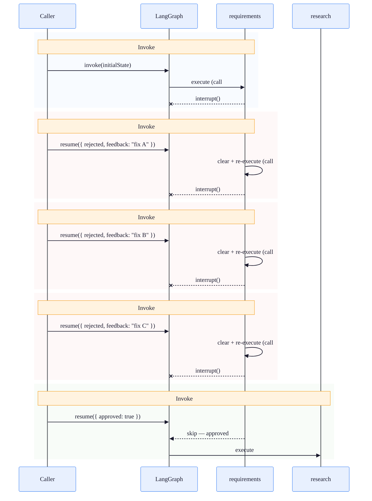
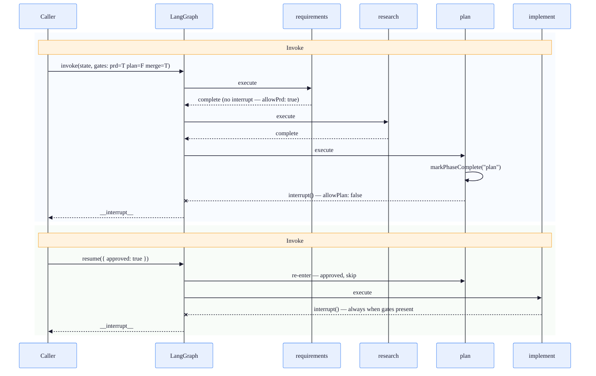
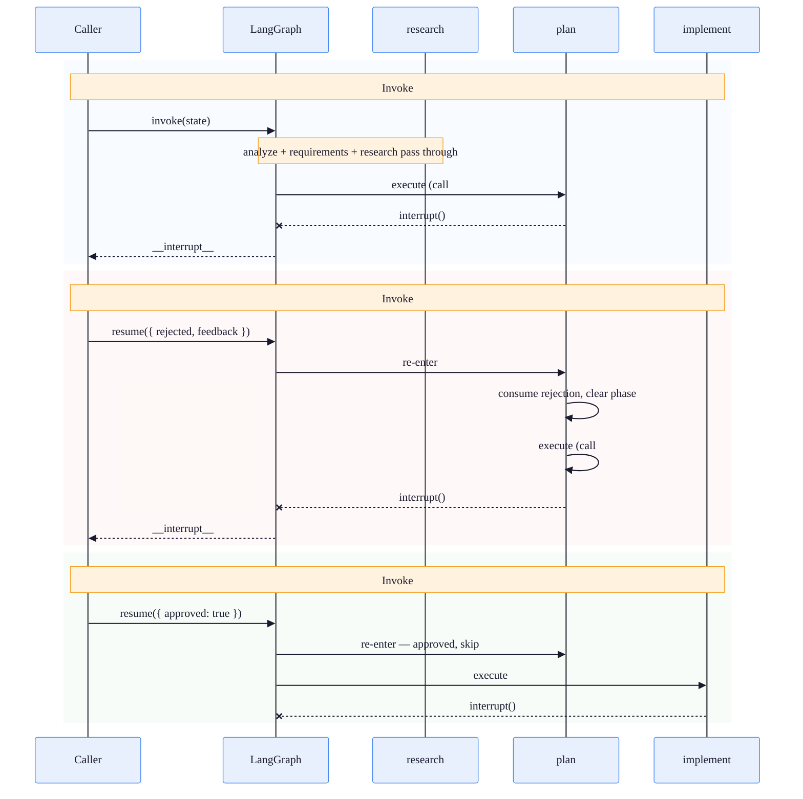
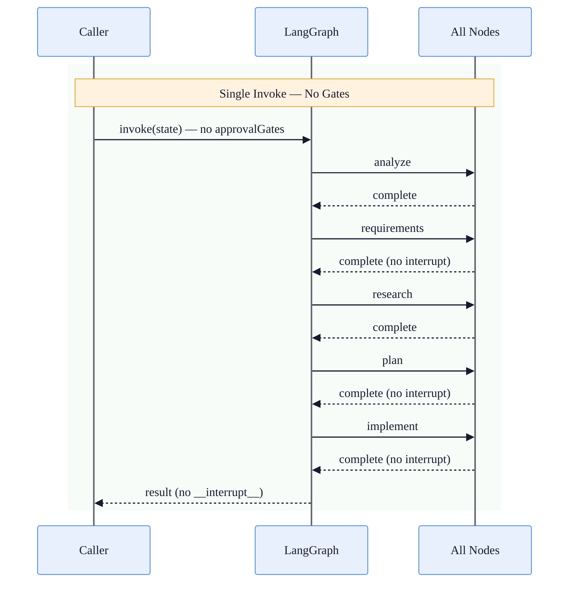
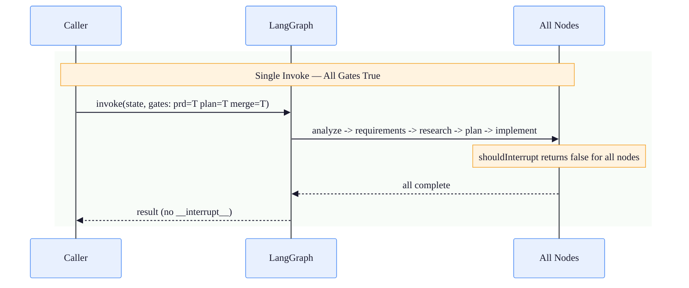
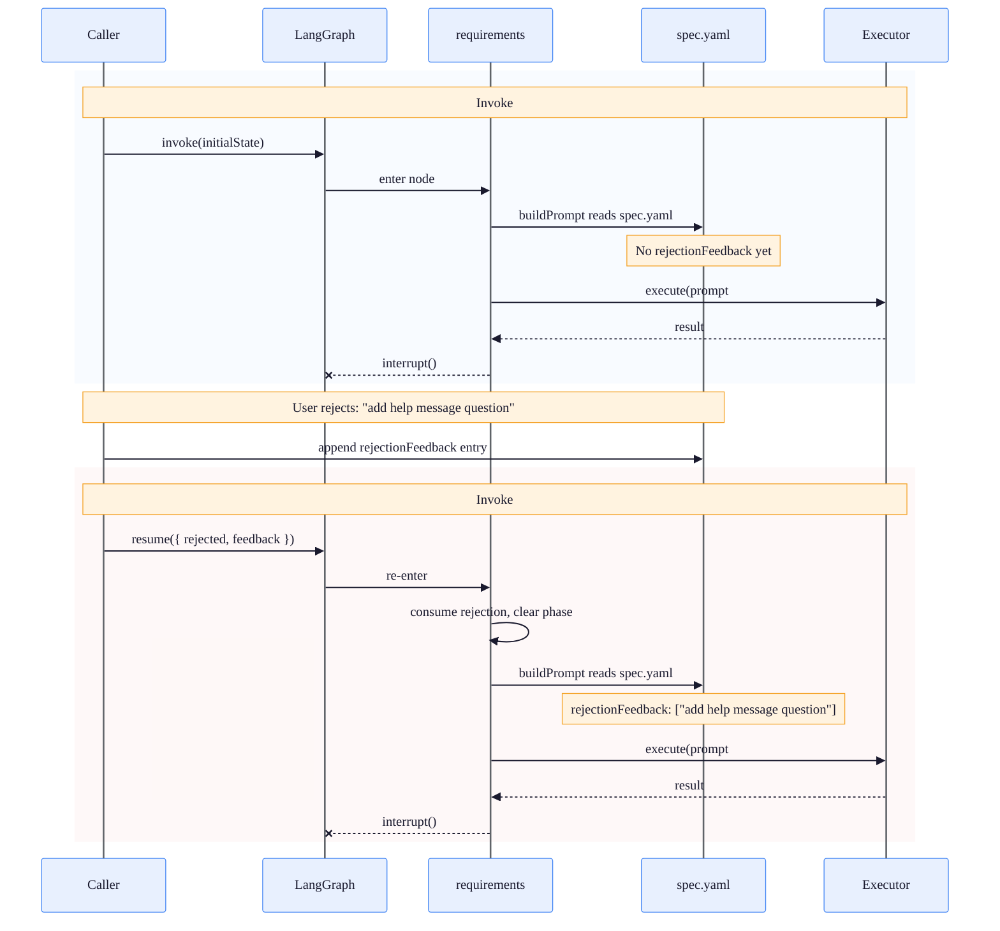
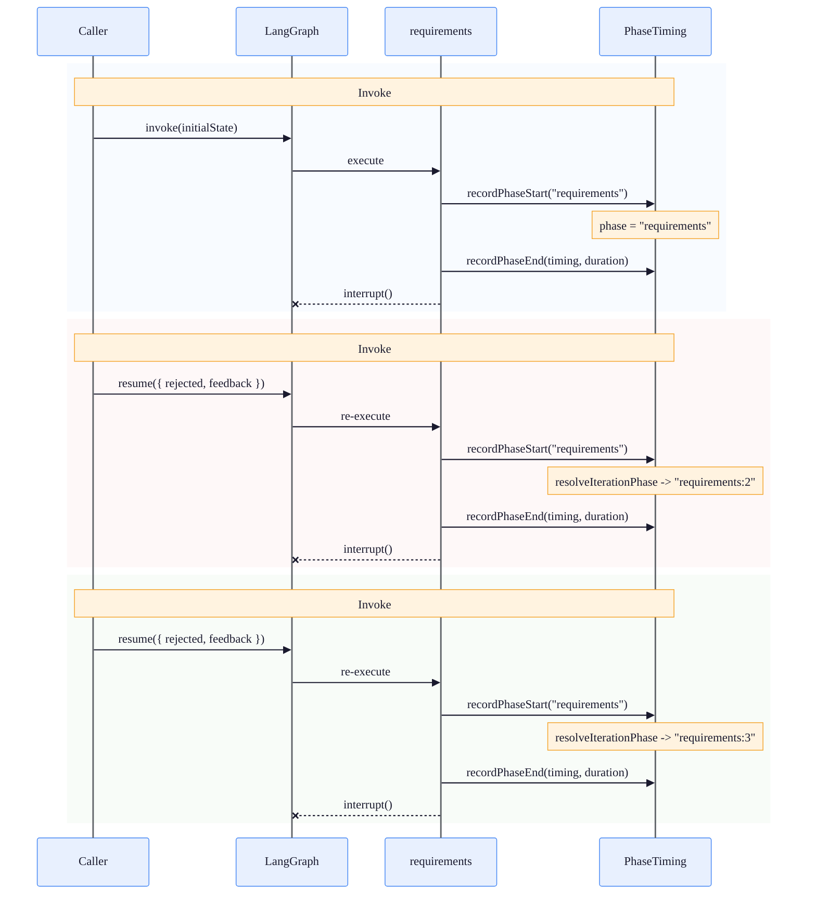

# Graph State Transition Integration Tests

## Motivation

Unit tests mock away LangGraph internals (interrupt, checkpoint, resume), so they can't catch bugs in the actual state transition mechanics. Two bugs were found in the PRD approval iteration feature:

1. **Rejected phase not re-executing** - `executeNode` skipped re-execution because `completedPhases` still included the rejected phase
2. **Re-executed phase not interrupting again** - After re-execution, the `interrupt()` at the bottom consumed the pending resume value instead of suspending

Both bugs only manifest when the real LangGraph checkpoint/interrupt/resume cycle runs end-to-end. These tests exercise that cycle with a stubbed executor (no real AI calls).

## Test Architecture

### Setup

- **Real LangGraph graph** via `createFeatureAgentGraph()` with real `SqliteSaver` checkpointer (`:memory:` or temp file)
- **Stubbed executor** implementing `IAgentExecutor` — returns canned results, no AI calls
- **Real `feature.yaml`** on disk in a temp directory — tests actual `completedPhases` read/write
- **Real `spec.yaml`** on disk — tests `buildPrompt` reads rejection feedback
- Each test uses a unique `thread_id` for checkpoint isolation

### Graph Structure Reference


**Legend**:

- Blue nodes: Producer nodes (execute agent, no interrupt)
- Orange nodes: Interruptible nodes (gated by `ApprovalGates`)
- Green nodes: Validation nodes (schema checks)

Interrupt-capable nodes (controlled by `ApprovalGates`):

- `requirements` — gated by `allowPrd`
- `plan` — gated by `allowPlan`
- `merge` — gated by `allowMerge`
- `implement` — always interrupts when gates present

---

## Test Cases

### 1. Approve Flow: Requirements

**Scenario**: Requirements completes, interrupts, user approves, graph continues to research.



**Assertions**:

- First invoke returns `__interrupt__` with node "requirements"
- `feature.yaml` `completedPhases` includes "requirements"
- Second invoke progresses past requirements to research
- Executor was called for requirements exactly once (not re-executed on resume)

---

### 2. Reject Flow: Requirements Re-executes and Interrupts Again

**Scenario**: Requirements completes, interrupts, user rejects, requirements re-executes and interrupts for re-approval.



**Assertions**:

- First invoke: `__interrupt__` present
- Second invoke (rejection): `__interrupt__` present again (not progressed to research)
- Executor called twice total for requirements (once per iteration)
- `feature.yaml` `completedPhases` includes "requirements" after second interrupt

---

### 3. Reject Then Approve: Full Iteration Cycle

**Scenario**: Requirements rejected once, then approved on second attempt.



**Assertions**:

- Three separate invoke calls
- Executor called for requirements exactly twice
- After invoke #3, research node executes
- `completedPhases` includes both "requirements" and "research" (or wherever it stops)

---

### 4. Multiple Rejections: Iteration Count

**Scenario**: Requirements rejected 3 times, then approved.



**Assertions**:

- Executor called for requirements exactly 4 times
- Each rejection triggers a new interrupt
- Final approval skips re-execution and proceeds

---

### 5. Approve Flow: Plan Phase

**Scenario**: Same as test 1 but for the plan node (validates gates work for all interruptible nodes).

**Gates**: `{ allowPrd: true, allowPlan: false, allowMerge: true }`



**Assertions**:

- Requirements does NOT interrupt (allowPrd: true)
- Plan DOES interrupt (allowPlan: false)
- Implement interrupts after plan is approved

---

### 6. Reject Flow: Plan Phase

**Scenario**: Plan rejected, re-executes, interrupts again.

**Gates**: `{ allowPrd: true, allowPlan: false, allowMerge: true }`



**Assertions**:

- Plan executor called twice
- Research NOT re-executed (only plan re-runs)

---

### 7. No Gates: No Interrupts

**Scenario**: Graph runs fully without any interrupts when `approvalGates` is undefined.



**Assertions**:

- Result has no `__interrupt__`
- All nodes executed exactly once

---

### 8. All Gates Allowed: No Interrupts

**Scenario**: `{ allowPrd: true, allowPlan: true, allowMerge: true }` — fully autonomous.



**Assertions**: Same as test 7 — no interrupts anywhere.

---

### 9. Rejection Feedback Appears in Re-execution Prompt

**Scenario**: After rejection, the re-executed requirements node should receive the rejection feedback in its prompt (via `spec.yaml` `rejectionFeedback` entries).



**Assertions**:

- Capture the prompt passed to executor on second call
- Prompt contains the rejection feedback text
- `spec.yaml` has `rejectionFeedback` array with the entry

---

### 10. Phase Timing: Iteration Suffix

**Scenario**: After rejection and re-execution, the phase timing records use iteration-aware names.



**Assertions**:

- First execution: phase name "requirements"
- After rejection + re-execution: phase name "requirements:2"
- Third iteration: phase name "requirements:3"

---

## Color Legend

| Color                                  | Meaning                       |
| -------------------------------------- | ----------------------------- |
| Blue background `rgba(232, 240, 254)`  | Initial / standard invoke     |
| Red background `rgba(252, 232, 230)`   | Rejection / re-execution path |
| Green background `rgba(232, 245, 233)` | Approval / success path       |
| Orange node border `#F4A226`           | Interruptible node            |
| Blue node fill `#E8F0FE`               | Standard producer node        |
| Green node fill `#E8F5E9`              | Validation node               |

---

## Implementation Notes

### Stubbed Executor

```typescript
class StubExecutor implements IAgentExecutor {
  callCount = 0;
  prompts: string[] = [];

  async execute(prompt: string, options: AgentExecutionOptions): Promise<AgentExecutionResult> {
    this.callCount++;
    this.prompts.push(prompt);
    return { result: `stub result #${this.callCount}`, exitCode: 0 };
  }
}
```

### Temp Spec Directory

Each test creates a temp directory with:

- `feature.yaml` — minimal valid structure with `status: { completedPhases: [] }`
- `spec.yaml` — minimal valid structure for the requirements prompt to read

### Graph Config

```typescript
const checkpointer = createCheckpointer(':memory:');
const graph = createFeatureAgentGraph({ executor: stubExecutor }, checkpointer);
const config = { configurable: { thread_id: `test-${randomUUID()}` } };
```

### Mocking Concerns

- **Phase timing context**: Mock or stub `setPhaseTimingContext` to avoid DB dependency
- **Lifecycle context**: Mock or stub `setLifecycleContext`
- **Heartbeat**: Mock or stub `setHeartbeatContext`
- All other graph mechanics (interrupt, checkpoint, state) should be real

### File Location

```
tests/integration/graph-state-transitions.test.ts
```
