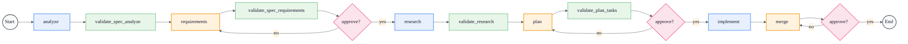

# Graph State Transition Integration Tests

## Motivation

Unit tests mock away LangGraph internals (interrupt, checkpoint, resume), so they can't catch bugs in the actual state transition mechanics. Two bugs were found in the PRD approval iteration feature:

1. **Rejected phase not re-executing** - `executeNode` skipped re-execution because `completedPhases` still included the rejected phase
2. **Re-executed phase not interrupting again** - After re-execution, the `interrupt()` at the bottom consumed the pending resume value instead of suspending

Both bugs only manifest when the real LangGraph checkpoint/interrupt/resume cycle runs end-to-end. These tests exercise that cycle with a stubbed executor (no real AI calls).

## Test Architecture

### Setup

- **Real LangGraph graph** via `createFeatureAgentGraph()` with real `SqliteSaver` checkpointer (`:memory:`)
- **Stubbed executor** implementing `IAgentExecutor` — returns canned results, no AI calls
- **Real `feature.yaml`** on disk in a temp directory — tests actual `completedPhases` read/write
- **Real `spec.yaml`** on disk — tests `buildPrompt` reads rejection feedback
- Each test uses a unique `thread_id` for checkpoint isolation

### Graph Structure Reference


```mermaid
%%{init: {'theme': 'base', 'themeVariables': {'primaryColor': '#E8F0FE', 'primaryBorderColor': '#4285F4', 'primaryTextColor': '#1A1A2E', 'lineColor': '#5F6368', 'secondaryColor': '#FFF3E0', 'tertiaryColor': '#E8F5E9', 'fontFamily': 'Inter, system-ui, sans-serif'}}}%%

graph LR
    S((Start)):::startEnd --> A[analyze]:::producer
    A --> VA[validate_spec_analyze]:::validator
    VA --> R[requirements]:::interruptible
    R --> VR[validate_spec_requirements]:::validator
    VR --> RI{approve?}:::iteration
    RI -->|yes| RS[research]:::producer
    RI -->|no| R
    RS --> VRS[validate_research]:::validator
    VRS --> P[plan]:::interruptible
    P --> VP[validate_plan_tasks]:::validator
    VP --> PI{approve?}:::iteration
    PI -->|yes| I[implement]:::producer
    PI -->|no| P
    I --> M[merge]:::interruptible
    M --> MI{approve?}:::iteration
    MI -->|yes| E((End)):::startEnd
    MI -->|no| M

    classDef startEnd fill:#F8F9FA,stroke:#5F6368,stroke-width:2px,color:#1A1A2E
    classDef producer fill:#E8F0FE,stroke:#4285F4,stroke-width:1.5px,color:#1A1A2E
    classDef interruptible fill:#FFF3E0,stroke:#F4A226,stroke-width:2px,color:#1A1A2E
    classDef validator fill:#E8F5E9,stroke:#34A853,stroke-width:1px,color:#1A1A2E
    classDef iteration fill:#FCE4EC,stroke:#E91E63,stroke-width:1.5px,color:#1A1A2E
    classDef reject fill:#FFCDD2,stroke:#E53935,stroke-width:1.5px,color:#1A1A2E
```

**Legend**:

- Blue nodes: Producer nodes (execute agent, no interrupt)
- Orange nodes: Interruptible nodes (gated by `ApprovalGates`)
- Green nodes: Validation nodes (schema checks)
- Pink diamonds: Iteration points (approve → continue, reject → re-execute the block)

Interrupt-capable nodes (controlled by `ApprovalGates`):

- `requirements` — gated by `allowPrd`
- `plan` — gated by `allowPlan`
- `merge` — gated by `allowMerge`

Non-interruptible nodes: `analyze`, `research`, `implement` (always proceed autonomously).

## Directory Structure

```
graph-state-transitions/
├── README.md                          # This file — full specification with diagrams
├── CLAUDE.md                          # Instructions for AI agents extending these tests
├── setup.ts                           # Test context factory (graph, executor, temp dirs)
├── fixtures.ts                        # Valid YAML fixtures for spec, research, plan, tasks
├── helpers.ts                         # Shared utilities (interrupt helpers, resume commands)
├── approve-flow.test.ts               # Approval path tests (Tests 1, 5)
├── reject-flow.test.ts                # Rejection iteration tests (Tests 2, 3, 4, 6, 11)
├── reject-feedback-propagation.test.ts # Rejection feedback stored per-phase, propagated to prompts
├── gate-configuration.test.ts         # ApprovalGates combination tests (Tests 7, 8)
├── merge-flow.test.ts                 # Merge node gate tests (Tests 12-16)
├── evidence-flow.test.ts              # Evidence sub-agent collection within implement node
├── feedback-and-timing.test.ts        # Feedback propagation and timing tests (Tests 9, 10)
├── resume-after-error.test.ts         # Resume from failed node (non-merge) with persistent checkpointer
└── resume-after-error-merge.test.ts   # Resume from failed merge node — reject/approve/retry paths
```

## Test Cases

### 1. Approve Flow: Requirements

Requirements completes, interrupts, user approves, graph continues to research.

| Step | Action          | Nodes executed | Result        |
| ---- | --------------- | -------------- | ------------- |
| #1   | `invoke(state)` | analyze, req   | `⏸ req`      |
| #2   | `approve()`     | research, ...  | `→ continues` |

- Executor called for requirements exactly once (not re-executed on resume)
- `completedPhases` includes "requirements" after step 1

---

### 2. Reject Flow: Requirements Re-executes

Requirements completes, interrupts, user rejects, re-executes and interrupts again.

| Step | Action            | Nodes executed | Result           |
| ---- | ----------------- | -------------- | ---------------- |
| #1   | `invoke(state)`   | analyze, req   | `⏸ req`         |
| #2   | `reject("add X")` | req (re-exec)  | `⏸ req` (again) |

- Executor called twice for requirements (once per iteration)
- Does NOT progress to research after rejection

---

### 3. Reject Then Approve: Full Iteration Cycle

Requirements rejected once, then approved on second attempt.

| Step | Action          | Nodes executed | Result        |
| ---- | --------------- | -------------- | ------------- |
| #1   | `invoke(state)` | analyze, req   | `⏸ req`      |
| #2   | `reject("fix")` | req (re-exec)  | `⏸ req`      |
| #3   | `approve()`     | research, ...  | `→ continues` |

---

### 4. Multiple Rejections: Iteration Count

Requirements rejected 3 times, then approved.

| Step | Action            | Nodes executed | Result        |
| ---- | ----------------- | -------------- | ------------- |
| #1   | `invoke(state)`   | analyze, req   | `⏸ req`      |
| #2   | `reject("fix A")` | req (call #2)  | `⏸ req`      |
| #3   | `reject("fix B")` | req (call #3)  | `⏸ req`      |
| #4   | `reject("fix C")` | req (call #4)  | `⏸ req`      |
| #5   | `approve()`       | research, ...  | `→ continues` |

- Executor called for requirements exactly 4 times

---

### 5. Approve Flow: Plan Phase

Same as test 1 but for the plan node. **Gates**: `{ allowPrd: true, allowPlan: false }`

| Step | Action          | Nodes executed               | Result        |
| ---- | --------------- | ---------------------------- | ------------- |
| #1   | `invoke(state)` | analyze, req, research, plan | `⏸ plan`     |
| #2   | `approve()`     | implement, ...               | `→ completes` |

---

### 6. Reject Flow: Plan Phase

Plan rejected, re-executes. **Gates**: `{ allowPrd: true, allowPlan: false }`

| Step | Action           | Nodes executed | Result    |
| ---- | ---------------- | -------------- | --------- |
| #1   | `invoke(state)`  | ..., plan      | `⏸ plan` |
| #2   | `reject("more")` | plan (re-exec) | `⏸ plan` |

- Research NOT re-executed (only plan re-runs)

---

### 7. No Gates: No Interrupts

`approvalGates` undefined — fully autonomous, no interrupts. All nodes execute exactly once.

---

### 8. All Gates Allowed: No Interrupts

`{ allowPrd: true, allowPlan: true, allowMerge: true }` — same as test 7.

---

### 9. Rejection Feedback Appears in Re-execution Prompt

After rejection, the re-executed node's prompt contains the feedback text (via `spec.yaml` `rejectionFeedback`).

---

### 10. Phase Timing: Iteration Suffix

Phase timing names: `requirements` → `requirements:2` → `requirements:3` on successive rejections.

---

### 11. Five Consecutive Rejections Then Approve

| Step | Action            | Result        |
| ---- | ----------------- | ------------- |
| #1   | `invoke(state)`   | `⏸ req`      |
| #2-6 | `reject("fix N")` | `⏸ req` (x5) |
| #7   | `approve()`       | `→ continues` |

- Executor call count: analyze(1) + req(1) + 5 re-execs + research + plan = 9

---

### 12. Merge Interrupt With PRD+Plan Auto-Approved

**Gates**: `{ allowPrd: true, allowPlan: true, allowMerge: false }`, graph with merge node.

| Step | Action          | Nodes executed                            | Result     |
| ---- | --------------- | ----------------------------------------- | ---------- |
| #1   | `invoke(state)` | analyze, req, research, plan, impl, merge | `⏸ merge` |

---

### 13. Full Completion With All Gates Enabled (With Merge)

`{ allowPrd: true, allowPlan: true, allowMerge: true }` — no interrupts, all nodes run, completes.

---

### 14. Full Gate Walk-Through With Merge

All gates disabled — step through every approval point.

| Step | Action          | Result        |
| ---- | --------------- | ------------- |
| #1   | `invoke(state)` | `⏸ req`      |
| #2   | `approve()`     | `⏸ plan`     |
| #3   | `approve()`     | `⏸ merge`    |
| #4   | `approve()`     | `→ completes` |

---

### 15. Plan Reject Through Merge Approve

| Step | Action          | Result        |
| ---- | --------------- | ------------- |
| #1   | `invoke(state)` | `⏸ plan`     |
| #2   | `reject("fix")` | `⏸ plan`     |
| #3   | `approve()`     | `⏸ merge`    |
| #4   | `approve()`     | `→ completes` |

---

### 16. No Gates With Merge Node

`approvalGates` undefined, merge node wired. No interrupts at all — same as test 7 but with merge.

---

### 17-22. Resume After Error at Merge

Tests that when merge node throws, resume correctly re-executes merge (not the whole graph).

| Test | Scenario                              | Resume method      | Expected result             |
| ---- | ------------------------------------- | ------------------ | --------------------------- |
| 17   | Merge fails, plain re-invoke          | `invoke(state)`    | Only merge re-runs          |
| 18   | Merge fails, reject with Command      | `Command(reject)`  | Merge re-runs, feedback set |
| 19   | Merge fails, approve with Command     | `Command(approve)` | Only merge re-runs          |
| 20   | Merge fails, plain retry              | `invoke(state)`    | Only merge re-runs          |
| 21   | Fail → retry → complete               | `invoke(state)`    | Merge completes             |
| 22   | Merge fails, gated (allowMerge=false) | `invoke(state)`    | Merge re-runs → `⏸ merge`  |

- Early nodes (analyze, req, research, plan, impl) must NOT re-execute on resume

---

## Resolved Issues

### Double-Interrupt Replay Bug (FIXED)

Refactored to state-based detection via `Command({resume, update})`. On rejection, node returns `_needsReexecution: true` and a conditional edge routes back. Each invocation now has at most ONE `interrupt()` call.

### Reject/Approve on Failed Features (FIXED)

`rejectFeature` and `approveFeature` server actions previously used `ResumeFeatureUseCase` for failed/interrupted runs, which only prepended feedback to the prompt without setting `_approvalAction`/`_rejectionFeedback` state channels. Fixed to always use `RejectAgentRunUseCase`/`ApproveAgentRunUseCase` which propagate feedback via `Command({update})`.

---

## Implementation Notes

### Stubbed Executor

```typescript
// Created via createStubExecutor() from setup.ts
const executor: StubExecutor = {
  callCount: number;       // Total execute() calls
  prompts: string[];       // Prompts received in order
  execute: Mock;           // The vi.fn() mock
};
```

### Temp Spec Directory

Each test suite creates a temp directory with:

- `feature.yaml` — minimal valid structure with `status: { completedPhases: [] }`
- `spec.yaml` — minimal valid structure for the requirements prompt to read
- `research.yaml`, `plan.yaml`, `tasks.yaml` — pass validation nodes

### Mocking Concerns

- **Phase timing context**: Not set → `recordPhaseStart/End` are no-ops
- **Lifecycle context**: Not set → `updateNodeLifecycle` is no-op
- **Heartbeat**: Not set → `reportNodeStart` is no-op
- All other graph mechanics (interrupt, checkpoint, state) are real
